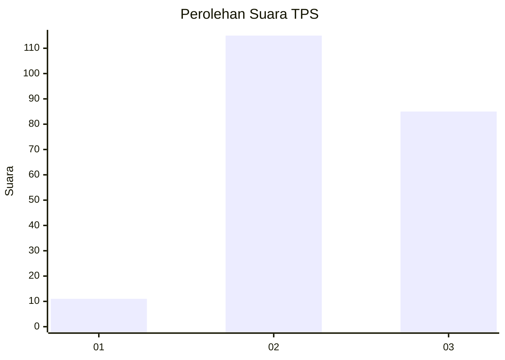
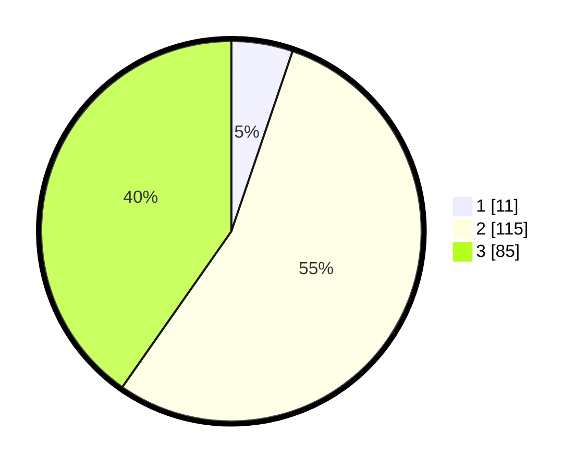

# Hasil

## Grafik

## Tabel

| No. | Nama Paslon    | Suara | Suara (raw) | Persentase |
|:--- |:-------------- | -----:| -----------:| ----------:|
| 1   | ANIES MUHAIMIN | 11    | [11][p-1]   | 5,21       |
| 2   | PRABOWO GIBRAN | 115   | [115][p-2]  | 54,50      |
| 3   | GANJAR MAHFUD  | 85    | [85][p-3]   | 40,28      |

[p-1]: https://github.com/gigit-pemilu/pemilu-2024/blob/main/pilpres/hitung-suara/sub/33-jawa-tengah/sub/03-purbalingga/sub/01-kemangkon/sub/2001-kedungbenda/sub/004-tps/sub/paslon-1.txt
[p-2]: https://github.com/gigit-pemilu/pemilu-2024/blob/main/pilpres/hitung-suara/sub/33-jawa-tengah/sub/03-purbalingga/sub/01-kemangkon/sub/2001-kedungbenda/sub/004-tps/sub/paslon-2.txt
[p-3]: https://github.com/gigit-pemilu/pemilu-2024/blob/main/pilpres/hitung-suara/sub/33-jawa-tengah/sub/03-purbalingga/sub/01-kemangkon/sub/2001-kedungbenda/sub/004-tps/sub/paslon-3.txt

## Foto C Plano

https://sirekap-obj-formc.kpu.go.id/8dde/pemilu/ppwp/33/03/01/20/01/3303012001004-20240214-200644--bd4db41d-66ee-4b81-bab5-f3a5e6da9b5b.jpg

https://sirekap-obj-formc.kpu.go.id/8dde/pemilu/ppwp/33/03/01/20/01/3303012001004-20240214-200817--73bfa900-a507-4b33-b5ec-c6c2618d3b07.jpg

https://sirekap-obj-formc.kpu.go.id/8dde/pemilu/ppwp/33/03/01/20/01/3303012001004-20240214-200911--b5c79453-a158-4f6e-97cc-0e5ad0c0c6e0.jpg

## Metadata

| Key        | Value               |
| ---------- | ------------------- |
| Time Stamp | 2024-02-15 12:00:28 |

