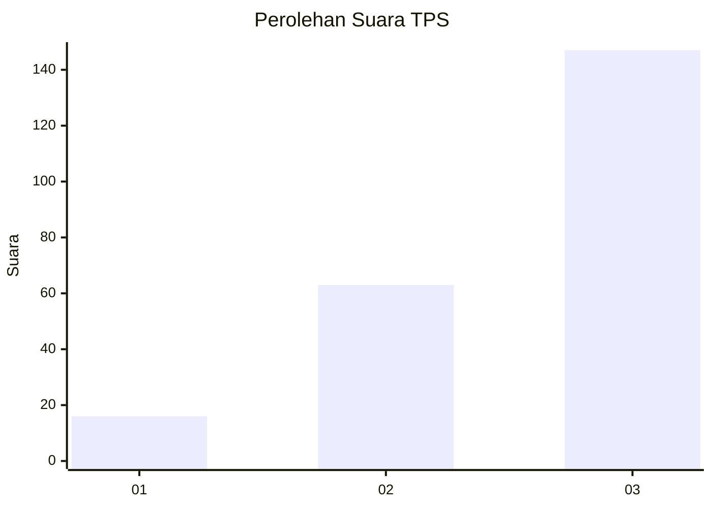
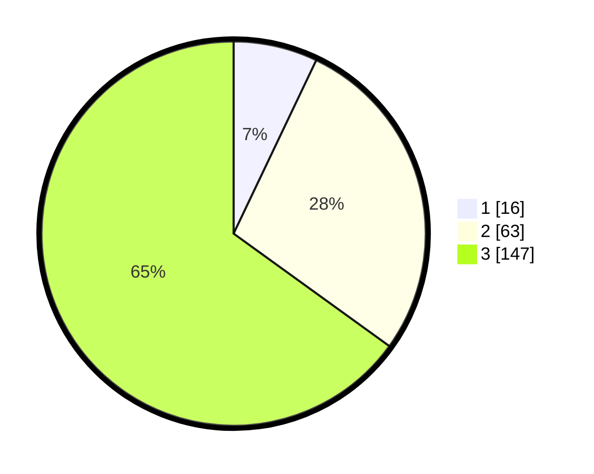

# Hasil

## Grafik

## Tabel

| No. | Nama Paslon    | Suara | Suara (raw) | Persentase |
|:--- |:-------------- | -----:| -----------:| ----------:|
| 1   | ANIES MUHAIMIN | 16    | [16][p-1]   | 7,08       |
| 2   | PRABOWO GIBRAN | 63    | [63][p-2]   | 27,88      |
| 3   | GANJAR MAHFUD  | 147   | [147][p-3]  | 65,04      |

[p-1]: https://github.com/gigit-pemilu/pemilu-2024-33-jawa-tengah/blob/main/pilpres/hitung-suara/sub/33-jawa-tengah/sub/03-purbalingga/sub/01-kemangkon/sub/2001-kedungbenda/sub/008-tps/sub/paslon-1.txt
[p-2]: https://github.com/gigit-pemilu/pemilu-2024-33-jawa-tengah/blob/main/pilpres/hitung-suara/sub/33-jawa-tengah/sub/03-purbalingga/sub/01-kemangkon/sub/2001-kedungbenda/sub/008-tps/sub/paslon-2.txt
[p-3]: https://github.com/gigit-pemilu/pemilu-2024-33-jawa-tengah/blob/main/pilpres/hitung-suara/sub/33-jawa-tengah/sub/03-purbalingga/sub/01-kemangkon/sub/2001-kedungbenda/sub/008-tps/sub/paslon-3.txt

## Foto C Plano

https://sirekap-obj-formc.kpu.go.id/5175/pemilu/ppwp/33/03/01/20/01/3303012001008-20240216-180730--27ffdd29-d7a3-434c-aca0-51869cee6c01.jpg

https://sirekap-obj-formc.kpu.go.id/5175/pemilu/ppwp/33/03/01/20/01/3303012001008-20240216-180731--24c79d8a-5895-4489-932d-46d6e174dc03.jpg

https://sirekap-obj-formc.kpu.go.id/5175/pemilu/ppwp/33/03/01/20/01/3303012001008-20240216-180731--eb12fd19-82eb-4e84-9c91-2ce328aa4612.jpg

## Metadata

| Key        | Value               |
| ---------- | ------------------- |
| Time Stamp | 2024-02-16 21:01:00 |

## DATA PEMILIH TETAP

Jumlah pemilih dalam DPT: **288**.
 * L: **148**.
 * P: **140**.

## DATA PENGGUNA HAK PILIH

Jumlah pengguna hak pilih dalam DPT: **234**.
 * L: **116**.
 * P: **118**.

Jumlah pengguna hak pilih dalam DPTb: **2**.
 * L: **2**.
 * P: **0**.

Jumlah pengguna hak pilih dalam DPK: **0**.
 * L: **0**.
 * P: **0**.

Jumlah pengguna hak pilih: **236**.
 * L: **118**.
 * P: **118**.

## JUMLAH SUARA SAH DAN TIDAK SAH

JUMLAH SELURUH SUARA SAH: **226**.

JUMLAH SUARA TIDAK SAH: **10**.

JUMLAH SELURUH SUARA SAH DAN SUARA TIDAK SAH: **236**.

