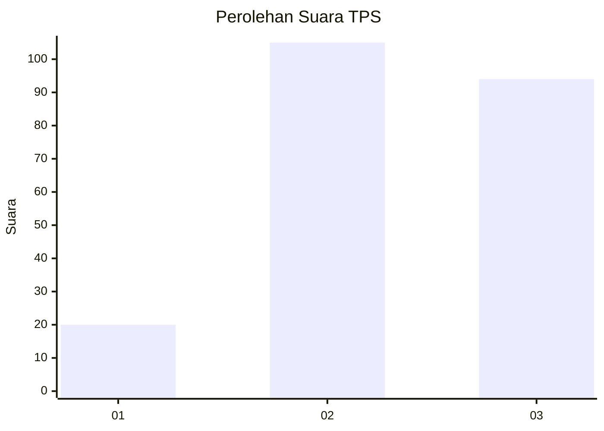
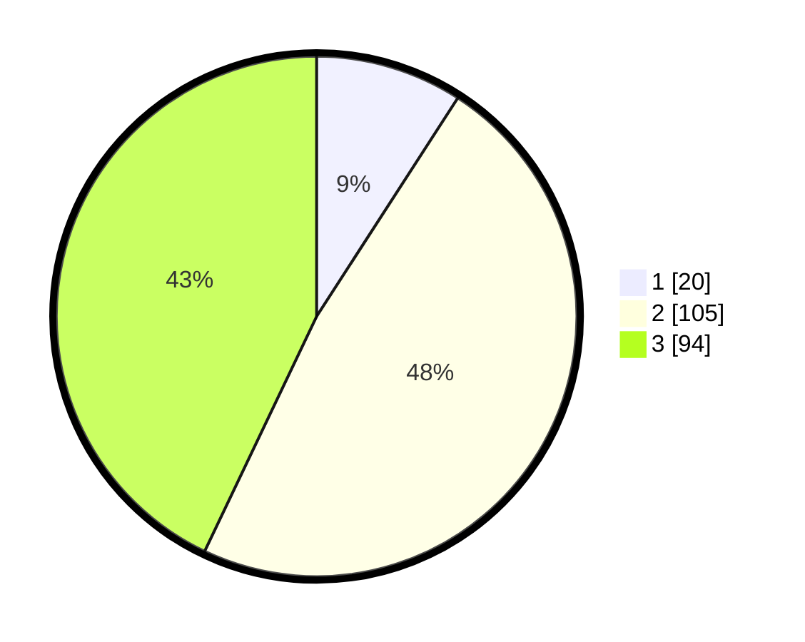

# Hasil

## Grafik

## Tabel

| No. | Nama Paslon    | Suara | Suara (raw) | Persentase |
|:--- |:-------------- | -----:| -----------:| ----------:|
| 1   | ANIES MUHAIMIN | 20    | [20][p-1]   | 9,13       |
| 2   | PRABOWO GIBRAN | 105   | [105][p-2]  | 47,95      |
| 3   | GANJAR MAHFUD  | 94    | [94][p-3]   | 42,92      |

[p-1]: https://github.com/gigit-pemilu/pemilu-2024/blob/main/pilpres/hitung-suara/sub/33-jawa-tengah/sub/03-purbalingga/sub/01-kemangkon/sub/2006-kemangkon/sub/011-tps/sub/paslon-1.txt
[p-2]: https://github.com/gigit-pemilu/pemilu-2024/blob/main/pilpres/hitung-suara/sub/33-jawa-tengah/sub/03-purbalingga/sub/01-kemangkon/sub/2006-kemangkon/sub/011-tps/sub/paslon-2.txt
[p-3]: https://github.com/gigit-pemilu/pemilu-2024/blob/main/pilpres/hitung-suara/sub/33-jawa-tengah/sub/03-purbalingga/sub/01-kemangkon/sub/2006-kemangkon/sub/011-tps/sub/paslon-3.txt

## Foto C Plano

https://sirekap-obj-formc.kpu.go.id/1668/pemilu/ppwp/33/03/01/20/06/3303012006011-20240214-155908--7443cd43-cdc6-43a5-b353-2c63f2994770.jpg

https://sirekap-obj-formc.kpu.go.id/1668/pemilu/ppwp/33/03/01/20/06/3303012006011-20240214-160102--f0e05324-04d3-4a35-9630-bbcd8b0b61b7.jpg

https://sirekap-obj-formc.kpu.go.id/1668/pemilu/ppwp/33/03/01/20/06/3303012006011-20240215-021030--7243026b-0232-461e-8488-2dcc76351e7b.jpg

## Metadata

| Key        | Value               |
| ---------- | ------------------- |
| Time Stamp | 2024-02-15 12:00:28 |

