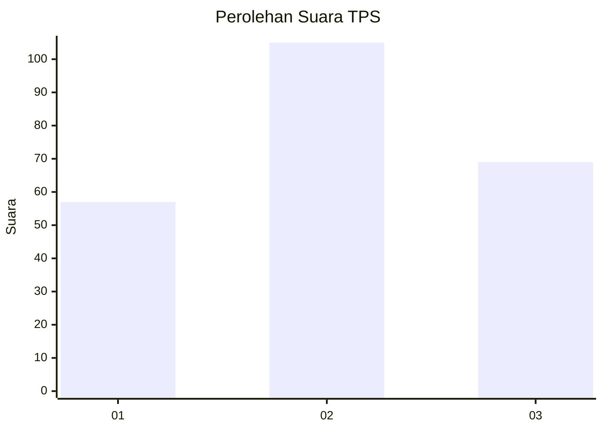
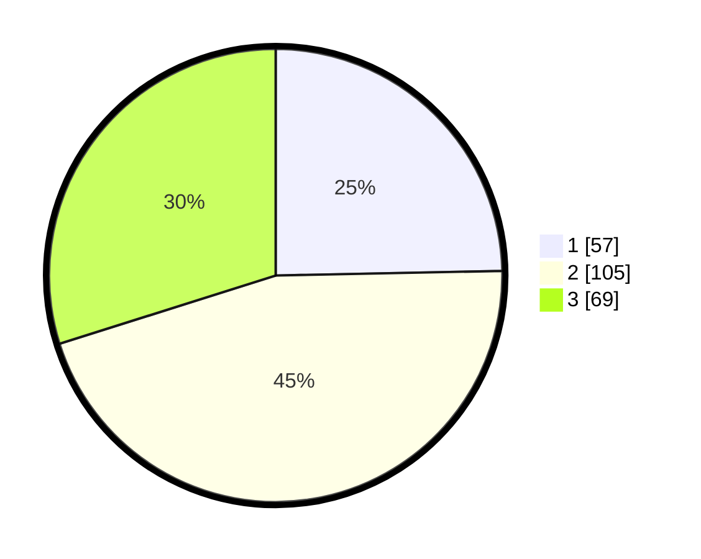

# Hasil

## Grafik

## Tabel

| No. | Nama Paslon    | Suara | Suara (raw) | Persentase |
|:--- |:-------------- | -----:| -----------:| ----------:|
| 1   | ANIES MUHAIMIN | 57    | [57][p-1]   | 24,68      |
| 2   | PRABOWO GIBRAN | 105   | [105][p-2]  | 45,45      |
| 3   | GANJAR MAHFUD  | 69    | [69][p-3]   | 29,87      |

[p-1]: https://github.com/gigit-pemilu/pemilu-2024/blob/main/pilpres/hitung-suara/sub/33-jawa-tengah/sub/03-purbalingga/sub/01-kemangkon/sub/2007-panican/sub/015-tps/sub/paslon-1.txt
[p-2]: https://github.com/gigit-pemilu/pemilu-2024/blob/main/pilpres/hitung-suara/sub/33-jawa-tengah/sub/03-purbalingga/sub/01-kemangkon/sub/2007-panican/sub/015-tps/sub/paslon-2.txt
[p-3]: https://github.com/gigit-pemilu/pemilu-2024/blob/main/pilpres/hitung-suara/sub/33-jawa-tengah/sub/03-purbalingga/sub/01-kemangkon/sub/2007-panican/sub/015-tps/sub/paslon-3.txt

## Foto C Plano

https://sirekap-obj-formc.kpu.go.id/e6cc/pemilu/ppwp/33/03/01/20/07/3303012007015-20240216-124242--c5e0a969-1fed-4405-8418-0c8e8bdefa0b.jpg

https://sirekap-obj-formc.kpu.go.id/e6cc/pemilu/ppwp/33/03/01/20/07/3303012007015-20240215-050224--2dd0b0f0-e660-4f93-a9d7-d411506d17ff.jpg

https://sirekap-obj-formc.kpu.go.id/e6cc/pemilu/ppwp/33/03/01/20/07/3303012007015-20240215-050341--d9fe21e0-59e3-440a-b8a0-68bd94aa2191.jpg

## Metadata

| Key        | Value               |
| ---------- | ------------------- |
| Time Stamp | 2024-02-16 12:51:22 |

