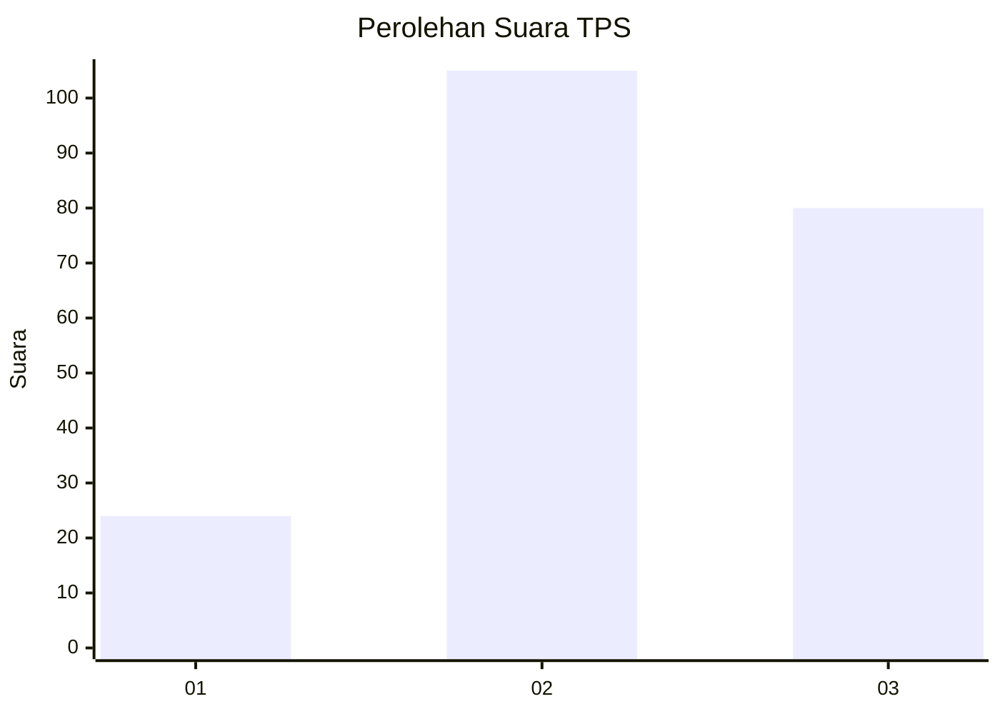
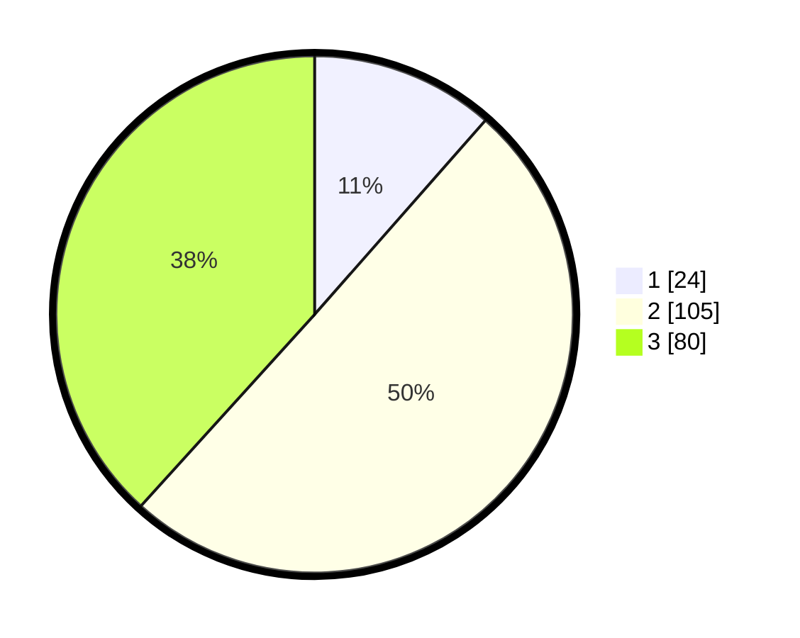

# Hasil

## Grafik

## Tabel

| No. | Nama Paslon    | Suara | Suara (raw) | Persentase |
|:--- |:-------------- | -----:| -----------:| ----------:|
| 1   | ANIES MUHAIMIN | 24    | [24][p-1]   | 11,48      |
| 2   | PRABOWO GIBRAN | 105   | [105][p-2]  | 50,24      |
| 3   | GANJAR MAHFUD  | 80    | [80][p-3]   | 38,28      |

[p-1]: https://github.com/gigit-pemilu/pemilu-2024/blob/main/pilpres/hitung-suara/sub/33-jawa-tengah/sub/03-purbalingga/sub/02-bukateja/sub/2002-wirasaba/sub/004-tps/sub/paslon-1.txt
[p-2]: https://github.com/gigit-pemilu/pemilu-2024/blob/main/pilpres/hitung-suara/sub/33-jawa-tengah/sub/03-purbalingga/sub/02-bukateja/sub/2002-wirasaba/sub/004-tps/sub/paslon-2.txt
[p-3]: https://github.com/gigit-pemilu/pemilu-2024/blob/main/pilpres/hitung-suara/sub/33-jawa-tengah/sub/03-purbalingga/sub/02-bukateja/sub/2002-wirasaba/sub/004-tps/sub/paslon-3.txt

## Foto C Plano

https://sirekap-obj-formc.kpu.go.id/82a8/pemilu/ppwp/33/03/02/20/02/3303022002004-20240214-204048--7a18c39e-c7e2-4451-97e2-1ebcfa523951.jpg

https://sirekap-obj-formc.kpu.go.id/82a8/pemilu/ppwp/33/03/02/20/02/3303022002004-20240215-045714--aa8f180e-77af-4bb2-9fa3-cb2295a321e9.jpg

https://sirekap-obj-formc.kpu.go.id/82a8/pemilu/ppwp/33/03/02/20/02/3303022002004-20240215-045859--164845c2-3edc-4315-9cfe-082bbf9bcf36.jpg

## Metadata

| Key        | Value               |
| ---------- | ------------------- |
| Time Stamp | 2024-02-15 15:00:29 |

