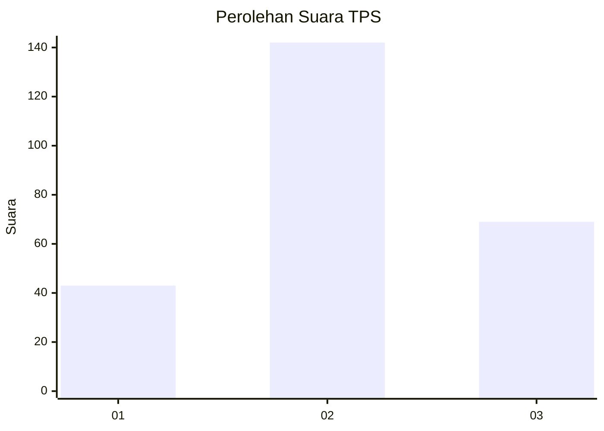
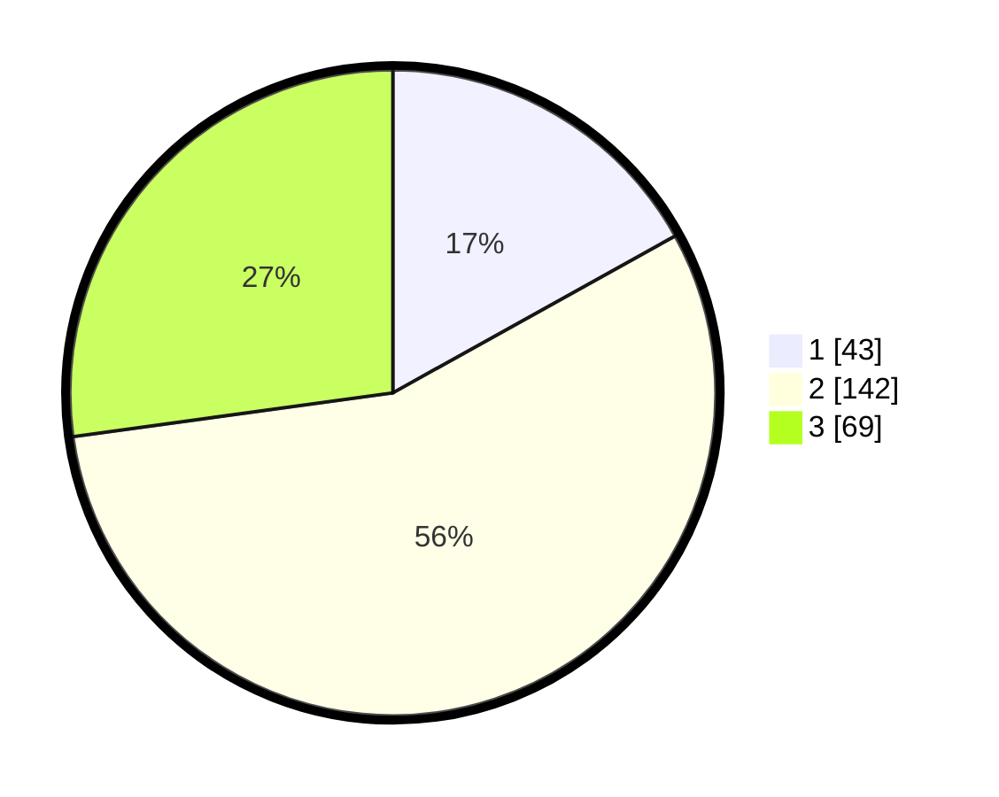

# Hasil

## Grafik

## Tabel

| No. | Nama Paslon    | Suara | Suara (raw) | Persentase |
|:--- |:-------------- | -----:| -----------:| ----------:|
| 1   | ANIES MUHAIMIN | 43    | [43][p-1]   | 16,93      |
| 2   | PRABOWO GIBRAN | 142   | [142][p-2]  | 55,91      |
| 3   | GANJAR MAHFUD  | 69    | [69][p-3]   | 27,17      |

[p-1]: https://github.com/gigit-pemilu/pemilu-2024/blob/main/pilpres/hitung-suara/sub/33-jawa-tengah/sub/03-purbalingga/sub/02-bukateja/sub/2011-kedungjati/sub/013-tps/sub/paslon-1.txt
[p-2]: https://github.com/gigit-pemilu/pemilu-2024/blob/main/pilpres/hitung-suara/sub/33-jawa-tengah/sub/03-purbalingga/sub/02-bukateja/sub/2011-kedungjati/sub/013-tps/sub/paslon-2.txt
[p-3]: https://github.com/gigit-pemilu/pemilu-2024/blob/main/pilpres/hitung-suara/sub/33-jawa-tengah/sub/03-purbalingga/sub/02-bukateja/sub/2011-kedungjati/sub/013-tps/sub/paslon-3.txt

## Foto C Plano

https://sirekap-obj-formc.kpu.go.id/d94c/pemilu/ppwp/33/03/02/20/11/3303022011013-20240215-001952--930c03a9-4334-46d8-a25b-0f20f1f0427d.jpg

https://sirekap-obj-formc.kpu.go.id/d94c/pemilu/ppwp/33/03/02/20/11/3303022011013-20240215-002156--49e67e3e-93da-4e35-8eef-fda8b2f0232d.jpg

https://sirekap-obj-formc.kpu.go.id/d94c/pemilu/ppwp/33/03/02/20/11/3303022011013-20240215-002345--0584d130-c8d4-4a37-b871-5058c333d612.jpg

## Metadata

| Key        | Value               |
| ---------- | ------------------- |
| Time Stamp | 2024-02-15 12:00:28 |

