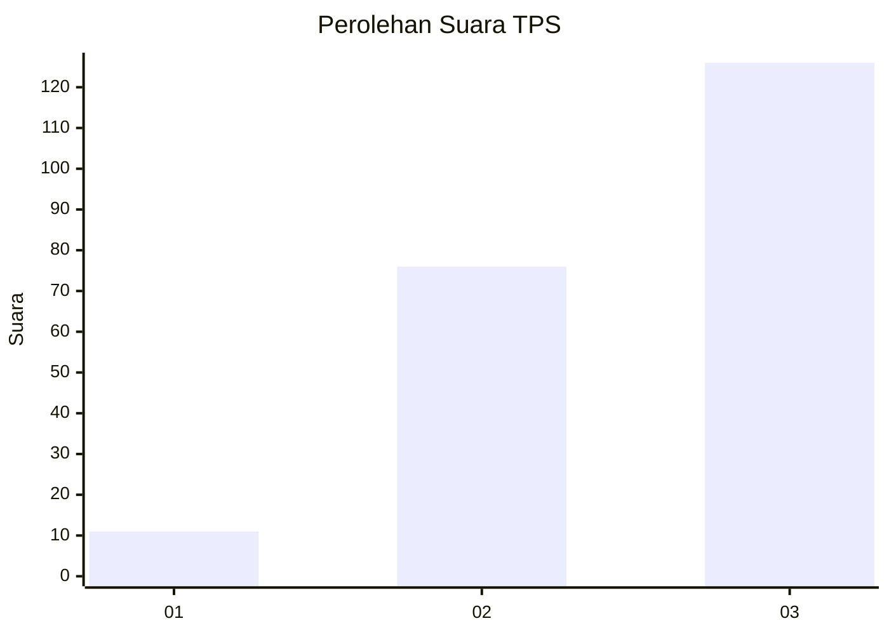
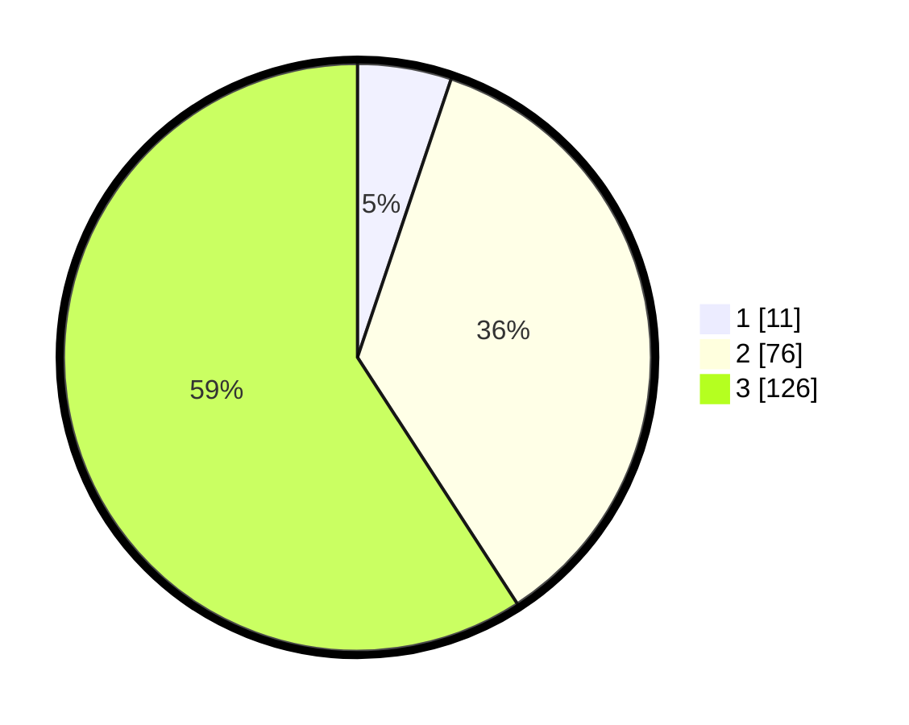

# Hasil

## Grafik

## Tabel

| No. | Nama Paslon    | Suara | Suara (raw) | Persentase |
|:--- |:-------------- | -----:| -----------:| ----------:|
| 1   | ANIES MUHAIMIN | 11    | [11][p-1]   | 5,16       |
| 2   | PRABOWO GIBRAN | 76    | [76][p-2]   | 35,68      |
| 3   | GANJAR MAHFUD  | 126   | [126][p-3]  | 59,15      |

[p-1]: https://github.com/gigit-pemilu/pemilu-2024-33-jawa-tengah/blob/main/pilpres/hitung-suara/sub/33-jawa-tengah/sub/03-purbalingga/sub/03-kejobong/sub/2011-nangkod/sub/007-tps/sub/paslon-1.txt
[p-2]: https://github.com/gigit-pemilu/pemilu-2024-33-jawa-tengah/blob/main/pilpres/hitung-suara/sub/33-jawa-tengah/sub/03-purbalingga/sub/03-kejobong/sub/2011-nangkod/sub/007-tps/sub/paslon-2.txt
[p-3]: https://github.com/gigit-pemilu/pemilu-2024-33-jawa-tengah/blob/main/pilpres/hitung-suara/sub/33-jawa-tengah/sub/03-purbalingga/sub/03-kejobong/sub/2011-nangkod/sub/007-tps/sub/paslon-3.txt

## Foto C Plano

https://sirekap-obj-formc.kpu.go.id/f176/pemilu/ppwp/33/03/03/20/11/3303032011007-20240214-155826--d1930b48-1e7a-4e78-834e-44608eac144e.jpg

https://sirekap-obj-formc.kpu.go.id/f176/pemilu/ppwp/33/03/03/20/11/3303032011007-20240215-183417--843852d7-deea-42a9-86dc-475331ddc57f.jpg

https://sirekap-obj-formc.kpu.go.id/f176/pemilu/ppwp/33/03/03/20/11/3303032011007-20240214-160108--42a769c6-0d32-4b79-bed0-591982d25500.jpg

## Metadata

| Key        | Value               |
| ---------- | ------------------- |
| Time Stamp | 2024-02-16 16:25:10 |

