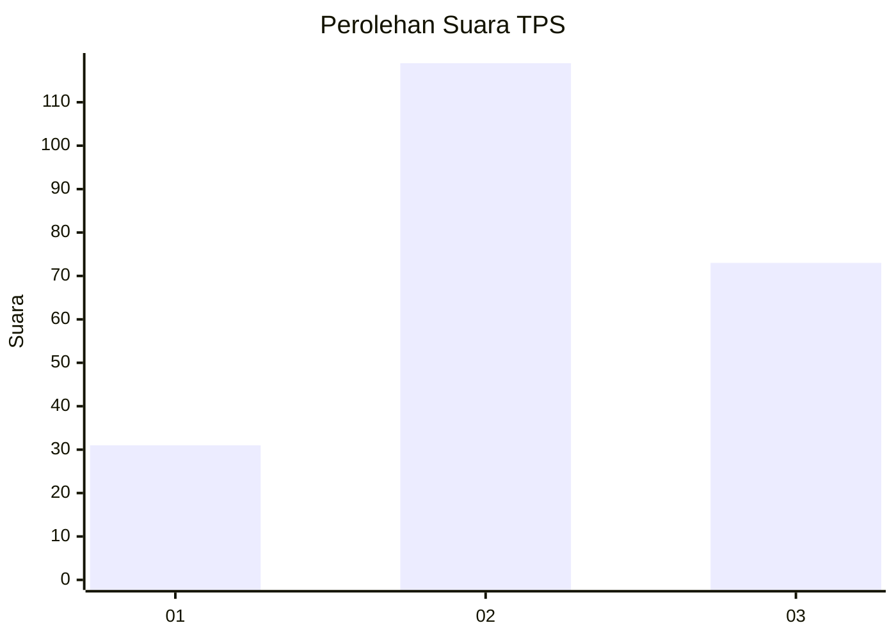
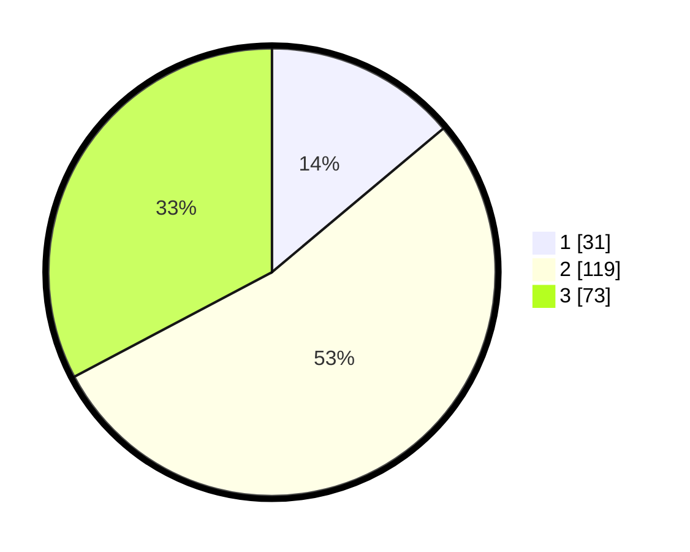

# Hasil

## Grafik

## Tabel

| No. | Nama Paslon    | Suara | Suara (raw) | Persentase |
|:--- |:-------------- | -----:| -----------:| ----------:|
| 1   | ANIES MUHAIMIN | 31    | [31][p-1]   | 13,90      |
| 2   | PRABOWO GIBRAN | 119   | [119][p-2]  | 53,36      |
| 3   | GANJAR MAHFUD  | 73    | [73][p-3]   | 32,74      |

[p-1]: https://github.com/gigit-pemilu/pemilu-2024/blob/main/pilpres/hitung-suara/sub/33-jawa-tengah/sub/03-purbalingga/sub/04-kaligondang/sub/2001-lamongan/sub/003-tps/sub/paslon-1.txt
[p-2]: https://github.com/gigit-pemilu/pemilu-2024/blob/main/pilpres/hitung-suara/sub/33-jawa-tengah/sub/03-purbalingga/sub/04-kaligondang/sub/2001-lamongan/sub/003-tps/sub/paslon-2.txt
[p-3]: https://github.com/gigit-pemilu/pemilu-2024/blob/main/pilpres/hitung-suara/sub/33-jawa-tengah/sub/03-purbalingga/sub/04-kaligondang/sub/2001-lamongan/sub/003-tps/sub/paslon-3.txt

## Foto C Plano

https://sirekap-obj-formc.kpu.go.id/aeee/pemilu/ppwp/33/03/04/20/01/3303042001003-20240218-134103--1500421c-fd22-4507-aa43-3a5aa40e740e.jpg

https://sirekap-obj-formc.kpu.go.id/aeee/pemilu/ppwp/33/03/04/20/01/3303042001003-20240217-204635--1f886156-59ca-49a6-b77f-a5ee0d1d3a3c.jpg

https://sirekap-obj-formc.kpu.go.id/aeee/pemilu/ppwp/33/03/04/20/01/3303042001003-20240217-205713--17d5b95e-0c12-4ae7-9a3a-e207d11faf39.jpg

## Metadata

| Key        | Value               |
| ---------- | ------------------- |
| Time Stamp | 2024-02-19 06:16:00 |

