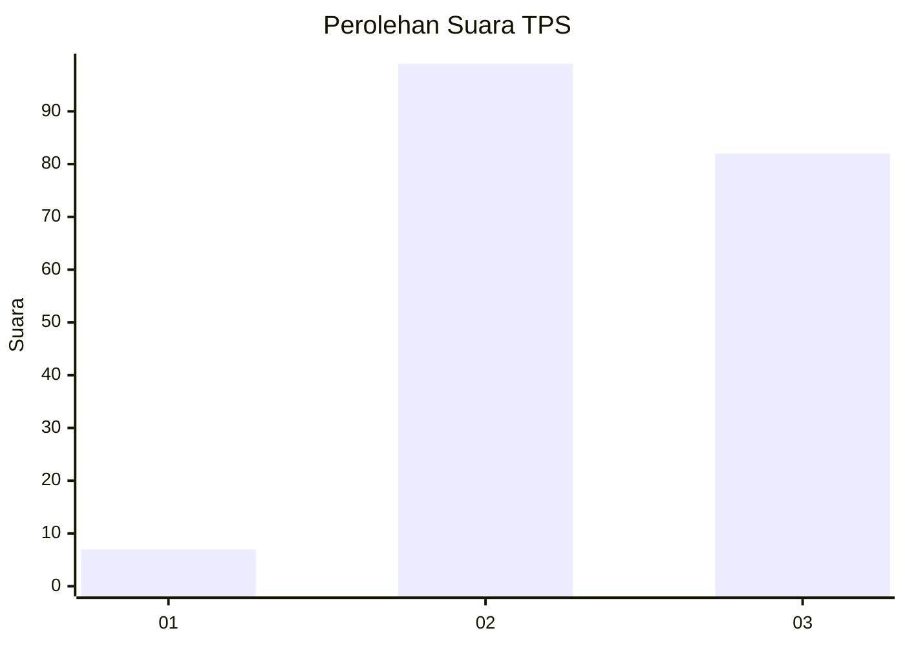
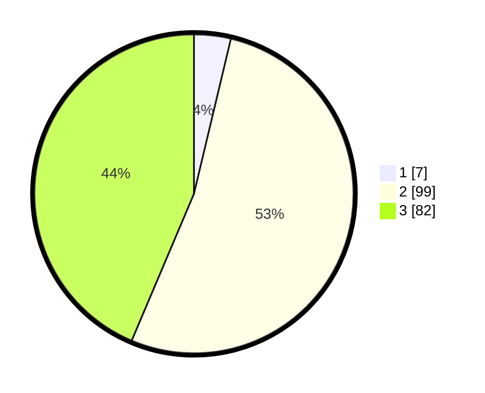

# Hasil

## Grafik

## Tabel

| No. | Nama Paslon    | Suara | Suara (raw) | Persentase |
|:--- |:-------------- | -----:| -----------:| ----------:|
| 1   | ANIES MUHAIMIN | 7     | [7][p-1]    | 3,72       |
| 2   | PRABOWO GIBRAN | 99    | [99][p-2]   | 52,66      |
| 3   | GANJAR MAHFUD  | 82    | [82][p-3]   | 43,62      |

[p-1]: https://github.com/gigit-pemilu/pemilu-2024/blob/main/pilpres/hitung-suara/sub/33-jawa-tengah/sub/03-purbalingga/sub/04-kaligondang/sub/2006-selakambang/sub/003-tps/sub/paslon-1.txt
[p-2]: https://github.com/gigit-pemilu/pemilu-2024/blob/main/pilpres/hitung-suara/sub/33-jawa-tengah/sub/03-purbalingga/sub/04-kaligondang/sub/2006-selakambang/sub/003-tps/sub/paslon-2.txt
[p-3]: https://github.com/gigit-pemilu/pemilu-2024/blob/main/pilpres/hitung-suara/sub/33-jawa-tengah/sub/03-purbalingga/sub/04-kaligondang/sub/2006-selakambang/sub/003-tps/sub/paslon-3.txt

## Foto C Plano

https://sirekap-obj-formc.kpu.go.id/fbd1/pemilu/ppwp/33/03/04/20/06/3303042006003-20240215-045555--73cf5648-ef21-493e-8d05-dcd9315e3794.jpg

https://sirekap-obj-formc.kpu.go.id/fbd1/pemilu/ppwp/33/03/04/20/06/3303042006003-20240215-045712--52ff17a0-c7b4-462c-8b18-dc5c05da02b5.jpg

https://sirekap-obj-formc.kpu.go.id/fbd1/pemilu/ppwp/33/03/04/20/06/3303042006003-20240215-045830--dd0d9892-321f-4dbb-8d2b-5e815641be77.jpg

## Metadata

| Key        | Value               |
| ---------- | ------------------- |
| Time Stamp | 2024-02-15 21:30:27 |

