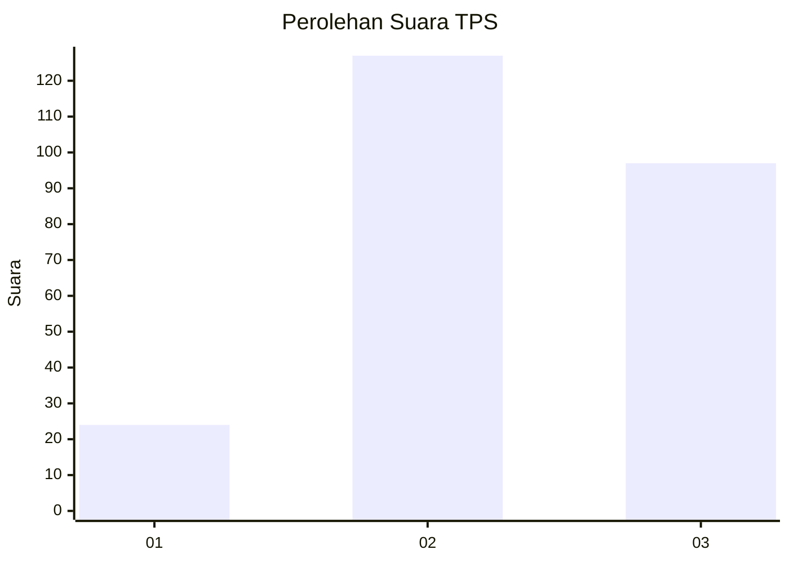
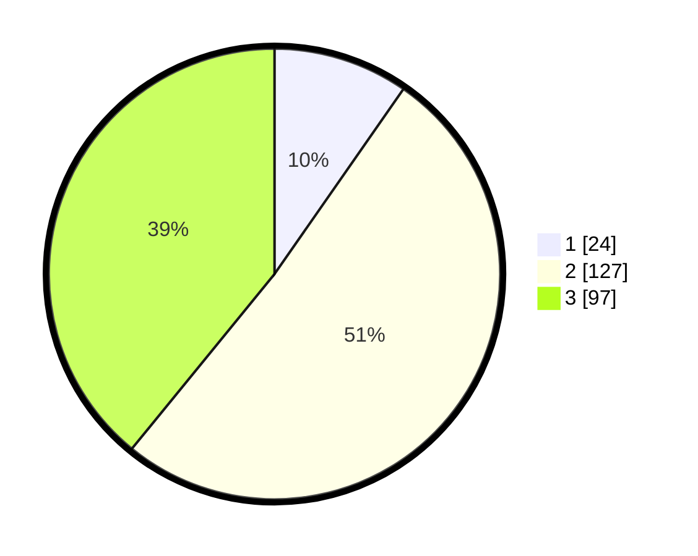

# Hasil

## Grafik

## Tabel

| No. | Nama Paslon    | Suara | Suara (raw) | Persentase |
|:--- |:-------------- | -----:| -----------:| ----------:|
| 1   | ANIES MUHAIMIN | 24    | [24][p-1]   | 9,68       |
| 2   | PRABOWO GIBRAN | 127   | [127][p-2]  | 51,21      |
| 3   | GANJAR MAHFUD  | 97    | [97][p-3]   | 39,11      |

[p-1]: https://github.com/gigit-pemilu/pemilu-2024-33-jawa-tengah/blob/main/pilpres/hitung-suara/sub/33-jawa-tengah/sub/03-purbalingga/sub/04-kaligondang/sub/2009-brecek/sub/003-tps/sub/paslon-1.txt
[p-2]: https://github.com/gigit-pemilu/pemilu-2024-33-jawa-tengah/blob/main/pilpres/hitung-suara/sub/33-jawa-tengah/sub/03-purbalingga/sub/04-kaligondang/sub/2009-brecek/sub/003-tps/sub/paslon-2.txt
[p-3]: https://github.com/gigit-pemilu/pemilu-2024-33-jawa-tengah/blob/main/pilpres/hitung-suara/sub/33-jawa-tengah/sub/03-purbalingga/sub/04-kaligondang/sub/2009-brecek/sub/003-tps/sub/paslon-3.txt

## Foto C Plano

https://sirekap-obj-formc.kpu.go.id/7666/pemilu/ppwp/33/03/04/20/09/3303042009003-20240214-205006--e5b8df60-2c06-4bf7-91fc-6310c98d9013.jpg

https://sirekap-obj-formc.kpu.go.id/7666/pemilu/ppwp/33/03/04/20/09/3303042009003-20240214-205153--3279fd63-2c3c-4509-8677-2c46cdfe8f7d.jpg

https://sirekap-obj-formc.kpu.go.id/7666/pemilu/ppwp/33/03/04/20/09/3303042009003-20240214-215339--af19e005-54f8-46e3-b5b4-a913137325c2.jpg

## Metadata

| Key        | Value               |
| ---------- | ------------------- |
| Time Stamp | 2024-02-15 04:00:24 |

