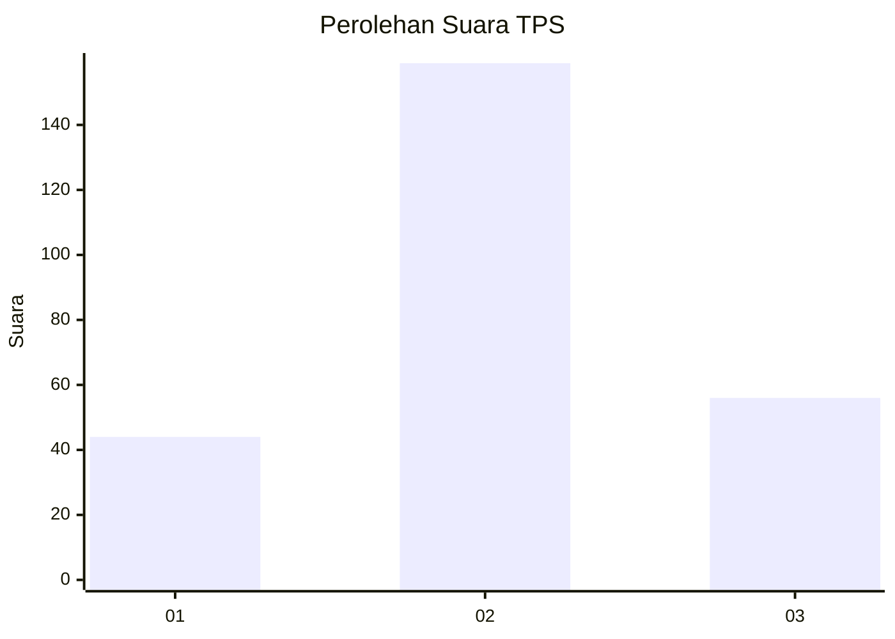
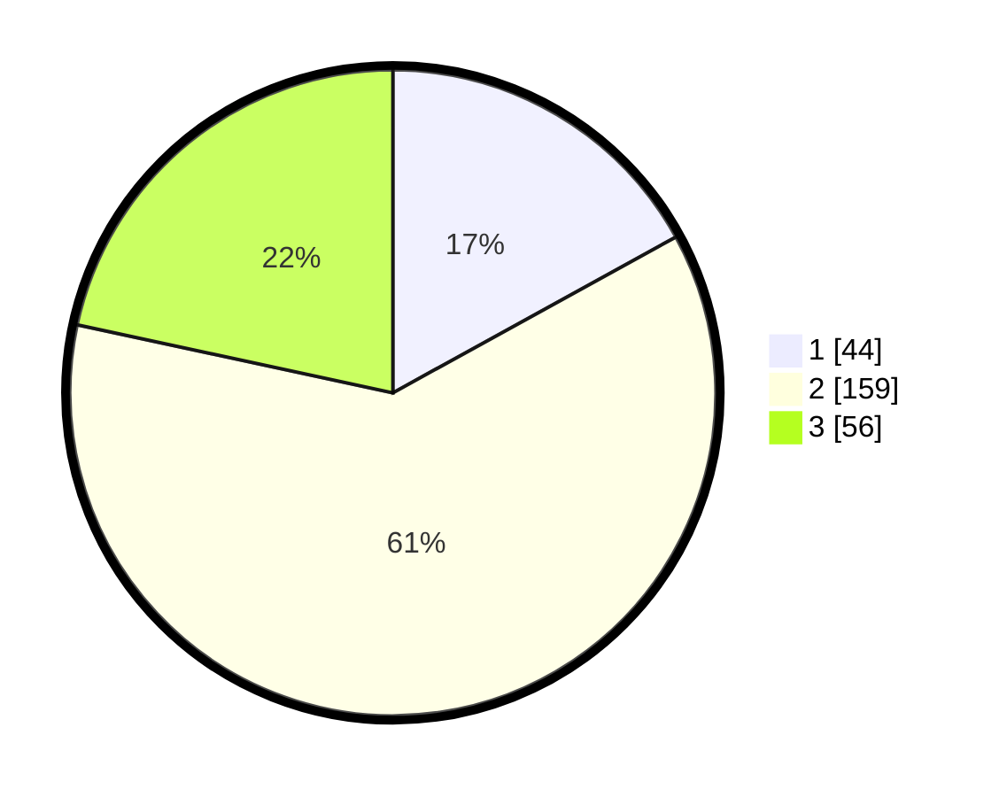

# Hasil

## Grafik

## Tabel

| No. | Nama Paslon    | Suara | Suara (raw) | Persentase |
|:--- |:-------------- | -----:| -----------:| ----------:|
| 1   | ANIES MUHAIMIN | 44    | [44][p-1]   | 16,99      |
| 2   | PRABOWO GIBRAN | 159   | [159][p-2]  | 61,39      |
| 3   | GANJAR MAHFUD  | 56    | [56][p-3]   | 21,62      |

[p-1]: https://github.com/gigit-pemilu/pemilu-2024/blob/main/pilpres/hitung-suara/sub/33-jawa-tengah/sub/03-purbalingga/sub/04-kaligondang/sub/2011-penaruban/sub/002-tps/sub/paslon-1.txt
[p-2]: https://github.com/gigit-pemilu/pemilu-2024/blob/main/pilpres/hitung-suara/sub/33-jawa-tengah/sub/03-purbalingga/sub/04-kaligondang/sub/2011-penaruban/sub/002-tps/sub/paslon-2.txt
[p-3]: https://github.com/gigit-pemilu/pemilu-2024/blob/main/pilpres/hitung-suara/sub/33-jawa-tengah/sub/03-purbalingga/sub/04-kaligondang/sub/2011-penaruban/sub/002-tps/sub/paslon-3.txt

## Foto C Plano

https://sirekap-obj-formc.kpu.go.id/3cf2/pemilu/ppwp/33/03/04/20/11/3303042011002-20240215-010942--3c843578-9ba3-4bbe-a310-7f65d7834e2b.jpg

https://sirekap-obj-formc.kpu.go.id/3cf2/pemilu/ppwp/33/03/04/20/11/3303042011002-20240215-011306--9ba816ec-a225-4c51-8926-53cfee1cdbbe.jpg

https://sirekap-obj-formc.kpu.go.id/3cf2/pemilu/ppwp/33/03/04/20/11/3303042011002-20240215-011355--d70242c8-3485-43e7-b50f-b9e01623ff17.jpg

## Metadata

| Key        | Value               |
| ---------- | ------------------- |
| Time Stamp | 2024-02-15 18:00:26 |

