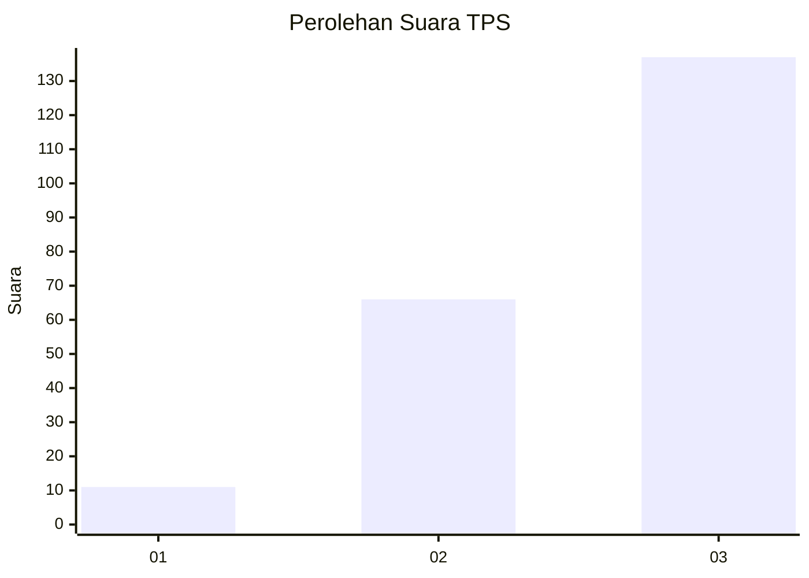
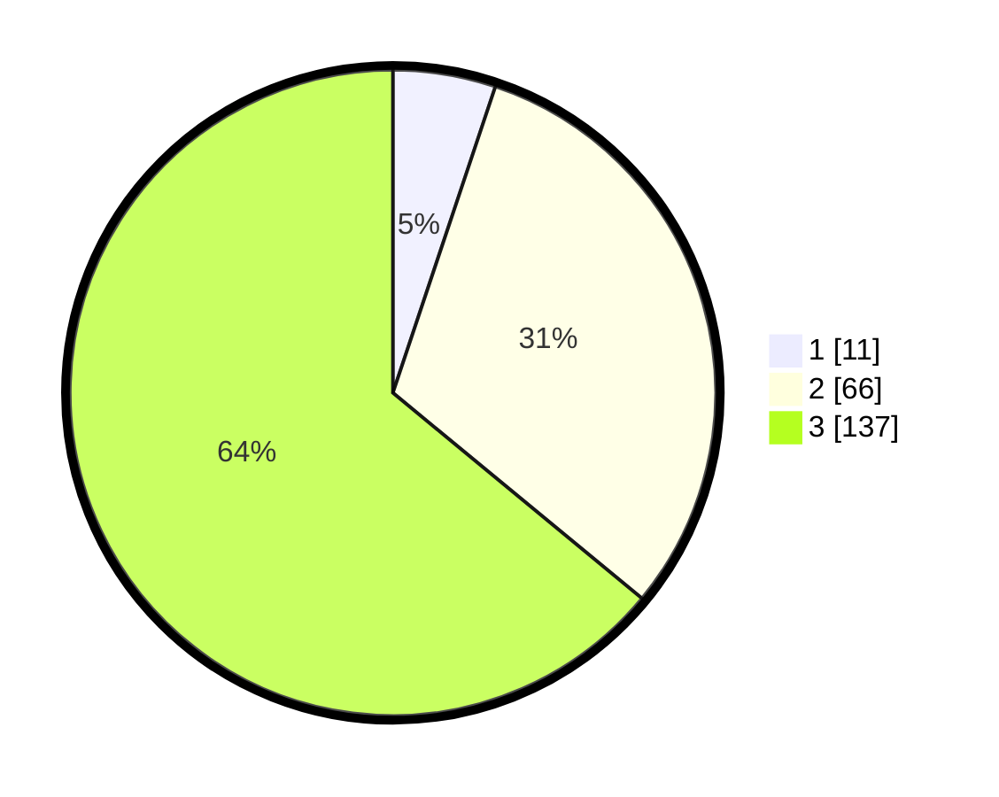

# Hasil

## Grafik

## Tabel

| No. | Nama Paslon    | Suara | Suara (raw) | Persentase |
|:--- |:-------------- | -----:| -----------:| ----------:|
| 1   | ANIES MUHAIMIN | 11    | [11][p-1]   | 5,14       |
| 2   | PRABOWO GIBRAN | 66    | [66][p-2]   | 30,84      |
| 3   | GANJAR MAHFUD  | 137   | [137][p-3]  | 64,02      |

[p-1]: https://github.com/gigit-pemilu/pemilu-2024-33-jawa-tengah/blob/main/pilpres/hitung-suara/sub/33-jawa-tengah/sub/03-purbalingga/sub/04-kaligondang/sub/2016-sidanegara/sub/007-tps/sub/paslon-1.txt
[p-2]: https://github.com/gigit-pemilu/pemilu-2024-33-jawa-tengah/blob/main/pilpres/hitung-suara/sub/33-jawa-tengah/sub/03-purbalingga/sub/04-kaligondang/sub/2016-sidanegara/sub/007-tps/sub/paslon-2.txt
[p-3]: https://github.com/gigit-pemilu/pemilu-2024-33-jawa-tengah/blob/main/pilpres/hitung-suara/sub/33-jawa-tengah/sub/03-purbalingga/sub/04-kaligondang/sub/2016-sidanegara/sub/007-tps/sub/paslon-3.txt

## Foto C Plano

https://sirekap-obj-formc.kpu.go.id/cdbe/pemilu/ppwp/33/03/04/20/16/3303042016007-20240219-190132--9406495f-b28a-4d61-b4bd-6ac2913ccce2.jpg

https://sirekap-obj-formc.kpu.go.id/cdbe/pemilu/ppwp/33/03/04/20/16/3303042016007-20240219-191308--ec90e77f-7af8-42a2-a8fa-f992cfc4262b.jpg

https://sirekap-obj-formc.kpu.go.id/cdbe/pemilu/ppwp/33/03/04/20/16/3303042016007-20240219-185757--c9f55019-64f2-4795-8cb6-fdcdd88b3086.jpg

## Metadata

| Key        | Value               |
| ---------- | ------------------- |
| Time Stamp | 2024-02-25 12:00:00 |

