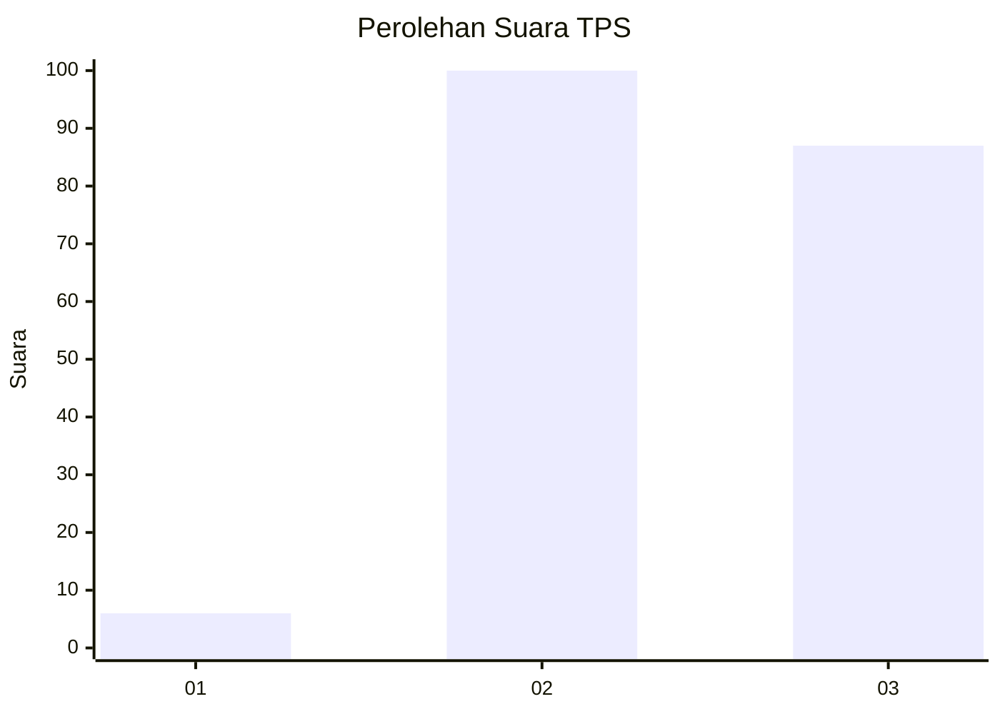
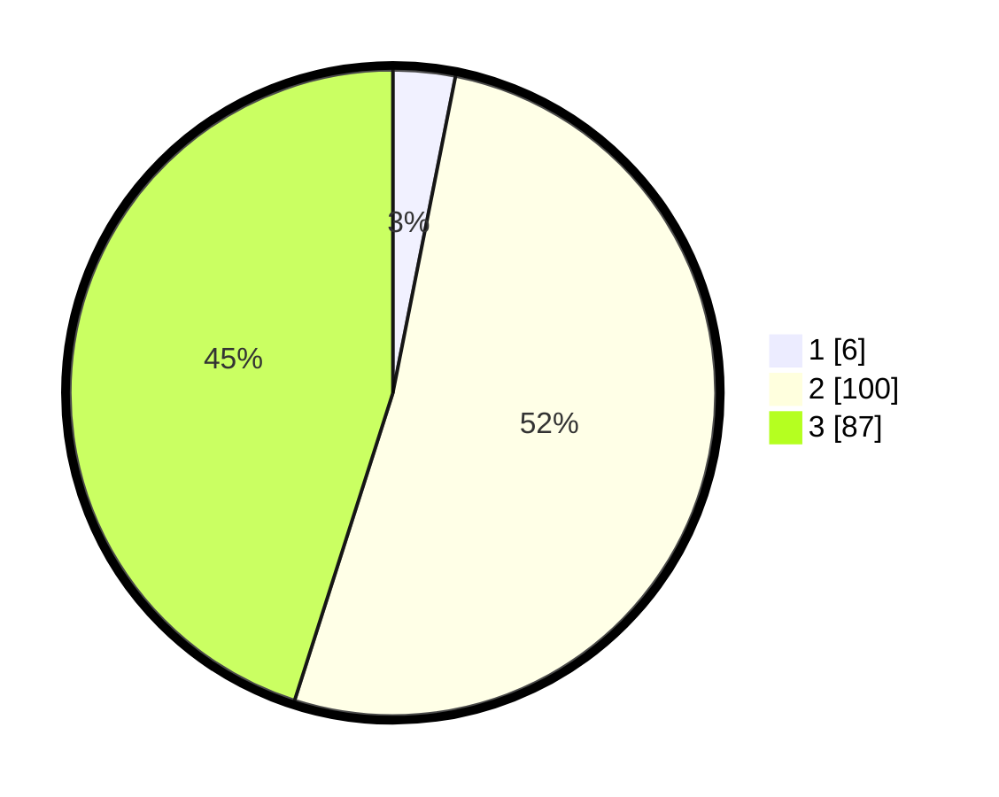

# Hasil

## Grafik

## Tabel

| No. | Nama Paslon    | Suara | Suara (raw) | Persentase |
|:--- |:-------------- | -----:| -----------:| ----------:|
| 1   | ANIES MUHAIMIN | 6     | [6][p-1]    | 3,11       |
| 2   | PRABOWO GIBRAN | 100   | [100][p-2]  | 51,81      |
| 3   | GANJAR MAHFUD  | 87    | [87][p-3]   | 45,08      |

[p-1]: https://github.com/gigit-pemilu/pemilu-2024/blob/main/pilpres/hitung-suara/sub/33-jawa-tengah/sub/03-purbalingga/sub/04-kaligondang/sub/2017-pagerandong/sub/003-tps/sub/paslon-1.txt
[p-2]: https://github.com/gigit-pemilu/pemilu-2024/blob/main/pilpres/hitung-suara/sub/33-jawa-tengah/sub/03-purbalingga/sub/04-kaligondang/sub/2017-pagerandong/sub/003-tps/sub/paslon-2.txt
[p-3]: https://github.com/gigit-pemilu/pemilu-2024/blob/main/pilpres/hitung-suara/sub/33-jawa-tengah/sub/03-purbalingga/sub/04-kaligondang/sub/2017-pagerandong/sub/003-tps/sub/paslon-3.txt

## Foto C Plano

https://sirekap-obj-formc.kpu.go.id/7aeb/pemilu/ppwp/33/03/04/20/17/3303042017003-20240214-232816--724b6c7f-0ed4-465e-b10b-ef1e930cbdb4.jpg

https://sirekap-obj-formc.kpu.go.id/7aeb/pemilu/ppwp/33/03/04/20/17/3303042017003-20240214-232911--92b7e7ea-f4c7-41ae-ade4-77e3e60cd4d1.jpg

https://sirekap-obj-formc.kpu.go.id/7aeb/pemilu/ppwp/33/03/04/20/17/3303042017003-20240214-233038--fb9cd1ad-1b1a-436a-9289-9fc5ea953a51.jpg

## Metadata

| Key        | Value               |
| ---------- | ------------------- |
| Time Stamp | 2024-02-16 21:01:00 |

