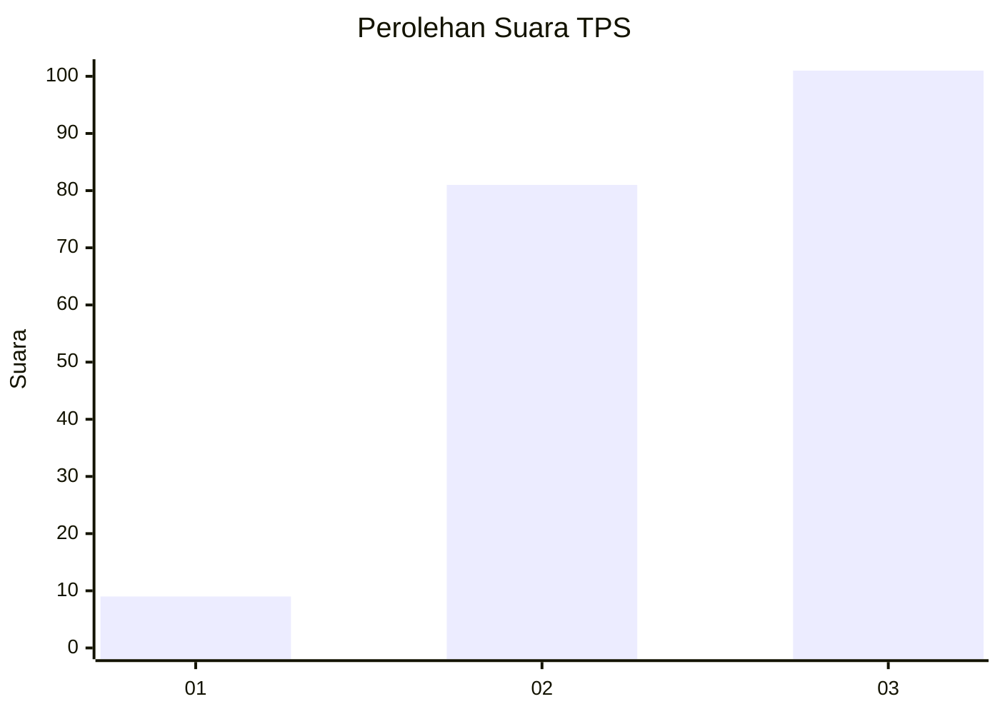
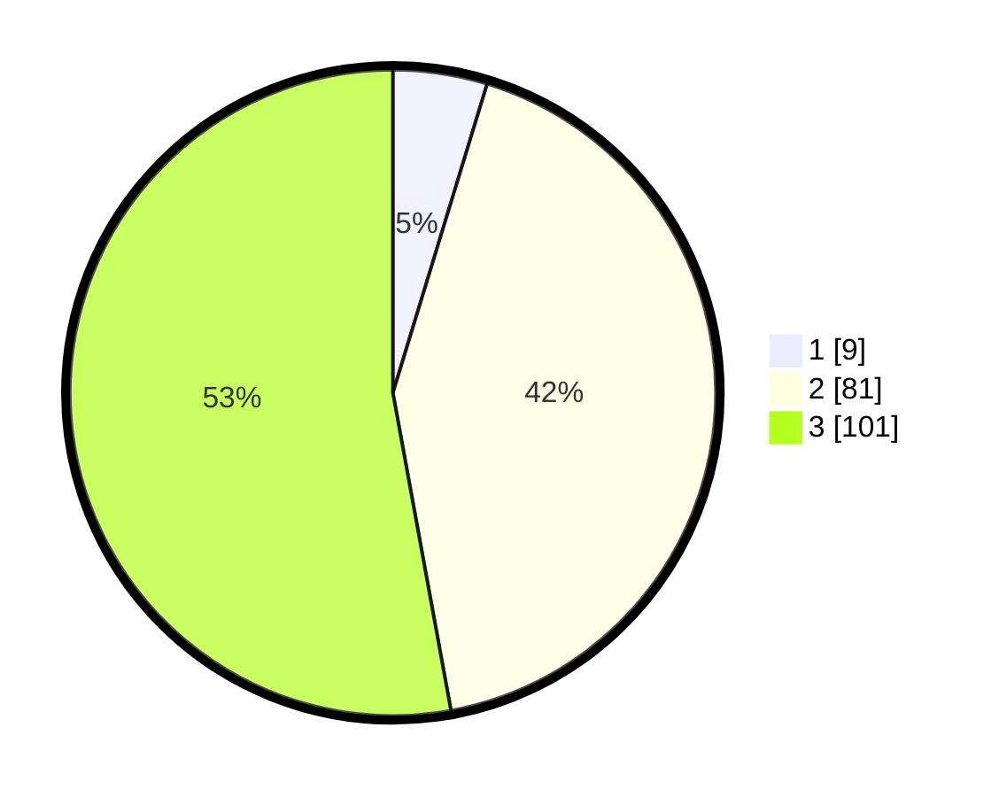

# Hasil

## Grafik

## Tabel

| No. | Nama Paslon    | Suara | Suara (raw) | Persentase |
|:--- |:-------------- | -----:| -----------:| ----------:|
| 1   | ANIES MUHAIMIN | 9     | [9][p-1]    | 4,71       |
| 2   | PRABOWO GIBRAN | 81    | [81][p-2]   | 42,41      |
| 3   | GANJAR MAHFUD  | 101   | [101][p-3]  | 52,88      |

[p-1]: https://github.com/gigit-pemilu/pemilu-2024/blob/main/pilpres/hitung-suara/sub/33-jawa-tengah/sub/03-purbalingga/sub/04-kaligondang/sub/2017-pagerandong/sub/005-tps/sub/paslon-1.txt
[p-2]: https://github.com/gigit-pemilu/pemilu-2024/blob/main/pilpres/hitung-suara/sub/33-jawa-tengah/sub/03-purbalingga/sub/04-kaligondang/sub/2017-pagerandong/sub/005-tps/sub/paslon-2.txt
[p-3]: https://github.com/gigit-pemilu/pemilu-2024/blob/main/pilpres/hitung-suara/sub/33-jawa-tengah/sub/03-purbalingga/sub/04-kaligondang/sub/2017-pagerandong/sub/005-tps/sub/paslon-3.txt

## Foto C Plano

https://sirekap-obj-formc.kpu.go.id/bc03/pemilu/ppwp/33/03/04/20/17/3303042017005-20240214-201906--a131253a-ce31-4903-b511-fec7c135fb9d.jpg

https://sirekap-obj-formc.kpu.go.id/bc03/pemilu/ppwp/33/03/04/20/17/3303042017005-20240214-202049--cdecb894-bd1c-4607-b33d-8fecc43d2734.jpg

https://sirekap-obj-formc.kpu.go.id/bc03/pemilu/ppwp/33/03/04/20/17/3303042017005-20240214-202141--8a57f5ad-88bb-4c0f-a341-445bf091d424.jpg

## Metadata

| Key        | Value               |
| ---------- | ------------------- |
| Time Stamp | 2024-02-16 21:01:00 |

