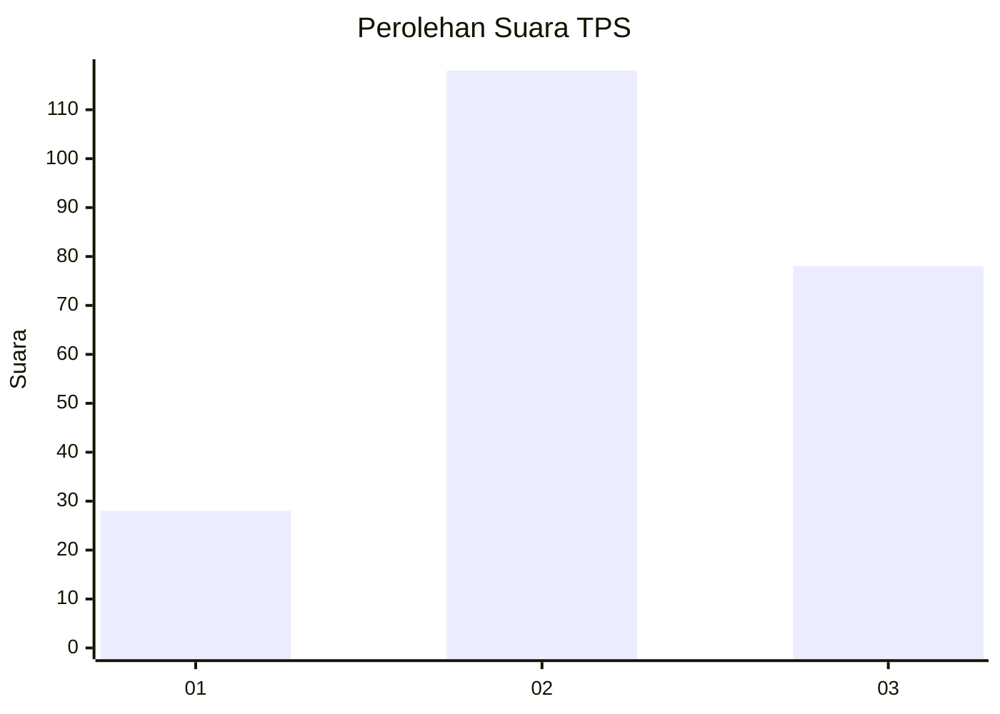
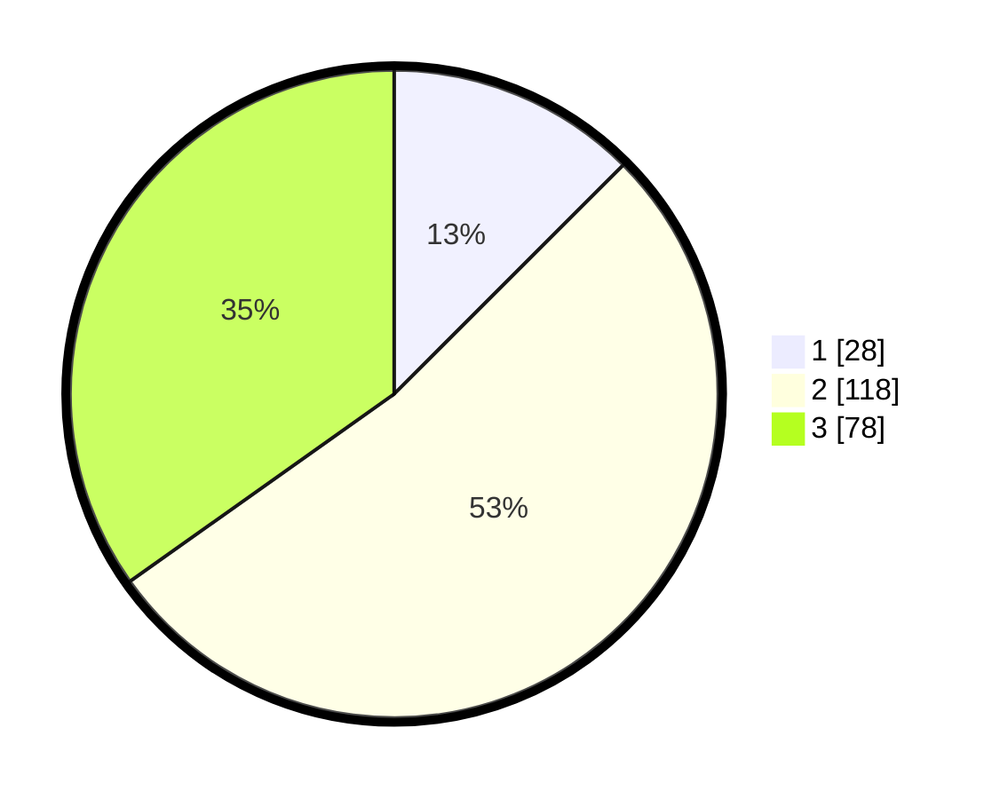

# Hasil

## Grafik

## Tabel

| No. | Nama Paslon    | Suara | Suara (raw) | Persentase |
|:--- |:-------------- | -----:| -----------:| ----------:|
| 1   | ANIES MUHAIMIN | 28    | [28][p-1]   | 12,50      |
| 2   | PRABOWO GIBRAN | 118   | [118][p-2]  | 52,68      |
| 3   | GANJAR MAHFUD  | 78    | [78][p-3]   | 34,82      |

[p-1]: https://github.com/gigit-pemilu/pemilu-2024/blob/main/pilpres/hitung-suara/sub/33-jawa-tengah/sub/03-purbalingga/sub/05-purbalingga/sub/1001-bojong/sub/002-tps/sub/paslon-1.txt
[p-2]: https://github.com/gigit-pemilu/pemilu-2024/blob/main/pilpres/hitung-suara/sub/33-jawa-tengah/sub/03-purbalingga/sub/05-purbalingga/sub/1001-bojong/sub/002-tps/sub/paslon-2.txt
[p-3]: https://github.com/gigit-pemilu/pemilu-2024/blob/main/pilpres/hitung-suara/sub/33-jawa-tengah/sub/03-purbalingga/sub/05-purbalingga/sub/1001-bojong/sub/002-tps/sub/paslon-3.txt

## Foto C Plano

https://sirekap-obj-formc.kpu.go.id/9be1/pemilu/ppwp/33/03/05/10/01/3303051001002-20240215-065459--382e9a1f-c0c7-4a40-89cc-bc40f6faf18f.jpg

https://sirekap-obj-formc.kpu.go.id/9be1/pemilu/ppwp/33/03/05/10/01/3303051001002-20240215-065629--0e63a617-83f3-4c18-b14e-4c074cd3a4d0.jpg

https://sirekap-obj-formc.kpu.go.id/9be1/pemilu/ppwp/33/03/05/10/01/3303051001002-20240215-065751--8ffca421-c816-4361-b976-670ba1fbc422.jpg

## Metadata

| Key        | Value               |
| ---------- | ------------------- |
| Time Stamp | 2024-02-16 21:01:00 |

