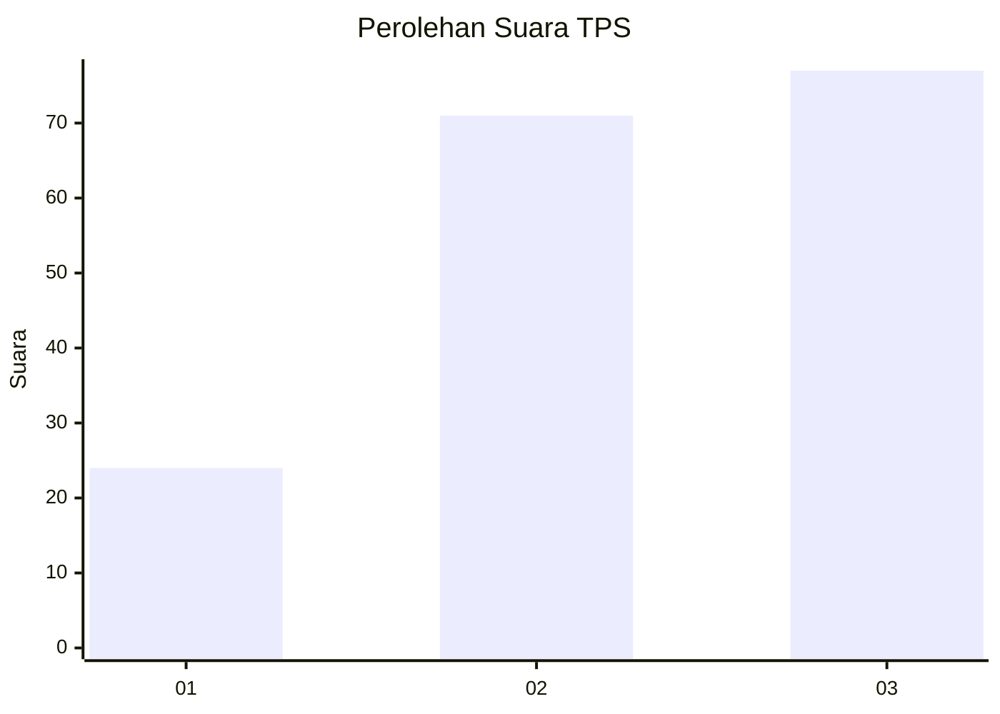
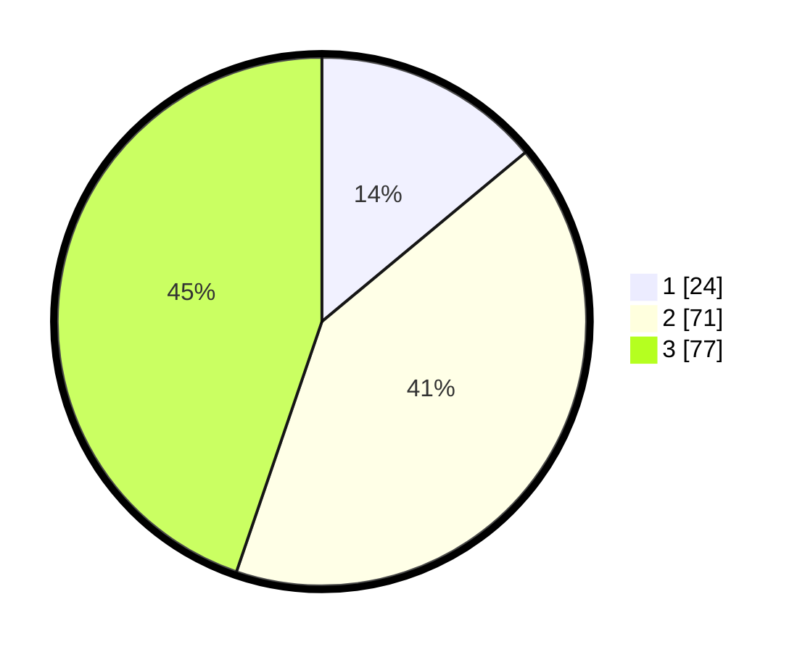

# Hasil

## Grafik

## Tabel

| No. | Nama Paslon    | Suara | Suara (raw) | Persentase |
|:--- |:-------------- | -----:| -----------:| ----------:|
| 1   | ANIES MUHAIMIN | 24    | [24][p-1]   | 13,95      |
| 2   | PRABOWO GIBRAN | 71    | [71][p-2]   | 41,28      |
| 3   | GANJAR MAHFUD  | 77    | [77][p-3]   | 44,77      |

[p-1]: https://github.com/gigit-pemilu/pemilu-2024-33-jawa-tengah/blob/main/pilpres/hitung-suara/sub/33-jawa-tengah/sub/03-purbalingga/sub/05-purbalingga/sub/1005-bancar/sub/001-tps/sub/paslon-1.txt
[p-2]: https://github.com/gigit-pemilu/pemilu-2024-33-jawa-tengah/blob/main/pilpres/hitung-suara/sub/33-jawa-tengah/sub/03-purbalingga/sub/05-purbalingga/sub/1005-bancar/sub/001-tps/sub/paslon-2.txt
[p-3]: https://github.com/gigit-pemilu/pemilu-2024-33-jawa-tengah/blob/main/pilpres/hitung-suara/sub/33-jawa-tengah/sub/03-purbalingga/sub/05-purbalingga/sub/1005-bancar/sub/001-tps/sub/paslon-3.txt

## Foto C Plano

https://sirekap-obj-formc.kpu.go.id/e719/pemilu/ppwp/33/03/05/10/05/3303051005001-20240214-155021--a4d38bf6-56e1-4966-a7dd-c1c847d0eff2.jpg

https://sirekap-obj-formc.kpu.go.id/e719/pemilu/ppwp/33/03/05/10/05/3303051005001-20240215-031833--35172922-9339-416c-9950-38beff7b4839.jpg

https://sirekap-obj-formc.kpu.go.id/e719/pemilu/ppwp/33/03/05/10/05/3303051005001-20240215-052012--0a40e0bf-a85b-4287-974d-6769fb1fd893.jpg

## Metadata

| Key        | Value               |
| ---------- | ------------------- |
| Time Stamp | 2024-02-15 06:00:23 |

