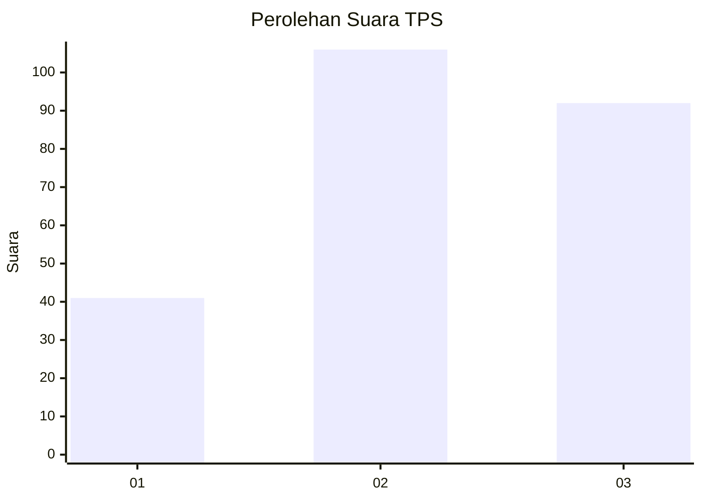
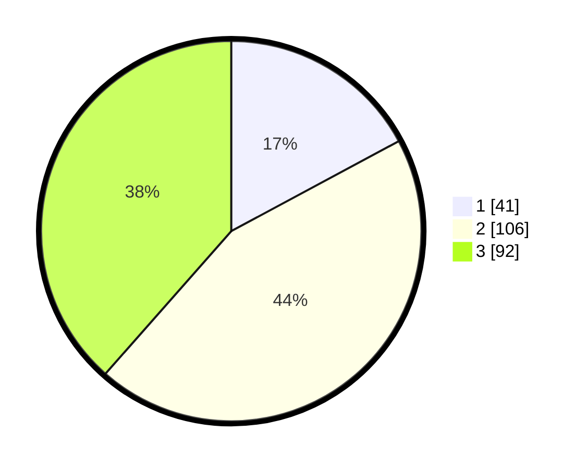

# Hasil

## Grafik

## Tabel

| No. | Nama Paslon    | Suara | Suara (raw) | Persentase |
|:--- |:-------------- | -----:| -----------:| ----------:|
| 1   | ANIES MUHAIMIN | 41    | [41][p-1]   | 17,15      |
| 2   | PRABOWO GIBRAN | 106   | [106][p-2]  | 44,35      |
| 3   | GANJAR MAHFUD  | 92    | [92][p-3]   | 38,49      |

[p-1]: https://github.com/gigit-pemilu/pemilu-2024/blob/main/pilpres/hitung-suara/sub/33-jawa-tengah/sub/03-purbalingga/sub/05-purbalingga/sub/1006-purbalingga-wetan/sub/001-tps/sub/paslon-1.txt
[p-2]: https://github.com/gigit-pemilu/pemilu-2024/blob/main/pilpres/hitung-suara/sub/33-jawa-tengah/sub/03-purbalingga/sub/05-purbalingga/sub/1006-purbalingga-wetan/sub/001-tps/sub/paslon-2.txt
[p-3]: https://github.com/gigit-pemilu/pemilu-2024/blob/main/pilpres/hitung-suara/sub/33-jawa-tengah/sub/03-purbalingga/sub/05-purbalingga/sub/1006-purbalingga-wetan/sub/001-tps/sub/paslon-3.txt

## Foto C Plano

https://sirekap-obj-formc.kpu.go.id/e505/pemilu/ppwp/33/03/05/10/06/3303051006001-20240214-191601--32c28d1e-5f42-42de-8559-8960594b719f.jpg

https://sirekap-obj-formc.kpu.go.id/e505/pemilu/ppwp/33/03/05/10/06/3303051006001-20240214-190958--2f6b9b6f-a78a-4b00-a450-261c90a89bee.jpg

https://sirekap-obj-formc.kpu.go.id/e505/pemilu/ppwp/33/03/05/10/06/3303051006001-20240214-222142--6ea4f353-b853-467d-b471-da698dc1a76b.jpg

## Metadata

| Key        | Value               |
| ---------- | ------------------- |
| Time Stamp | 2024-02-15 00:41:44 |

