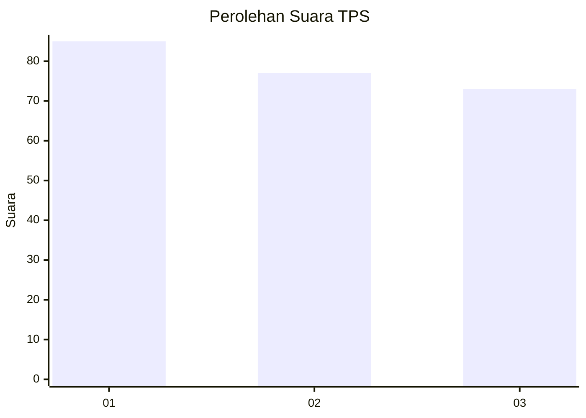
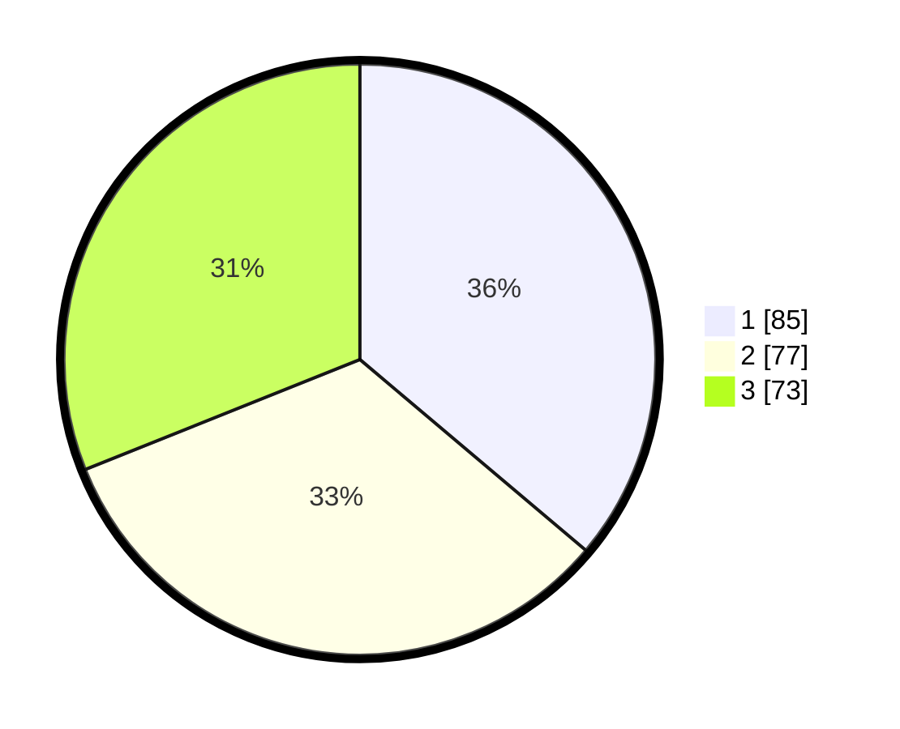

# Hasil

## Grafik

## Tabel

| No. | Nama Paslon    | Suara | Suara (raw) | Persentase |
|:--- |:-------------- | -----:| -----------:| ----------:|
| 1   | ANIES MUHAIMIN | 85    | [85][p-1]   | 36,17      |
| 2   | PRABOWO GIBRAN | 77    | [77][p-2]   | 32,77      |
| 3   | GANJAR MAHFUD  | 73    | [73][p-3]   | 31,06      |

[p-1]: https://github.com/gigit-pemilu/pemilu-2024/blob/main/pilpres/hitung-suara/sub/33-jawa-tengah/sub/03-purbalingga/sub/05-purbalingga/sub/1006-purbalingga-wetan/sub/004-tps/sub/paslon-1.txt
[p-2]: https://github.com/gigit-pemilu/pemilu-2024/blob/main/pilpres/hitung-suara/sub/33-jawa-tengah/sub/03-purbalingga/sub/05-purbalingga/sub/1006-purbalingga-wetan/sub/004-tps/sub/paslon-2.txt
[p-3]: https://github.com/gigit-pemilu/pemilu-2024/blob/main/pilpres/hitung-suara/sub/33-jawa-tengah/sub/03-purbalingga/sub/05-purbalingga/sub/1006-purbalingga-wetan/sub/004-tps/sub/paslon-3.txt

## Foto C Plano

https://sirekap-obj-formc.kpu.go.id/f197/pemilu/ppwp/33/03/05/10/06/3303051006004-20240214-215225--189374cb-f571-4412-944b-3831ba4fc53c.jpg

https://sirekap-obj-formc.kpu.go.id/f197/pemilu/ppwp/33/03/05/10/06/3303051006004-20240214-201606--46eb130b-5ee7-4a8b-9718-3dfc2b21e2d1.jpg

https://sirekap-obj-formc.kpu.go.id/f197/pemilu/ppwp/33/03/05/10/06/3303051006004-20240215-034939--fdecde4b-a29b-4ee1-bed6-7a5e5822d7b1.jpg

## Metadata

| Key        | Value               |
| ---------- | ------------------- |
| Time Stamp | 2024-02-16 21:01:00 |

