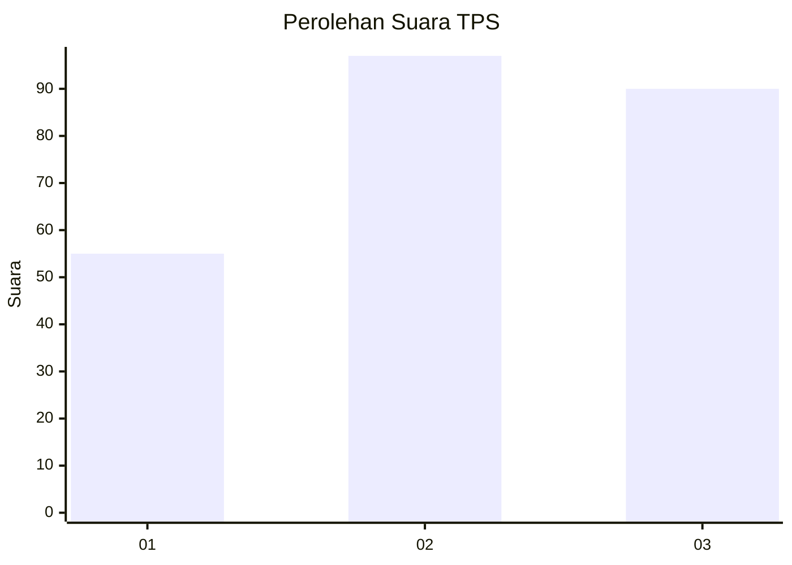
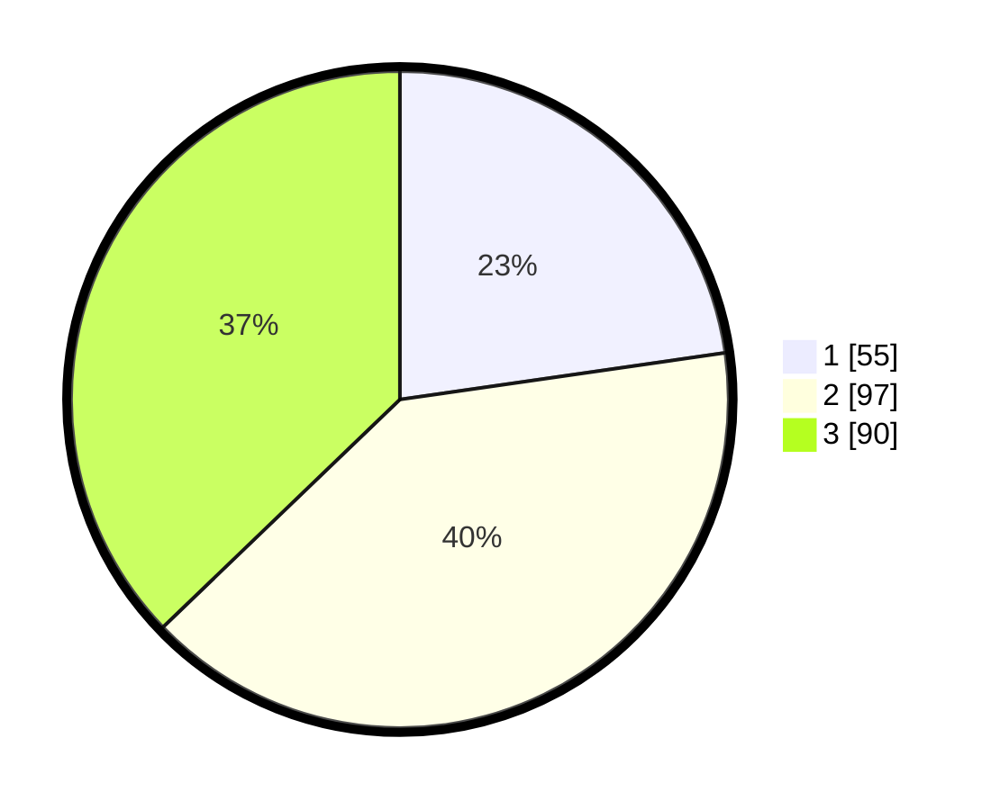

# Hasil

## Grafik

## Tabel

| No. | Nama Paslon    | Suara | Suara (raw) | Persentase |
|:--- |:-------------- | -----:| -----------:| ----------:|
| 1   | ANIES MUHAIMIN | 55    | [55][p-1]   | 22,73      |
| 2   | PRABOWO GIBRAN | 97    | [97][p-2]   | 40,08      |
| 3   | GANJAR MAHFUD  | 90    | [90][p-3]   | 37,19      |

[p-1]: https://github.com/gigit-pemilu/pemilu-2024/blob/main/pilpres/hitung-suara/sub/33-jawa-tengah/sub/03-purbalingga/sub/05-purbalingga/sub/1008-purbalingga-kidul/sub/014-tps/sub/paslon-1.txt
[p-2]: https://github.com/gigit-pemilu/pemilu-2024/blob/main/pilpres/hitung-suara/sub/33-jawa-tengah/sub/03-purbalingga/sub/05-purbalingga/sub/1008-purbalingga-kidul/sub/014-tps/sub/paslon-2.txt
[p-3]: https://github.com/gigit-pemilu/pemilu-2024/blob/main/pilpres/hitung-suara/sub/33-jawa-tengah/sub/03-purbalingga/sub/05-purbalingga/sub/1008-purbalingga-kidul/sub/014-tps/sub/paslon-3.txt

## Foto C Plano

https://sirekap-obj-formc.kpu.go.id/d753/pemilu/ppwp/33/03/05/10/08/3303051008014-20240214-195912--6c2b2333-1bc5-4448-b61b-ce6fb538efe2.jpg

https://sirekap-obj-formc.kpu.go.id/d753/pemilu/ppwp/33/03/05/10/08/3303051008014-20240214-200022--bf62dd63-3436-4516-b15b-baa24deef119.jpg

https://sirekap-obj-formc.kpu.go.id/d753/pemilu/ppwp/33/03/05/10/08/3303051008014-20240214-200129--ba46ca54-a048-4a16-b040-22d8fd30fcbb.jpg

## Metadata

| Key        | Value               |
| ---------- | ------------------- |
| Time Stamp | 2024-02-16 21:01:00 |

