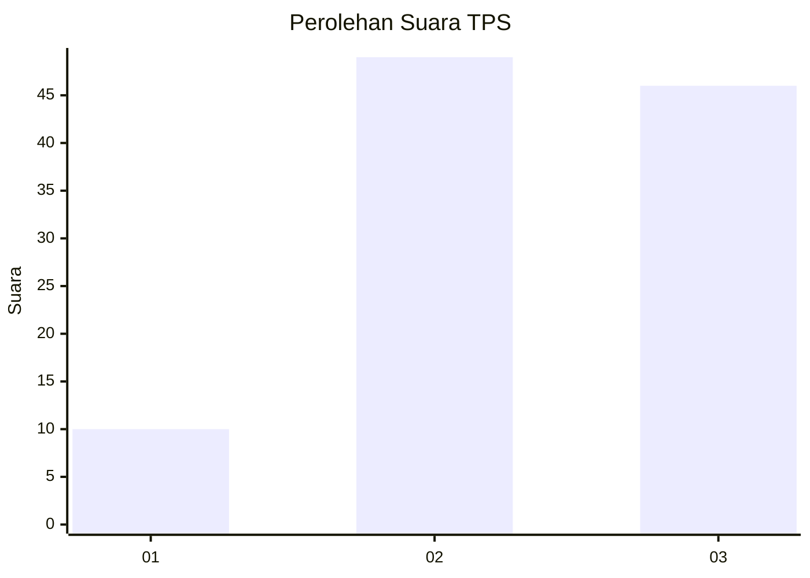
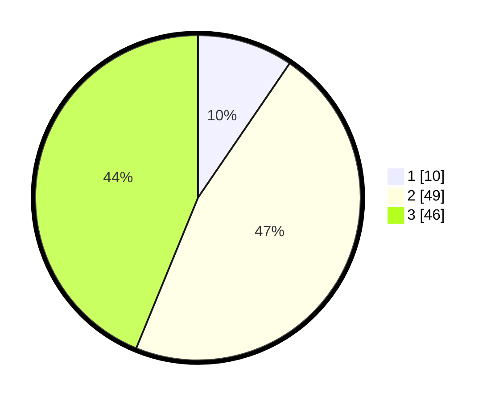

# Hasil

## Grafik

## Tabel

| No. | Nama Paslon    | Suara | Suara (raw) | Persentase |
|:--- |:-------------- | -----:| -----------:| ----------:|
| 1   | ANIES MUHAIMIN | 10    | [10][p-1]   | 9,52       |
| 2   | PRABOWO GIBRAN | 49    | [49][p-2]   | 46,67      |
| 3   | GANJAR MAHFUD  | 46    | [46][p-3]   | 43,81      |

[p-1]: https://github.com/gigit-pemilu/pemilu-2024-33-jawa-tengah/blob/main/pilpres/hitung-suara/sub/33-jawa-tengah/sub/03-purbalingga/sub/05-purbalingga/sub/1008-purbalingga-kidul/sub/901-tps/sub/paslon-1.txt
[p-2]: https://github.com/gigit-pemilu/pemilu-2024-33-jawa-tengah/blob/main/pilpres/hitung-suara/sub/33-jawa-tengah/sub/03-purbalingga/sub/05-purbalingga/sub/1008-purbalingga-kidul/sub/901-tps/sub/paslon-2.txt
[p-3]: https://github.com/gigit-pemilu/pemilu-2024-33-jawa-tengah/blob/main/pilpres/hitung-suara/sub/33-jawa-tengah/sub/03-purbalingga/sub/05-purbalingga/sub/1008-purbalingga-kidul/sub/901-tps/sub/paslon-3.txt

## Foto C Plano

https://sirekap-obj-formc.kpu.go.id/a9f2/pemilu/ppwp/33/03/05/10/08/3303051008901-20240215-094310--e3640299-2d3a-4dae-b19d-d0e565249538.jpg

https://sirekap-obj-formc.kpu.go.id/a9f2/pemilu/ppwp/33/03/05/10/08/3303051008901-20240214-192117--34a5c23c-4632-4cb3-b55a-aa1af0db0922.jpg

https://sirekap-obj-formc.kpu.go.id/a9f2/pemilu/ppwp/33/03/05/10/08/3303051008901-20240215-094346--8c137e5d-22b9-4290-ba12-6e0ee7e65b78.jpg

## Metadata

| Key        | Value               |
| ---------- | ------------------- |
| Time Stamp | 2024-02-15 19:30:26 |

