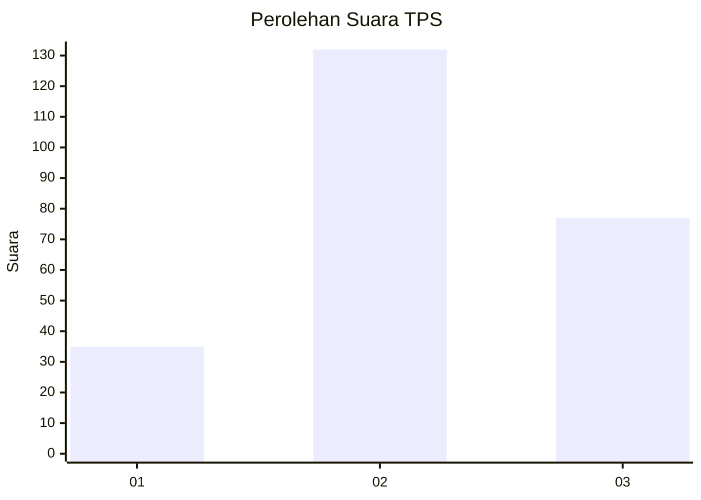
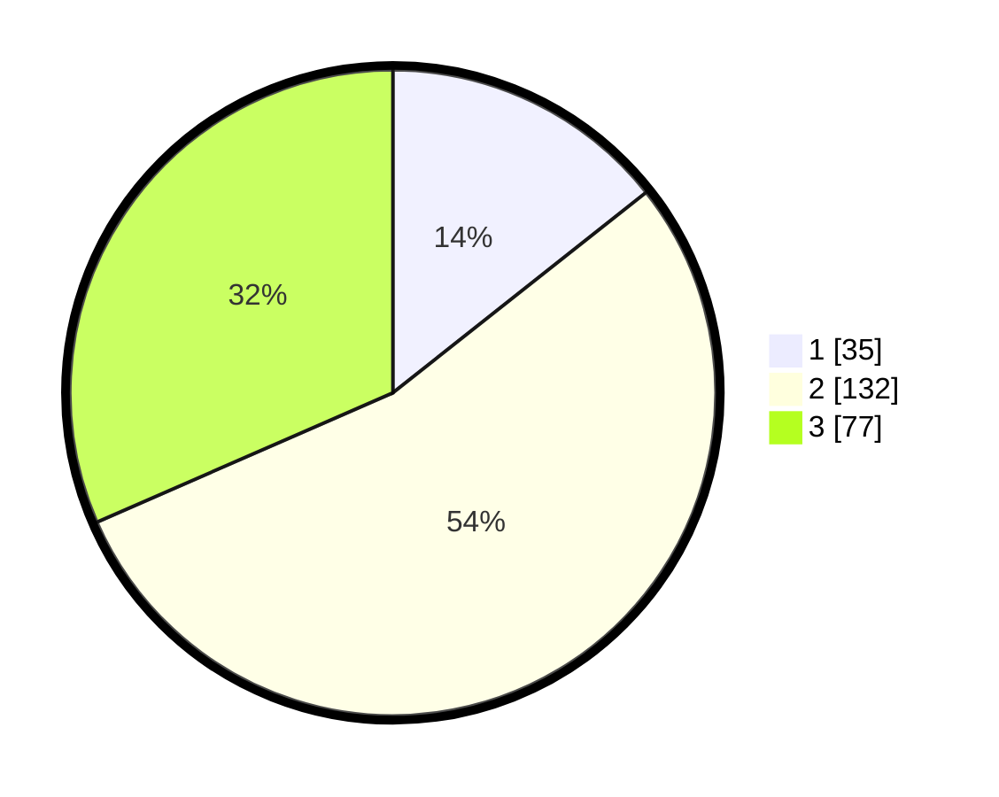

# Hasil

## Grafik

## Tabel

| No. | Nama Paslon    | Suara | Suara (raw) | Persentase |
|:--- |:-------------- | -----:| -----------:| ----------:|
| 1   | ANIES MUHAIMIN | 35    | [35][p-1]   | 14,34      |
| 2   | PRABOWO GIBRAN | 132   | [132][p-2]  | 54,10      |
| 3   | GANJAR MAHFUD  | 77    | [77][p-3]   | 31,56      |

[p-1]: https://github.com/gigit-pemilu/pemilu-2024-33-jawa-tengah/blob/main/pilpres/hitung-suara/sub/33-jawa-tengah/sub/03-purbalingga/sub/06-kalimanah/sub/2010-grecol/sub/001-tps/sub/paslon-1.txt
[p-2]: https://github.com/gigit-pemilu/pemilu-2024-33-jawa-tengah/blob/main/pilpres/hitung-suara/sub/33-jawa-tengah/sub/03-purbalingga/sub/06-kalimanah/sub/2010-grecol/sub/001-tps/sub/paslon-2.txt
[p-3]: https://github.com/gigit-pemilu/pemilu-2024-33-jawa-tengah/blob/main/pilpres/hitung-suara/sub/33-jawa-tengah/sub/03-purbalingga/sub/06-kalimanah/sub/2010-grecol/sub/001-tps/sub/paslon-3.txt

## Foto C Plano

https://sirekap-obj-formc.kpu.go.id/7a45/pemilu/ppwp/33/03/06/20/10/3303062010001-20240219-121754--06547e71-897b-4cbb-81ca-5ae3d9a36de5.jpg

https://sirekap-obj-formc.kpu.go.id/7a45/pemilu/ppwp/33/03/06/20/10/3303062010001-20240219-121915--77a5c91c-e87f-470c-ad09-08bb84b3ed9e.jpg

https://sirekap-obj-formc.kpu.go.id/7a45/pemilu/ppwp/33/03/06/20/10/3303062010001-20240219-122037--e176149c-7bba-4e8f-8e68-367d54416b95.jpg

## Metadata

| Key        | Value               |
| ---------- | ------------------- |
| Time Stamp | 2024-02-24 22:31:28 |

