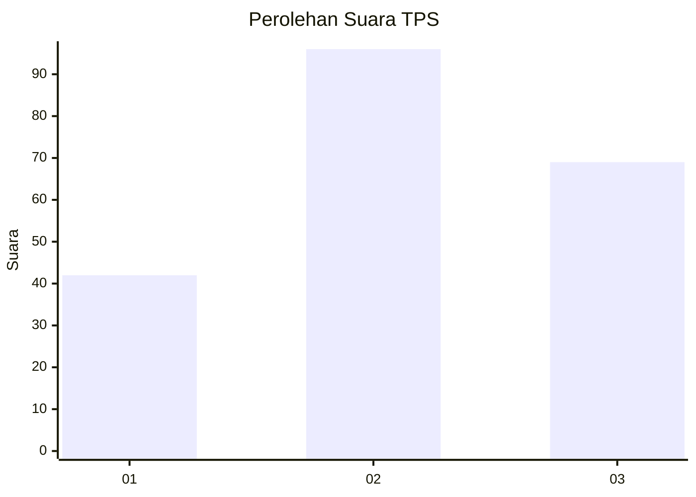
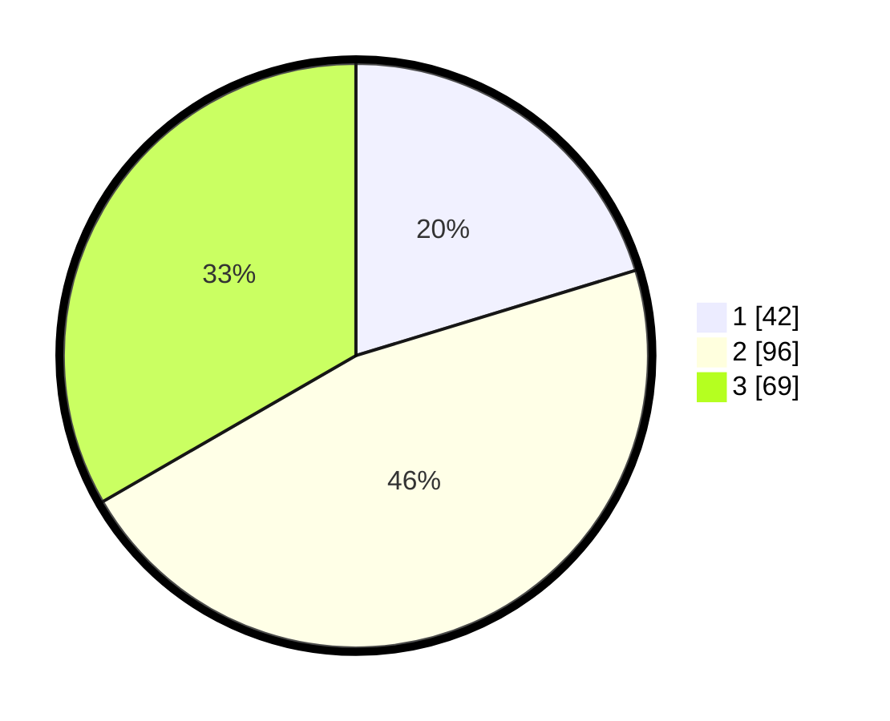

# Hasil

## Grafik

## Tabel

| No. | Nama Paslon    | Suara | Suara (raw) | Persentase |
|:--- |:-------------- | -----:| -----------:| ----------:|
| 1   | ANIES MUHAIMIN | 42    | [42][p-1]   | 20,29      |
| 2   | PRABOWO GIBRAN | 96    | [96][p-2]   | 46,38      |
| 3   | GANJAR MAHFUD  | 69    | [69][p-3]   | 33,33      |

[p-1]: https://github.com/gigit-pemilu/pemilu-2024/blob/main/pilpres/hitung-suara/sub/33-jawa-tengah/sub/03-purbalingga/sub/07-kutasari/sub/2001-karanglewas/sub/007-tps/sub/paslon-1.txt
[p-2]: https://github.com/gigit-pemilu/pemilu-2024/blob/main/pilpres/hitung-suara/sub/33-jawa-tengah/sub/03-purbalingga/sub/07-kutasari/sub/2001-karanglewas/sub/007-tps/sub/paslon-2.txt
[p-3]: https://github.com/gigit-pemilu/pemilu-2024/blob/main/pilpres/hitung-suara/sub/33-jawa-tengah/sub/03-purbalingga/sub/07-kutasari/sub/2001-karanglewas/sub/007-tps/sub/paslon-3.txt

## Foto C Plano

https://sirekap-obj-formc.kpu.go.id/666b/pemilu/ppwp/33/03/07/20/01/3303072001007-20240215-073918--f8010075-40db-4a21-beb0-998b1cfcb359.jpg

https://sirekap-obj-formc.kpu.go.id/666b/pemilu/ppwp/33/03/07/20/01/3303072001007-20240215-073929--27bfe0d4-413e-4cc9-9d37-e14aba646c02.jpg

https://sirekap-obj-formc.kpu.go.id/666b/pemilu/ppwp/33/03/07/20/01/3303072001007-20240215-073934--488bde9b-4dad-4b2f-9087-a1f7278c1be0.jpg

## Metadata

| Key        | Value               |
| ---------- | ------------------- |
| Time Stamp | 2024-02-15 19:00:26 |

