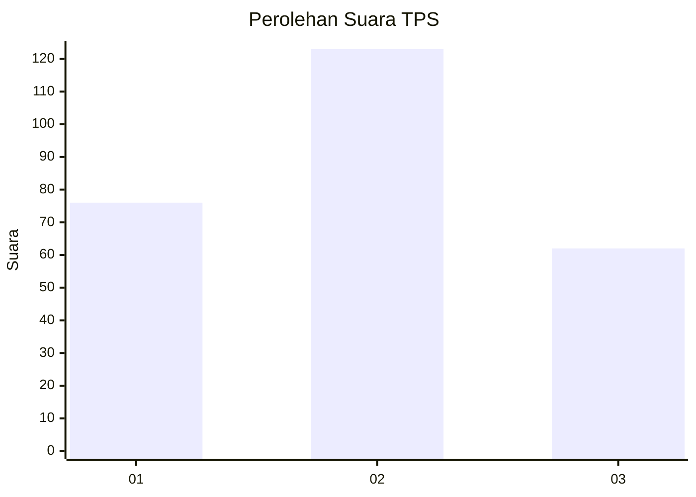
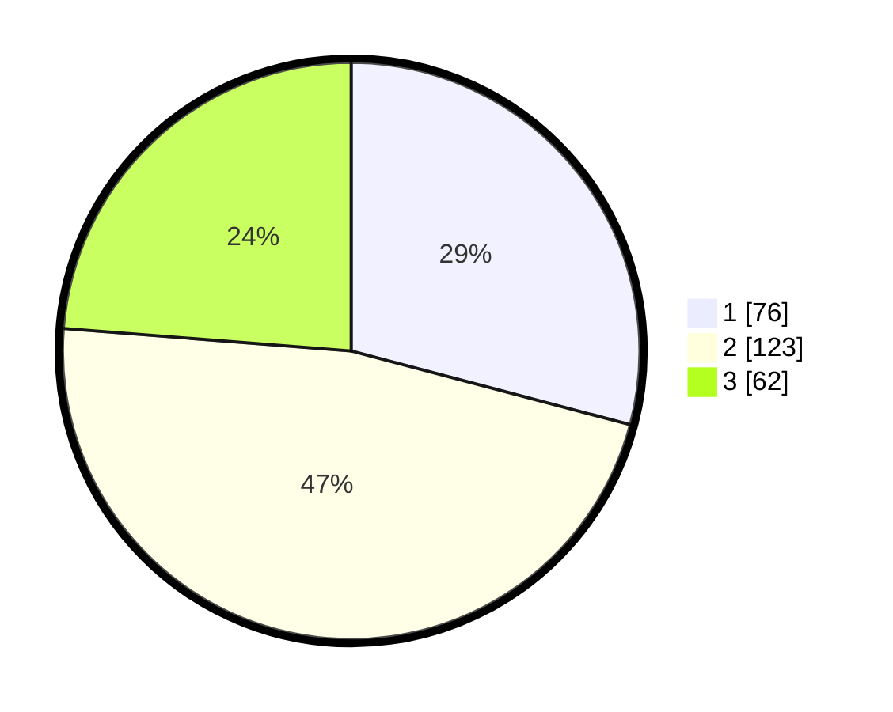

# Hasil

## Grafik

## Tabel

| No. | Nama Paslon    | Suara | Suara (raw) | Persentase |
|:--- |:-------------- | -----:| -----------:| ----------:|
| 1   | ANIES MUHAIMIN | 76    | [76][p-1]   | 29,12      |
| 2   | PRABOWO GIBRAN | 123   | [123][p-2]  | 47,13      |
| 3   | GANJAR MAHFUD  | 62    | [62][p-3]   | 23,75      |

[p-1]: https://github.com/gigit-pemilu/pemilu-2024-33-jawa-tengah/blob/main/pilpres/hitung-suara/sub/33-jawa-tengah/sub/03-purbalingga/sub/07-kutasari/sub/2002-munjul/sub/009-tps/sub/paslon-1.txt
[p-2]: https://github.com/gigit-pemilu/pemilu-2024-33-jawa-tengah/blob/main/pilpres/hitung-suara/sub/33-jawa-tengah/sub/03-purbalingga/sub/07-kutasari/sub/2002-munjul/sub/009-tps/sub/paslon-2.txt
[p-3]: https://github.com/gigit-pemilu/pemilu-2024-33-jawa-tengah/blob/main/pilpres/hitung-suara/sub/33-jawa-tengah/sub/03-purbalingga/sub/07-kutasari/sub/2002-munjul/sub/009-tps/sub/paslon-3.txt

## Foto C Plano

https://sirekap-obj-formc.kpu.go.id/cee8/pemilu/ppwp/33/03/07/20/02/3303072002009-20240214-212540--2edb9019-1be6-437e-b26b-58c83751a653.jpg

https://sirekap-obj-formc.kpu.go.id/cee8/pemilu/ppwp/33/03/07/20/02/3303072002009-20240214-213248--e200cd92-f8b7-4cff-a6ba-9a5a79ad1f21.jpg

https://sirekap-obj-formc.kpu.go.id/cee8/pemilu/ppwp/33/03/07/20/02/3303072002009-20240214-213330--c00e8134-0bb2-4190-b699-208b034dded4.jpg

## Metadata

| Key        | Value               |
| ---------- | ------------------- |
| Time Stamp | 2024-02-15 18:30:25 |

