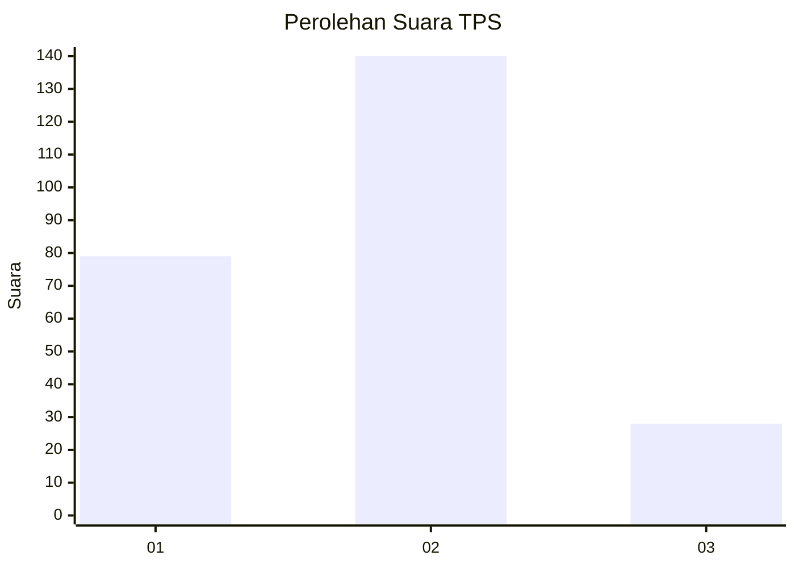
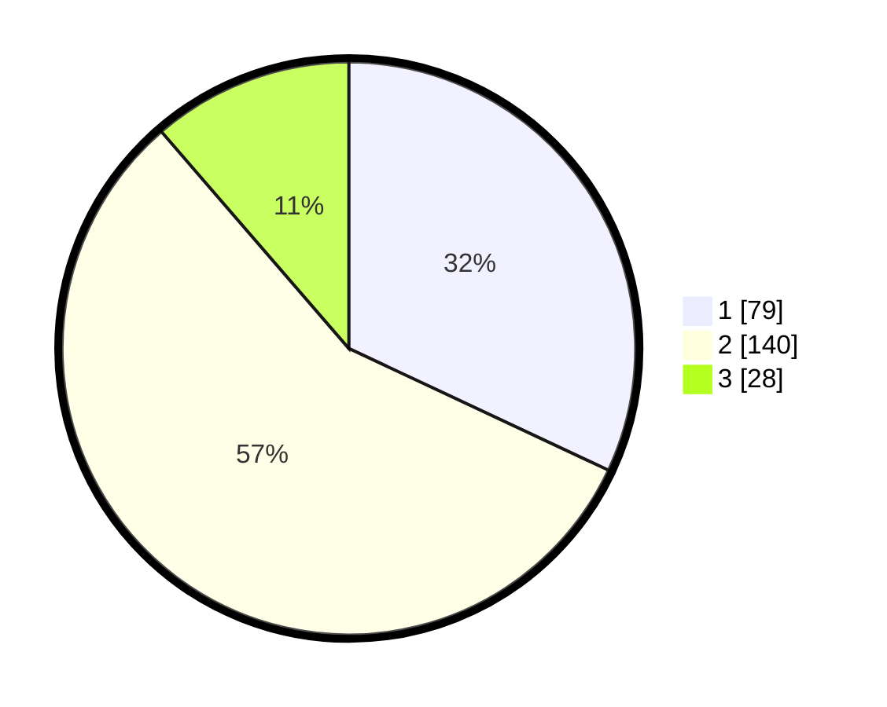

# Hasil

## Grafik

## Tabel

| No. | Nama Paslon    | Suara | Suara (raw) | Persentase |
|:--- |:-------------- | -----:| -----------:| ----------:|
| 1   | ANIES MUHAIMIN | 79    | [79][p-1]   | 31,98      |
| 2   | PRABOWO GIBRAN | 140   | [140][p-2]  | 56,68      |
| 3   | GANJAR MAHFUD  | 28    | [28][p-3]   | 11,34      |

[p-1]: https://github.com/gigit-pemilu/pemilu-2024/blob/main/pilpres/hitung-suara/sub/33-jawa-tengah/sub/03-purbalingga/sub/07-kutasari/sub/2005-kutasari/sub/013-tps/sub/paslon-1.txt
[p-2]: https://github.com/gigit-pemilu/pemilu-2024/blob/main/pilpres/hitung-suara/sub/33-jawa-tengah/sub/03-purbalingga/sub/07-kutasari/sub/2005-kutasari/sub/013-tps/sub/paslon-2.txt
[p-3]: https://github.com/gigit-pemilu/pemilu-2024/blob/main/pilpres/hitung-suara/sub/33-jawa-tengah/sub/03-purbalingga/sub/07-kutasari/sub/2005-kutasari/sub/013-tps/sub/paslon-3.txt

## Foto C Plano

https://sirekap-obj-formc.kpu.go.id/5dd3/pemilu/ppwp/33/03/07/20/05/3303072005013-20240214-214236--fbdfc365-41ec-477a-ab59-6dfc52996a42.jpg

https://sirekap-obj-formc.kpu.go.id/5dd3/pemilu/ppwp/33/03/07/20/05/3303072005013-20240215-025358--fa9e5193-529d-4ec6-b732-aea15a5e04f9.jpg

https://sirekap-obj-formc.kpu.go.id/5dd3/pemilu/ppwp/33/03/07/20/05/3303072005013-20240214-213255--071db60d-dca3-47b5-a4e3-ef83d2b9666e.jpg

## Metadata

| Key        | Value               |
| ---------- | ------------------- |
| Time Stamp | 2024-02-15 18:30:25 |

