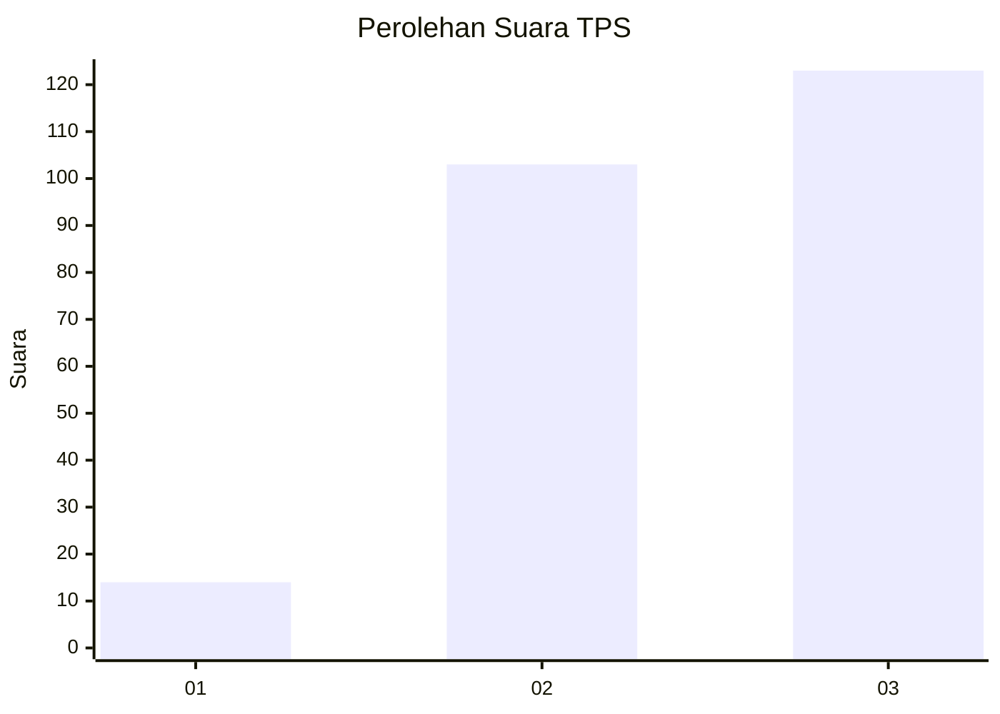
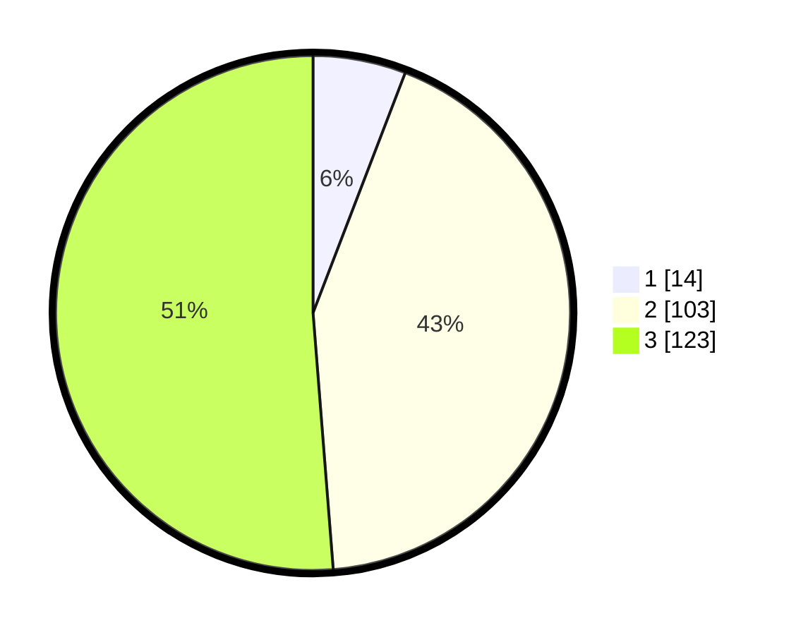

# Hasil

## Grafik

## Tabel

| No. | Nama Paslon    | Suara | Suara (raw) | Persentase |
|:--- |:-------------- | -----:| -----------:| ----------:|
| 1   | ANIES MUHAIMIN | 14    | [14][p-1]   | 5,83       |
| 2   | PRABOWO GIBRAN | 103   | [103][p-2]  | 42,92      |
| 3   | GANJAR MAHFUD  | 123   | [123][p-3]  | 51,25      |

[p-1]: https://github.com/gigit-pemilu/pemilu-2024/blob/main/pilpres/hitung-suara/sub/33-jawa-tengah/sub/03-purbalingga/sub/07-kutasari/sub/2006-karangklesem/sub/001-tps/sub/paslon-1.txt
[p-2]: https://github.com/gigit-pemilu/pemilu-2024/blob/main/pilpres/hitung-suara/sub/33-jawa-tengah/sub/03-purbalingga/sub/07-kutasari/sub/2006-karangklesem/sub/001-tps/sub/paslon-2.txt
[p-3]: https://github.com/gigit-pemilu/pemilu-2024/blob/main/pilpres/hitung-suara/sub/33-jawa-tengah/sub/03-purbalingga/sub/07-kutasari/sub/2006-karangklesem/sub/001-tps/sub/paslon-3.txt

## Foto C Plano

https://sirekap-obj-formc.kpu.go.id/652e/pemilu/ppwp/33/03/07/20/06/3303072006001-20240215-015331--78c299a7-0cb5-4e80-b2f8-54622c7edb15.jpg

https://sirekap-obj-formc.kpu.go.id/652e/pemilu/ppwp/33/03/07/20/06/3303072006001-20240214-224514--6964f668-4c65-4647-9562-0876bc7385b8.jpg

https://sirekap-obj-formc.kpu.go.id/652e/pemilu/ppwp/33/03/07/20/06/3303072006001-20240215-015622--17da045d-834f-4cc6-abf1-f97021a495d5.jpg

## Metadata

| Key        | Value               |
| ---------- | ------------------- |
| Time Stamp | 2024-02-15 19:30:26 |

