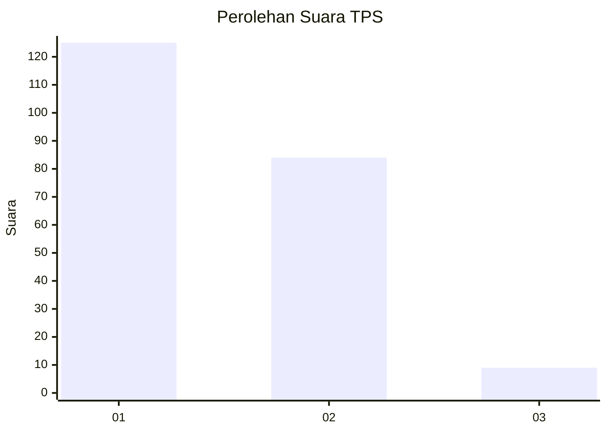
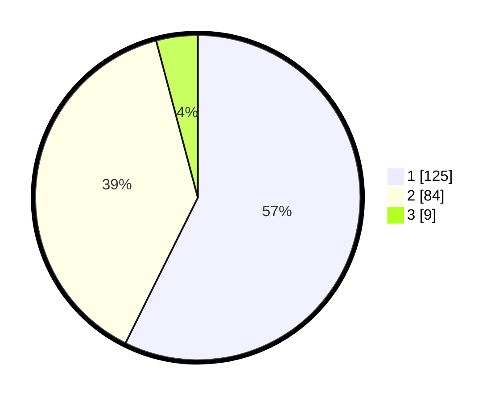

# Hasil

## Grafik

## Tabel

| No. | Nama Paslon    | Suara | Suara (raw) | Persentase |
|:--- |:-------------- | -----:| -----------:| ----------:|
| 1   | ANIES MUHAIMIN | 125   | [125][p-1]  | 57,34      |
| 2   | PRABOWO GIBRAN | 84    | [84][p-2]   | 38,53      |
| 3   | GANJAR MAHFUD  | 9     | [9][p-3]    | 4,13       |

[p-1]: https://github.com/gigit-pemilu/pemilu-2024-33-jawa-tengah/blob/main/pilpres/hitung-suara/sub/33-jawa-tengah/sub/03-purbalingga/sub/07-kutasari/sub/2007-karangreja/sub/013-tps/sub/paslon-1.txt
[p-2]: https://github.com/gigit-pemilu/pemilu-2024-33-jawa-tengah/blob/main/pilpres/hitung-suara/sub/33-jawa-tengah/sub/03-purbalingga/sub/07-kutasari/sub/2007-karangreja/sub/013-tps/sub/paslon-2.txt
[p-3]: https://github.com/gigit-pemilu/pemilu-2024-33-jawa-tengah/blob/main/pilpres/hitung-suara/sub/33-jawa-tengah/sub/03-purbalingga/sub/07-kutasari/sub/2007-karangreja/sub/013-tps/sub/paslon-3.txt

## Foto C Plano

https://sirekap-obj-formc.kpu.go.id/17a4/pemilu/ppwp/33/03/07/20/07/3303072007013-20240214-155907--b1af968b-c3ab-4103-80b2-c5c15063b1d2.jpg

https://sirekap-obj-formc.kpu.go.id/17a4/pemilu/ppwp/33/03/07/20/07/3303072007013-20240214-160104--26cf6c32-1ac5-4699-80bc-d3ec91f1b095.jpg

https://sirekap-obj-formc.kpu.go.id/17a4/pemilu/ppwp/33/03/07/20/07/3303072007013-20240214-160112--592cbb4f-13ac-4b50-9794-cbf29b8201c1.jpg

## Metadata

| Key        | Value               |
| ---------- | ------------------- |
| Time Stamp | 2024-02-15 18:00:26 |

