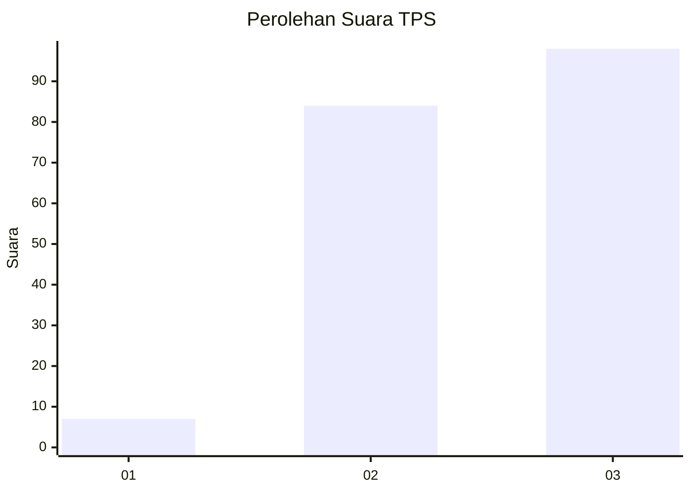
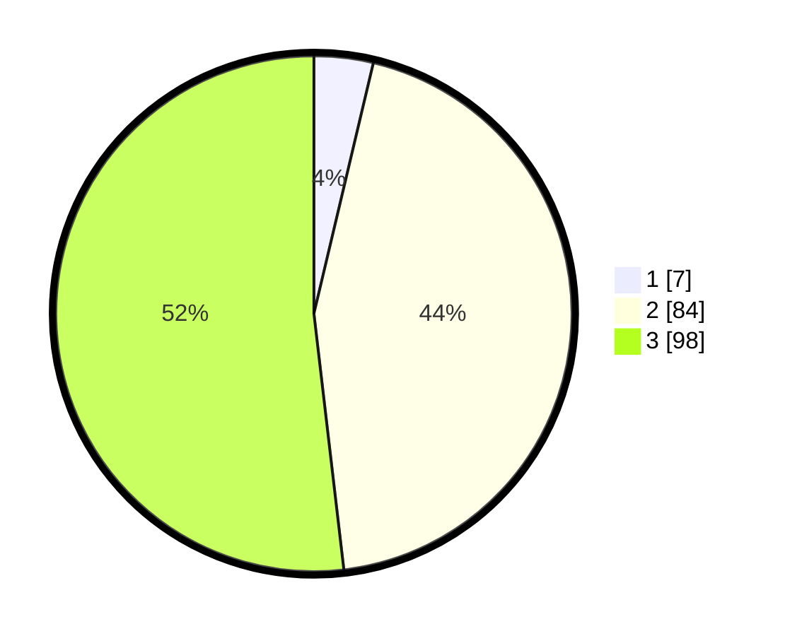

# Hasil

## Grafik

## Tabel

| No. | Nama Paslon    | Suara | Suara (raw) | Persentase |
|:--- |:-------------- | -----:| -----------:| ----------:|
| 1   | ANIES MUHAIMIN | 7     | [7][p-1]    | 3,70       |
| 2   | PRABOWO GIBRAN | 84    | [84][p-2]   | 44,44      |
| 3   | GANJAR MAHFUD  | 98    | [98][p-3]   | 51,85      |

[p-1]: https://github.com/gigit-pemilu/pemilu-2024/blob/main/pilpres/hitung-suara/sub/33-jawa-tengah/sub/03-purbalingga/sub/07-kutasari/sub/2010-cendana/sub/006-tps/sub/paslon-1.txt
[p-2]: https://github.com/gigit-pemilu/pemilu-2024/blob/main/pilpres/hitung-suara/sub/33-jawa-tengah/sub/03-purbalingga/sub/07-kutasari/sub/2010-cendana/sub/006-tps/sub/paslon-2.txt
[p-3]: https://github.com/gigit-pemilu/pemilu-2024/blob/main/pilpres/hitung-suara/sub/33-jawa-tengah/sub/03-purbalingga/sub/07-kutasari/sub/2010-cendana/sub/006-tps/sub/paslon-3.txt

## Foto C Plano

https://sirekap-obj-formc.kpu.go.id/19ad/pemilu/ppwp/33/03/07/20/10/3303072010006-20240214-203131--bcd56476-1f49-4359-8df2-add7bdac24f4.jpg

https://sirekap-obj-formc.kpu.go.id/19ad/pemilu/ppwp/33/03/07/20/10/3303072010006-20240214-235454--1c4393b2-ab1a-4470-8ea6-fc397c4a2513.jpg

https://sirekap-obj-formc.kpu.go.id/19ad/pemilu/ppwp/33/03/07/20/10/3303072010006-20240214-235944--e26af06e-9566-47a7-b44c-ec8f142d09cc.jpg

## Metadata

| Key        | Value               |
| ---------- | ------------------- |
| Time Stamp | 2024-02-15 12:00:28 |

