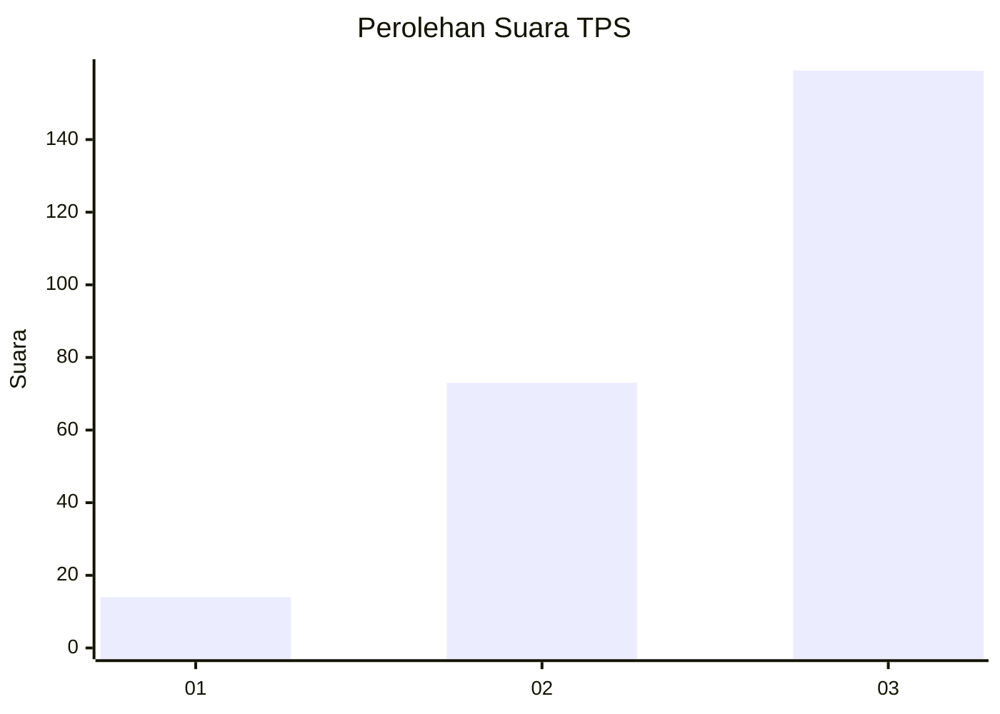
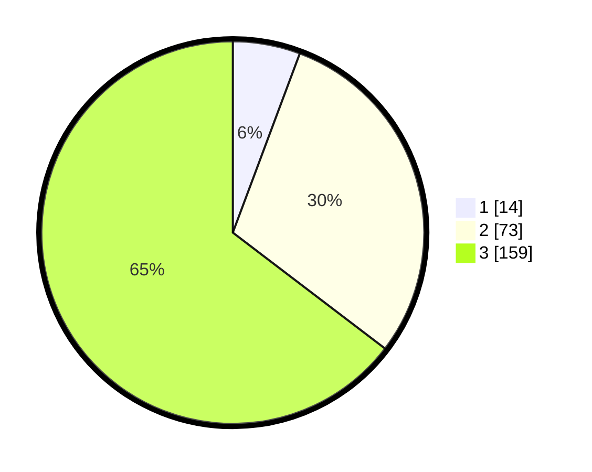

# Hasil

## Grafik

## Tabel

| No. | Nama Paslon    | Suara | Suara (raw) | Persentase |
|:--- |:-------------- | -----:| -----------:| ----------:|
| 1   | ANIES MUHAIMIN | 14    | [14][p-1]   | 5,69       |
| 2   | PRABOWO GIBRAN | 73    | [73][p-2]   | 29,67      |
| 3   | GANJAR MAHFUD  | 159   | [159][p-3]  | 64,63      |

[p-1]: https://github.com/gigit-pemilu/pemilu-2024-33-jawa-tengah/blob/main/pilpres/hitung-suara/sub/33-jawa-tengah/sub/03-purbalingga/sub/07-kutasari/sub/2010-cendana/sub/014-tps/sub/paslon-1.txt
[p-2]: https://github.com/gigit-pemilu/pemilu-2024-33-jawa-tengah/blob/main/pilpres/hitung-suara/sub/33-jawa-tengah/sub/03-purbalingga/sub/07-kutasari/sub/2010-cendana/sub/014-tps/sub/paslon-2.txt
[p-3]: https://github.com/gigit-pemilu/pemilu-2024-33-jawa-tengah/blob/main/pilpres/hitung-suara/sub/33-jawa-tengah/sub/03-purbalingga/sub/07-kutasari/sub/2010-cendana/sub/014-tps/sub/paslon-3.txt

## Foto C Plano

https://sirekap-obj-formc.kpu.go.id/f9a3/pemilu/ppwp/33/03/07/20/10/3303072010014-20240214-155658--3d8f8e2b-1f82-4bc8-b504-b17512476fa0.jpg

https://sirekap-obj-formc.kpu.go.id/f9a3/pemilu/ppwp/33/03/07/20/10/3303072010014-20240214-160059--84456a83-3aa1-4e49-af01-e6780d8d7302.jpg

https://sirekap-obj-formc.kpu.go.id/f9a3/pemilu/ppwp/33/03/07/20/10/3303072010014-20240214-160059--c20e7476-c51b-4962-8e8a-fbc64360c694.jpg

## Metadata

| Key        | Value               |
| ---------- | ------------------- |
| Time Stamp | 2024-02-14 21:46:01 |

