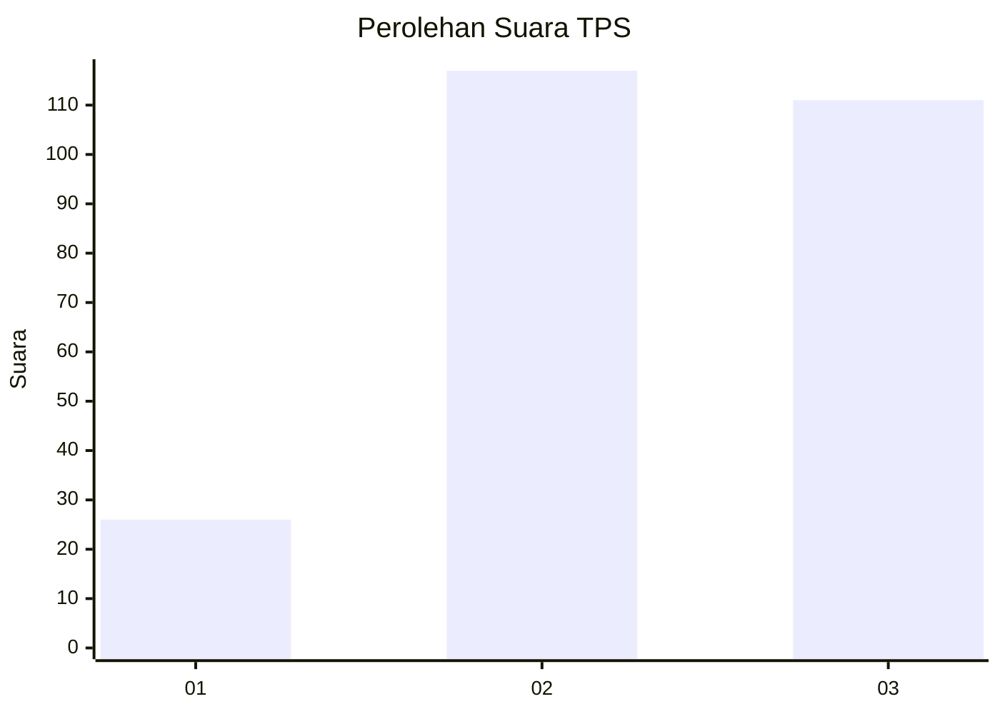
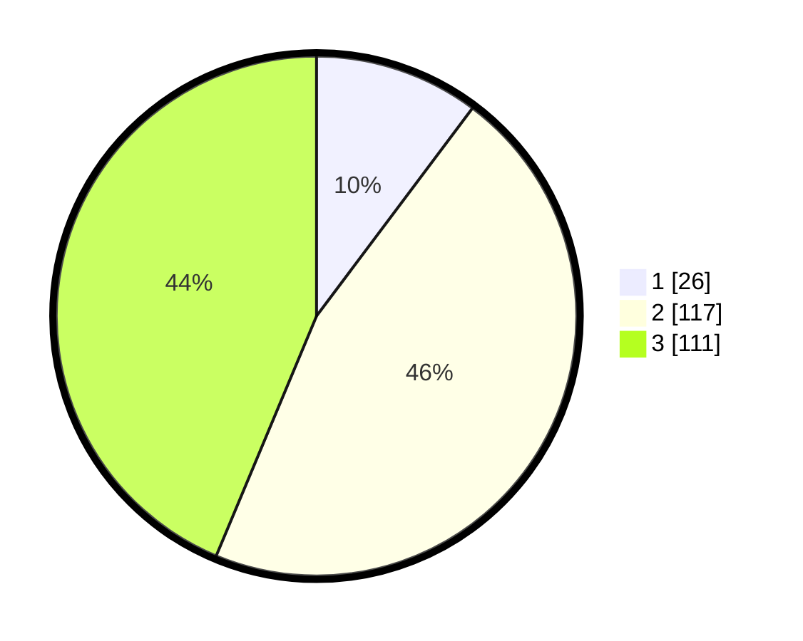

# Hasil

## Grafik

## Tabel

| No. | Nama Paslon    | Suara | Suara (raw) | Persentase |
|:--- |:-------------- | -----:| -----------:| ----------:|
| 1   | ANIES MUHAIMIN | 26    | [26][p-1]   | 10,24      |
| 2   | PRABOWO GIBRAN | 117   | [117][p-2]  | 46,06      |
| 3   | GANJAR MAHFUD  | 111   | [111][p-3]  | 43,70      |

[p-1]: https://github.com/gigit-pemilu/pemilu-2024-33-jawa-tengah/blob/main/pilpres/hitung-suara/sub/33-jawa-tengah/sub/03-purbalingga/sub/07-kutasari/sub/2011-candiwulan/sub/004-tps/sub/paslon-1.txt
[p-2]: https://github.com/gigit-pemilu/pemilu-2024-33-jawa-tengah/blob/main/pilpres/hitung-suara/sub/33-jawa-tengah/sub/03-purbalingga/sub/07-kutasari/sub/2011-candiwulan/sub/004-tps/sub/paslon-2.txt
[p-3]: https://github.com/gigit-pemilu/pemilu-2024-33-jawa-tengah/blob/main/pilpres/hitung-suara/sub/33-jawa-tengah/sub/03-purbalingga/sub/07-kutasari/sub/2011-candiwulan/sub/004-tps/sub/paslon-3.txt

## Foto C Plano

https://sirekap-obj-formc.kpu.go.id/9d99/pemilu/ppwp/33/03/07/20/11/3303072011004-20240215-010151--19ca42cc-0895-422b-962f-78fdb42e1b10.jpg

https://sirekap-obj-formc.kpu.go.id/9d99/pemilu/ppwp/33/03/07/20/11/3303072011004-20240215-010416--88cfe459-1d00-4d9c-8d2f-a9f493fa7fd2.jpg

https://sirekap-obj-formc.kpu.go.id/9d99/pemilu/ppwp/33/03/07/20/11/3303072011004-20240215-005801--a608690b-a4e2-4e6b-957d-b9a3de08386a.jpg

## Metadata

| Key        | Value               |
| ---------- | ------------------- |
| Time Stamp | 2024-02-15 15:00:29 |

