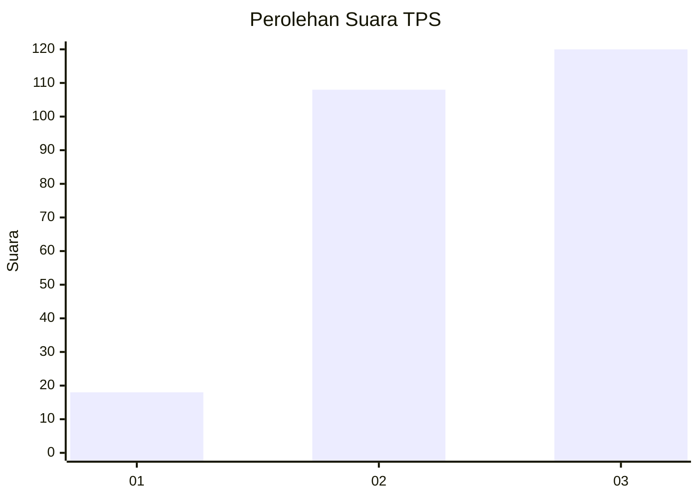
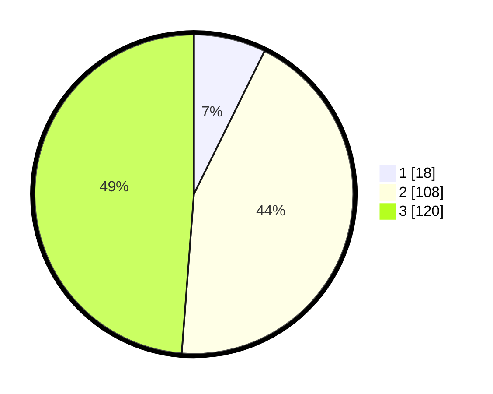

# Hasil

## Grafik

## Tabel

| No. | Nama Paslon    | Suara | Suara (raw) | Persentase |
|:--- |:-------------- | -----:| -----------:| ----------:|
| 1   | ANIES MUHAIMIN | 18    | [18][p-1]   | 7,32       |
| 2   | PRABOWO GIBRAN | 108   | [108][p-2]  | 43,90      |
| 3   | GANJAR MAHFUD  | 120   | [120][p-3]  | 48,78      |

[p-1]: https://github.com/gigit-pemilu/pemilu-2024-33-jawa-tengah/blob/main/pilpres/hitung-suara/sub/33-jawa-tengah/sub/03-purbalingga/sub/07-kutasari/sub/2011-candiwulan/sub/007-tps/sub/paslon-1.txt
[p-2]: https://github.com/gigit-pemilu/pemilu-2024-33-jawa-tengah/blob/main/pilpres/hitung-suara/sub/33-jawa-tengah/sub/03-purbalingga/sub/07-kutasari/sub/2011-candiwulan/sub/007-tps/sub/paslon-2.txt
[p-3]: https://github.com/gigit-pemilu/pemilu-2024-33-jawa-tengah/blob/main/pilpres/hitung-suara/sub/33-jawa-tengah/sub/03-purbalingga/sub/07-kutasari/sub/2011-candiwulan/sub/007-tps/sub/paslon-3.txt

## Foto C Plano

https://sirekap-obj-formc.kpu.go.id/e326/pemilu/ppwp/33/03/07/20/11/3303072011007-20240215-212125--f6d3397a-7b3d-416a-8b3e-85ba72e591c4.jpg

https://sirekap-obj-formc.kpu.go.id/e326/pemilu/ppwp/33/03/07/20/11/3303072011007-20240215-212413--169cc9f3-769a-4474-9a1f-2a7144b563ba.jpg

https://sirekap-obj-formc.kpu.go.id/e326/pemilu/ppwp/33/03/07/20/11/3303072011007-20240216-100908--12838c95-df63-40d1-a031-d9c8731bc5e7.jpg

## Metadata

| Key        | Value               |
| ---------- | ------------------- |
| Time Stamp | 2024-02-16 10:30:29 |

