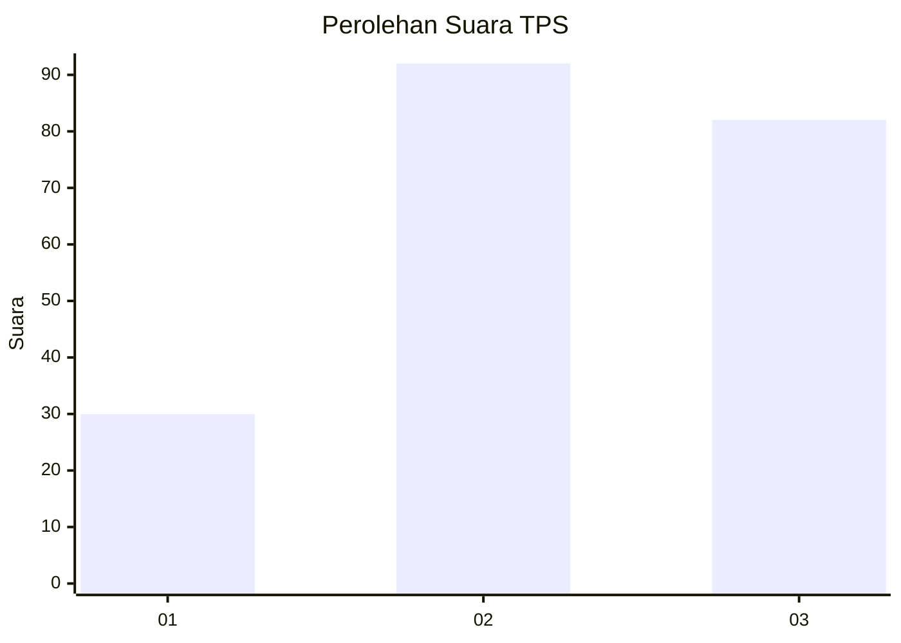
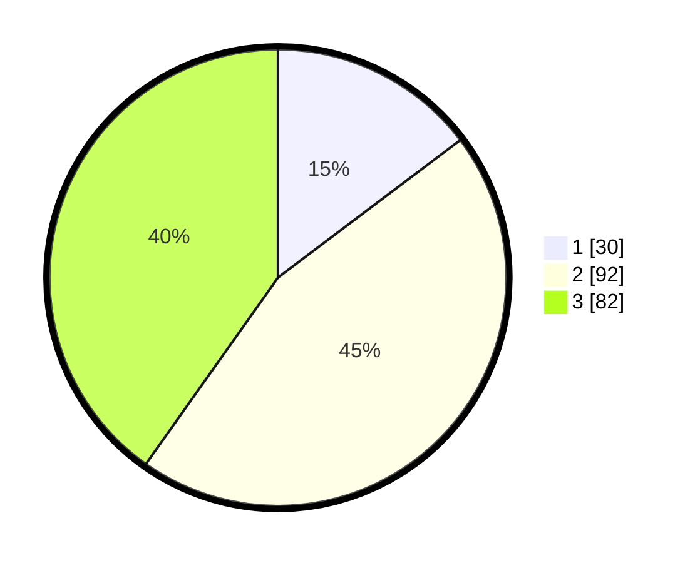

# Hasil

## Grafik

## Tabel

| No. | Nama Paslon    | Suara | Suara (raw) | Persentase |
|:--- |:-------------- | -----:| -----------:| ----------:|
| 1   | ANIES MUHAIMIN | 30    | [30][p-1]   | 14,71      |
| 2   | PRABOWO GIBRAN | 92    | [92][p-2]   | 45,10      |
| 3   | GANJAR MAHFUD  | 82    | [82][p-3]   | 40,20      |

[p-1]: https://github.com/gigit-pemilu/pemilu-2024-33-jawa-tengah/blob/main/pilpres/hitung-suara/sub/33-jawa-tengah/sub/03-purbalingga/sub/07-kutasari/sub/2011-candiwulan/sub/009-tps/sub/paslon-1.txt
[p-2]: https://github.com/gigit-pemilu/pemilu-2024-33-jawa-tengah/blob/main/pilpres/hitung-suara/sub/33-jawa-tengah/sub/03-purbalingga/sub/07-kutasari/sub/2011-candiwulan/sub/009-tps/sub/paslon-2.txt
[p-3]: https://github.com/gigit-pemilu/pemilu-2024-33-jawa-tengah/blob/main/pilpres/hitung-suara/sub/33-jawa-tengah/sub/03-purbalingga/sub/07-kutasari/sub/2011-candiwulan/sub/009-tps/sub/paslon-3.txt

## Foto C Plano

https://sirekap-obj-formc.kpu.go.id/a3c4/pemilu/ppwp/33/03/07/20/11/3303072011009-20240214-141625--03853501-e619-4aab-a0af-937e3fd7c960.jpg

https://sirekap-obj-formc.kpu.go.id/a3c4/pemilu/ppwp/33/03/07/20/11/3303072011009-20240214-141720--51632ebe-f7e2-4e5c-889d-b5f14fdd63db.jpg

https://sirekap-obj-formc.kpu.go.id/a3c4/pemilu/ppwp/33/03/07/20/11/3303072011009-20240214-141756--613dd6c5-f1ab-45ce-9512-9ea77b676545.jpg

## Metadata

| Key        | Value               |
| ---------- | ------------------- |
| Time Stamp | 2024-02-15 00:41:44 |

