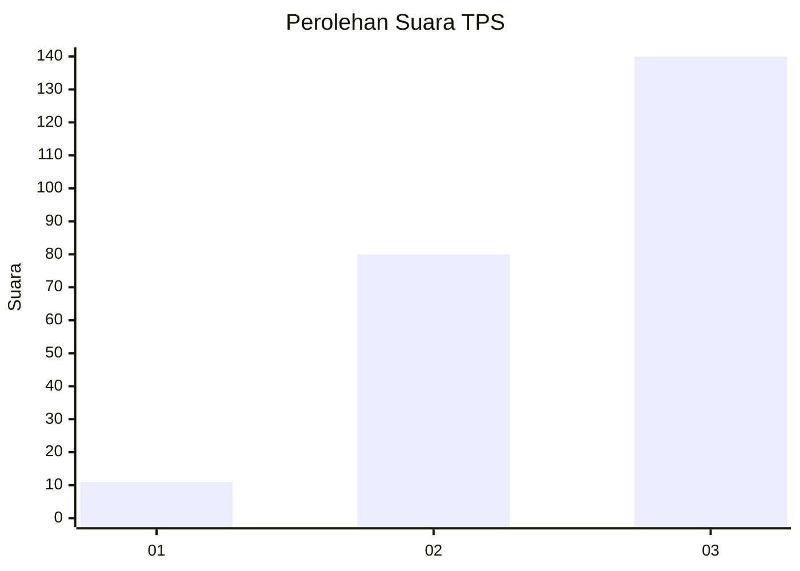
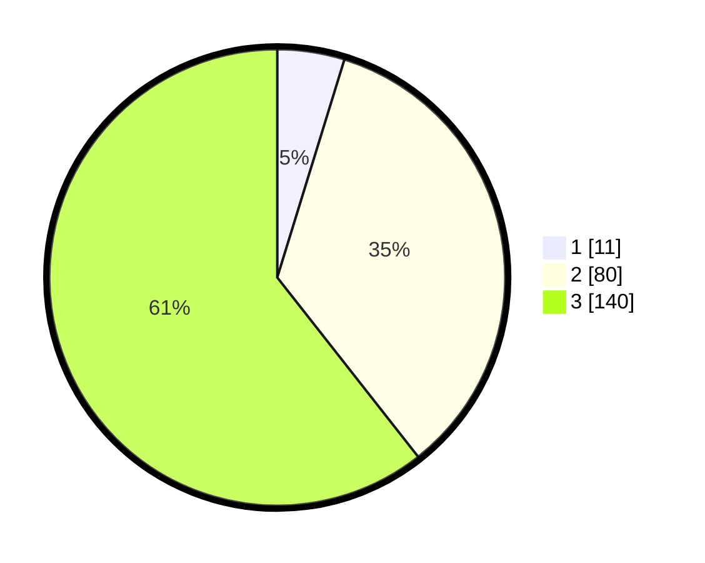

# Hasil

## Grafik

## Tabel

| No. | Nama Paslon    | Suara | Suara (raw) | Persentase |
|:--- |:-------------- | -----:| -----------:| ----------:|
| 1   | ANIES MUHAIMIN | 11    | [11][p-1]   | 4,76       |
| 2   | PRABOWO GIBRAN | 80    | [80][p-2]   | 34,63      |
| 3   | GANJAR MAHFUD  | 140   | [140][p-3]  | 60,61      |

[p-1]: https://github.com/gigit-pemilu/pemilu-2024/blob/main/pilpres/hitung-suara/sub/33-jawa-tengah/sub/03-purbalingga/sub/07-kutasari/sub/2012-karangcegak/sub/017-tps/sub/paslon-1.txt
[p-2]: https://github.com/gigit-pemilu/pemilu-2024/blob/main/pilpres/hitung-suara/sub/33-jawa-tengah/sub/03-purbalingga/sub/07-kutasari/sub/2012-karangcegak/sub/017-tps/sub/paslon-2.txt
[p-3]: https://github.com/gigit-pemilu/pemilu-2024/blob/main/pilpres/hitung-suara/sub/33-jawa-tengah/sub/03-purbalingga/sub/07-kutasari/sub/2012-karangcegak/sub/017-tps/sub/paslon-3.txt

## Foto C Plano

https://sirekap-obj-formc.kpu.go.id/6802/pemilu/ppwp/33/03/07/20/12/3303072012017-20240214-193605--9788c814-7583-499e-a5d5-f3d08aa30e1b.jpg

https://sirekap-obj-formc.kpu.go.id/6802/pemilu/ppwp/33/03/07/20/12/3303072012017-20240214-200137--bc55e10f-8051-4820-a9bf-7e7536d8d084.jpg

https://sirekap-obj-formc.kpu.go.id/6802/pemilu/ppwp/33/03/07/20/12/3303072012017-20240214-193554--c67d4d9b-5529-471d-91d3-96f71619a5c2.jpg

## Metadata

| Key        | Value               |
| ---------- | ------------------- |
| Time Stamp | 2024-02-15 21:01:18 |

