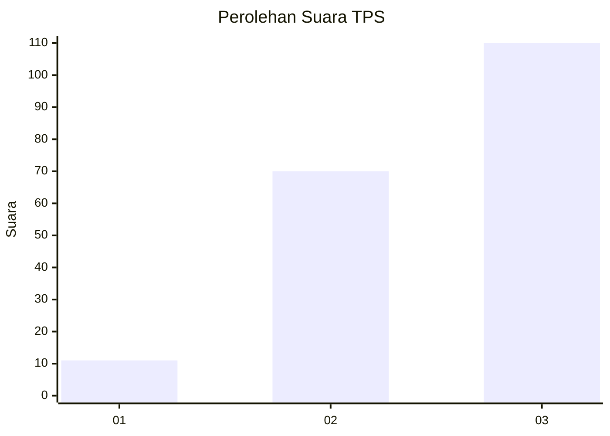
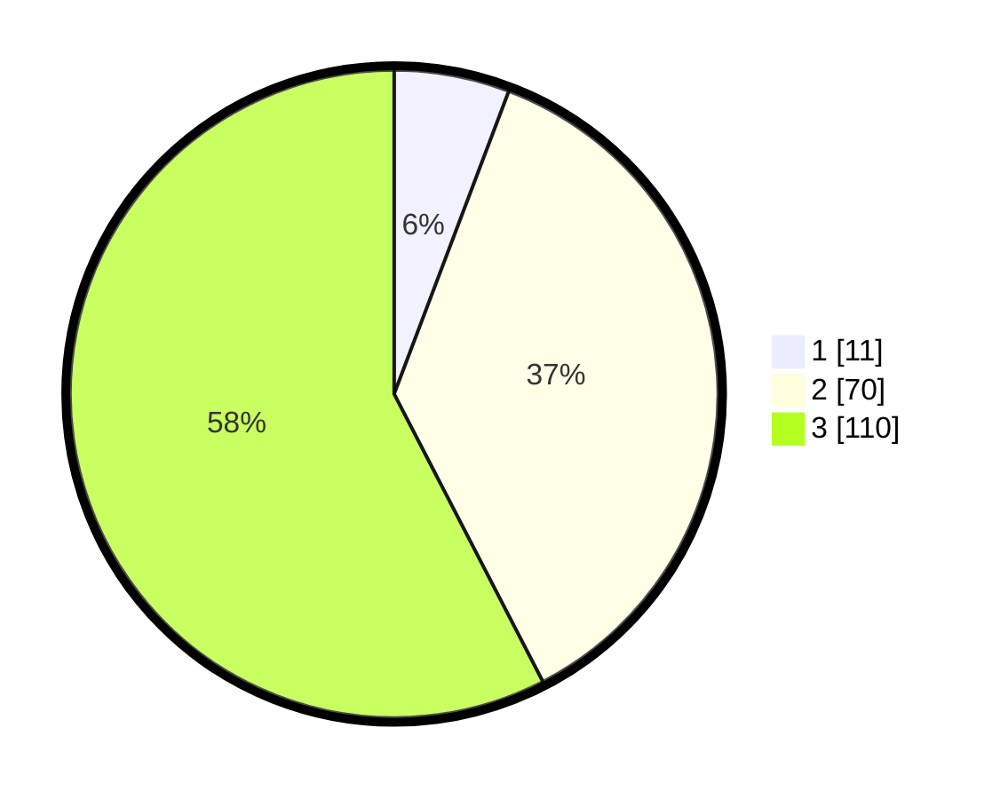

# Hasil

## Grafik

## Tabel

| No. | Nama Paslon    | Suara | Suara (raw) | Persentase |
|:--- |:-------------- | -----:| -----------:| ----------:|
| 1   | ANIES MUHAIMIN | 11    | [11][p-1]   | 5,76       |
| 2   | PRABOWO GIBRAN | 70    | [70][p-2]   | 36,65      |
| 3   | GANJAR MAHFUD  | 110   | [110][p-3]  | 57,59      |

[p-1]: https://github.com/gigit-pemilu/pemilu-2024/blob/main/pilpres/hitung-suara/sub/33-jawa-tengah/sub/03-purbalingga/sub/07-kutasari/sub/2012-karangcegak/sub/018-tps/sub/paslon-1.txt
[p-2]: https://github.com/gigit-pemilu/pemilu-2024/blob/main/pilpres/hitung-suara/sub/33-jawa-tengah/sub/03-purbalingga/sub/07-kutasari/sub/2012-karangcegak/sub/018-tps/sub/paslon-2.txt
[p-3]: https://github.com/gigit-pemilu/pemilu-2024/blob/main/pilpres/hitung-suara/sub/33-jawa-tengah/sub/03-purbalingga/sub/07-kutasari/sub/2012-karangcegak/sub/018-tps/sub/paslon-3.txt

## Foto C Plano

https://sirekap-obj-formc.kpu.go.id/4923/pemilu/ppwp/33/03/07/20/12/3303072012018-20240214-225334--40adcd71-aac6-4f02-ab57-c18e1fd56996.jpg

https://sirekap-obj-formc.kpu.go.id/4923/pemilu/ppwp/33/03/07/20/12/3303072012018-20240214-225532--ced07341-33c4-4134-a982-ede40e7ed7d3.jpg

https://sirekap-obj-formc.kpu.go.id/4923/pemilu/ppwp/33/03/07/20/12/3303072012018-20240214-225719--2b2d68b0-0cdc-427e-9a02-1543d52d7a0d.jpg

## Metadata

| Key        | Value               |
| ---------- | ------------------- |
| Time Stamp | 2024-02-15 12:00:28 |

