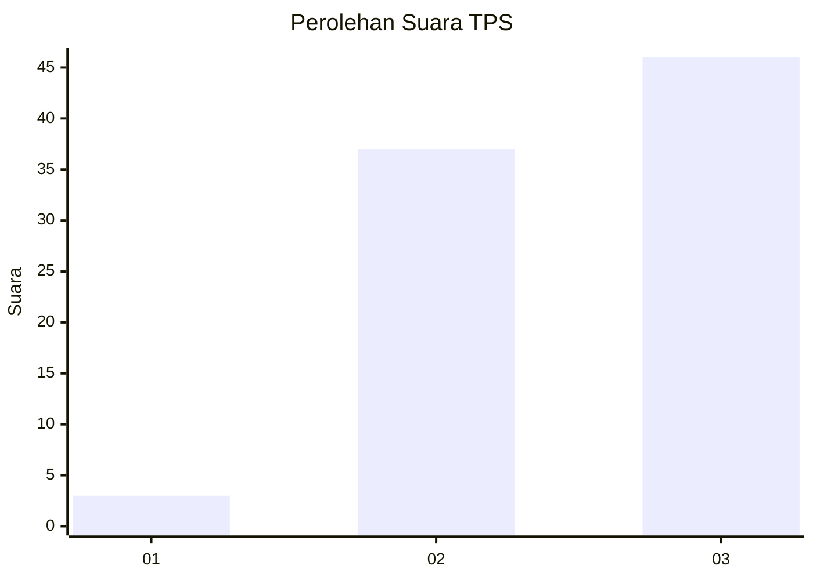
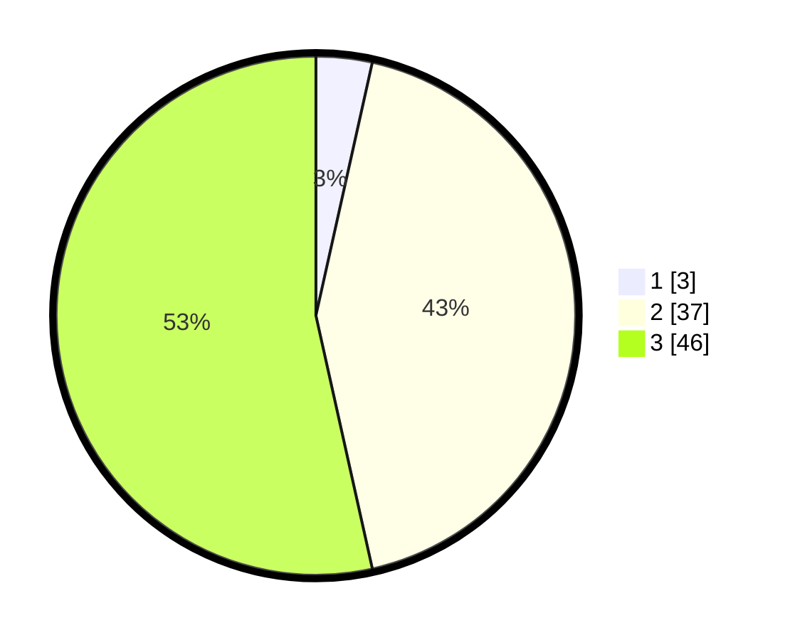

# Hasil

## Grafik

## Tabel

| No. | Nama Paslon    | Suara | Suara (raw) | Persentase |
|:--- |:-------------- | -----:| -----------:| ----------:|
| 1   | ANIES MUHAIMIN | 3     | [3][p-1]    | 3,49       |
| 2   | PRABOWO GIBRAN | 37    | [37][p-2]   | 43,02      |
| 3   | GANJAR MAHFUD  | 46    | [46][p-3]   | 53,49      |

[p-1]: https://github.com/gigit-pemilu/pemilu-2024/blob/main/pilpres/hitung-suara/sub/33-jawa-tengah/sub/03-purbalingga/sub/07-kutasari/sub/2013-candinata/sub/016-tps/sub/paslon-1.txt
[p-2]: https://github.com/gigit-pemilu/pemilu-2024/blob/main/pilpres/hitung-suara/sub/33-jawa-tengah/sub/03-purbalingga/sub/07-kutasari/sub/2013-candinata/sub/016-tps/sub/paslon-2.txt
[p-3]: https://github.com/gigit-pemilu/pemilu-2024/blob/main/pilpres/hitung-suara/sub/33-jawa-tengah/sub/03-purbalingga/sub/07-kutasari/sub/2013-candinata/sub/016-tps/sub/paslon-3.txt

## Foto C Plano

https://sirekap-obj-formc.kpu.go.id/9b80/pemilu/ppwp/33/03/07/20/13/3303072013016-20240215-183127--8031f997-9966-4aa7-b5fe-f1e65502d23f.jpg

https://sirekap-obj-formc.kpu.go.id/9b80/pemilu/ppwp/33/03/07/20/13/3303072013016-20240215-183142--1d613f46-ece8-4870-99ba-04bd0618df42.jpg

https://sirekap-obj-formc.kpu.go.id/9b80/pemilu/ppwp/33/03/07/20/13/3303072013016-20240215-183156--0c0b2345-25df-484a-944b-5555367295fb.jpg

## Metadata

| Key        | Value               |
| ---------- | ------------------- |
| Time Stamp | 2024-02-15 22:00:27 |

