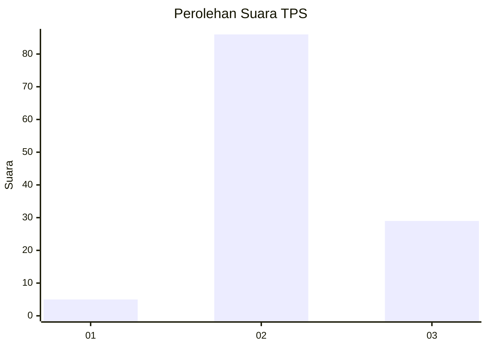
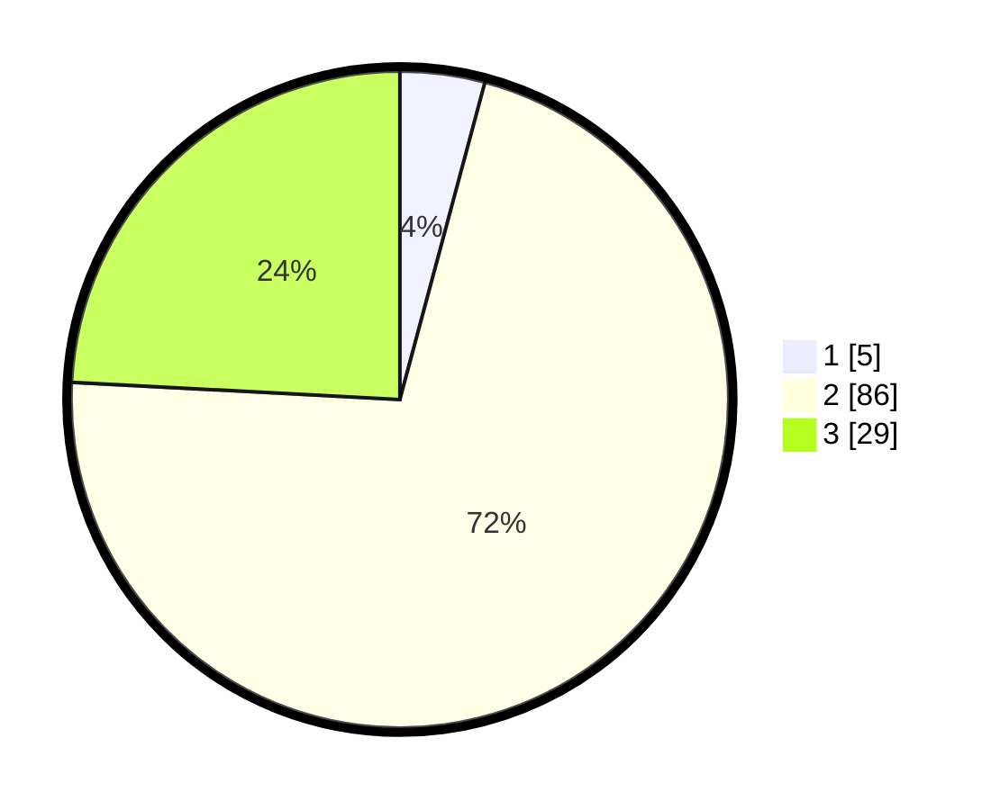

# Hasil

## Grafik

## Tabel

| No. | Nama Paslon    | Suara | Suara (raw) | Persentase |
|:--- |:-------------- | -----:| -----------:| ----------:|
| 1   | ANIES MUHAIMIN | 5     | [5][p-1]    | 4,17       |
| 2   | PRABOWO GIBRAN | 86    | [86][p-2]   | 71,67      |
| 3   | GANJAR MAHFUD  | 29    | [29][p-3]   | 24,17      |

[p-1]: https://github.com/gigit-pemilu/pemilu-2024/blob/main/pilpres/hitung-suara/sub/33-jawa-tengah/sub/03-purbalingga/sub/07-kutasari/sub/2013-candinata/sub/019-tps/sub/paslon-1.txt
[p-2]: https://github.com/gigit-pemilu/pemilu-2024/blob/main/pilpres/hitung-suara/sub/33-jawa-tengah/sub/03-purbalingga/sub/07-kutasari/sub/2013-candinata/sub/019-tps/sub/paslon-2.txt
[p-3]: https://github.com/gigit-pemilu/pemilu-2024/blob/main/pilpres/hitung-suara/sub/33-jawa-tengah/sub/03-purbalingga/sub/07-kutasari/sub/2013-candinata/sub/019-tps/sub/paslon-3.txt

## Foto C Plano

https://sirekap-obj-formc.kpu.go.id/d912/pemilu/ppwp/33/03/07/20/13/3303072013019-20240215-004642--fb18eb3f-b1b1-4af2-bdde-7a8297d41f66.jpg

https://sirekap-obj-formc.kpu.go.id/d912/pemilu/ppwp/33/03/07/20/13/3303072013019-20240215-004737--318939d2-58d1-43aa-962e-0fc48b966352.jpg

https://sirekap-obj-formc.kpu.go.id/d912/pemilu/ppwp/33/03/07/20/13/3303072013019-20240215-004815--43c09a25-4b54-4ddf-a9ec-683c578b32e8.jpg

## Metadata

| Key        | Value               |
| ---------- | ------------------- |
| Time Stamp | 2024-02-15 12:00:28 |

