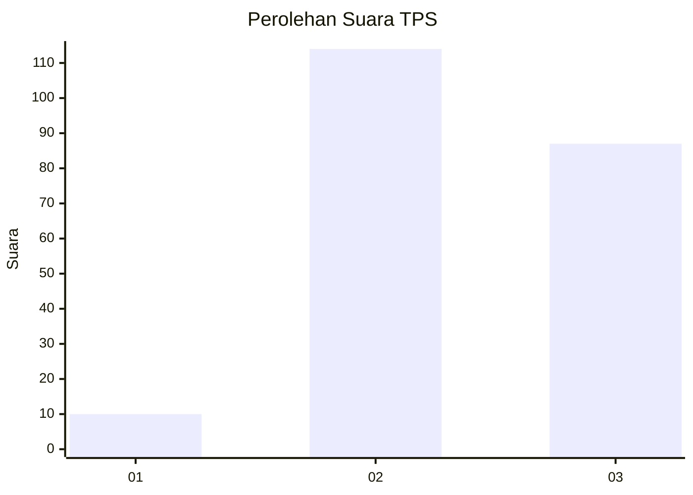
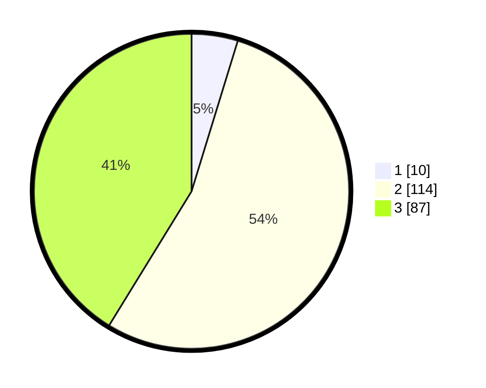

# Hasil

## Grafik

## Tabel

| No. | Nama Paslon    | Suara | Suara (raw) | Persentase |
|:--- |:-------------- | -----:| -----------:| ----------:|
| 1   | ANIES MUHAIMIN | 10    | [10][p-1]   | 4,74       |
| 2   | PRABOWO GIBRAN | 114   | [114][p-2]  | 54,03      |
| 3   | GANJAR MAHFUD  | 87    | [87][p-3]   | 41,23      |

[p-1]: https://github.com/gigit-pemilu/pemilu-2024-33-jawa-tengah/blob/main/pilpres/hitung-suara/sub/33-jawa-tengah/sub/03-purbalingga/sub/07-kutasari/sub/2014-karangjengkol/sub/006-tps/sub/paslon-1.txt
[p-2]: https://github.com/gigit-pemilu/pemilu-2024-33-jawa-tengah/blob/main/pilpres/hitung-suara/sub/33-jawa-tengah/sub/03-purbalingga/sub/07-kutasari/sub/2014-karangjengkol/sub/006-tps/sub/paslon-2.txt
[p-3]: https://github.com/gigit-pemilu/pemilu-2024-33-jawa-tengah/blob/main/pilpres/hitung-suara/sub/33-jawa-tengah/sub/03-purbalingga/sub/07-kutasari/sub/2014-karangjengkol/sub/006-tps/sub/paslon-3.txt

## Foto C Plano

https://sirekap-obj-formc.kpu.go.id/3a43/pemilu/ppwp/33/03/07/20/14/3303072014006-20240216-174929--6807a19e-29a6-480f-8eb5-bf7ddddf1e3f.jpg

https://sirekap-obj-formc.kpu.go.id/3a43/pemilu/ppwp/33/03/07/20/14/3303072014006-20240216-175110--a92be83a-ce7f-41a7-ab46-f0924ee987a3.jpg

https://sirekap-obj-formc.kpu.go.id/3a43/pemilu/ppwp/33/03/07/20/14/3303072014006-20240216-175206--25581b43-cde2-4403-adbc-b317621f9102.jpg

## Metadata

| Key        | Value               |
| ---------- | ------------------- |
| Time Stamp | 2024-02-19 06:16:00 |

