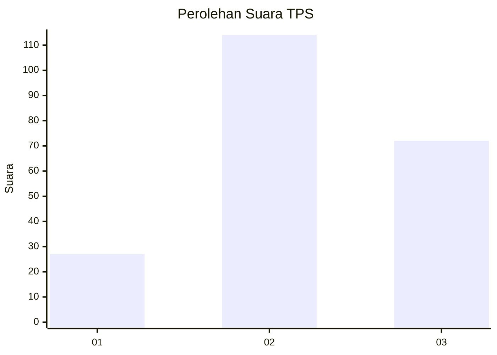
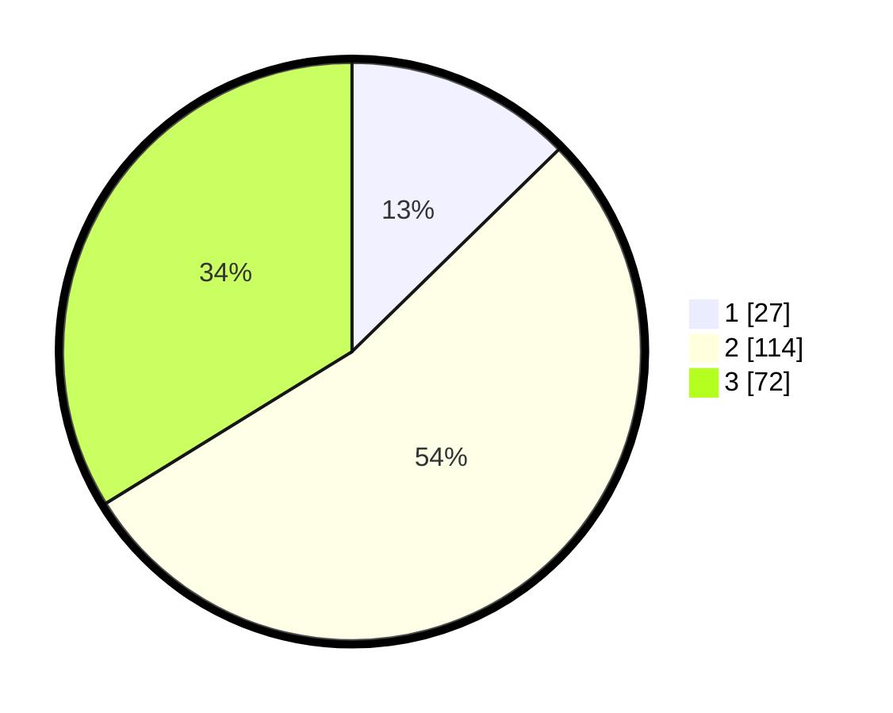

# Hasil

## Grafik

## Tabel

| No. | Nama Paslon    | Suara | Suara (raw) | Persentase |
|:--- |:-------------- | -----:| -----------:| ----------:|
| 1   | ANIES MUHAIMIN | 27    | [27][p-1]   | 12,68      |
| 2   | PRABOWO GIBRAN | 114   | [114][p-2]  | 53,52      |
| 3   | GANJAR MAHFUD  | 72    | [72][p-3]   | 33,80      |

[p-1]: https://github.com/gigit-pemilu/pemilu-2024-33-jawa-tengah/blob/main/pilpres/hitung-suara/sub/33-jawa-tengah/sub/03-purbalingga/sub/08-mrebet/sub/2001-karangturi/sub/008-tps/sub/paslon-1.txt
[p-2]: https://github.com/gigit-pemilu/pemilu-2024-33-jawa-tengah/blob/main/pilpres/hitung-suara/sub/33-jawa-tengah/sub/03-purbalingga/sub/08-mrebet/sub/2001-karangturi/sub/008-tps/sub/paslon-2.txt
[p-3]: https://github.com/gigit-pemilu/pemilu-2024-33-jawa-tengah/blob/main/pilpres/hitung-suara/sub/33-jawa-tengah/sub/03-purbalingga/sub/08-mrebet/sub/2001-karangturi/sub/008-tps/sub/paslon-3.txt

## Foto C Plano

https://sirekap-obj-formc.kpu.go.id/2d6a/pemilu/ppwp/33/03/08/20/01/3303082001008-20240214-235007--dc00febb-5ad4-49a0-ab7a-516c2fdc2132.jpg

https://sirekap-obj-formc.kpu.go.id/2d6a/pemilu/ppwp/33/03/08/20/01/3303082001008-20240214-235111--e0a4741f-399b-4252-b405-c1cf1e49cf0b.jpg

https://sirekap-obj-formc.kpu.go.id/2d6a/pemilu/ppwp/33/03/08/20/01/3303082001008-20240214-235159--bd313e1e-12b9-4aeb-821a-fe7b5ad1a199.jpg

## Metadata

| Key        | Value               |
| ---------- | ------------------- |
| Time Stamp | 2024-02-15 12:00:28 |

