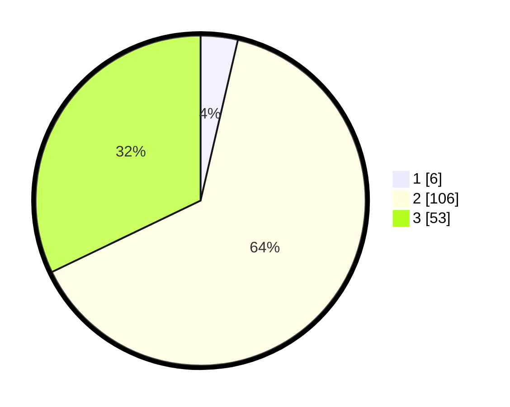

# Hasil

## Grafik

## Tabel

| No. | Nama Paslon    | Suara | Suara (raw) | Persentase |
|:--- |:-------------- | -----:| -----------:| ----------:|
| 1   | ANIES MUHAIMIN | 6     | [6][p-1]    | 3,64       |
| 2   | PRABOWO GIBRAN | 106   | [106][p-2]  | 64,24      |
| 3   | GANJAR MAHFUD  | 53    | [53][p-3]   | 32,12      |

[p-1]: https://github.com/gigit-pemilu/pemilu-2024/blob/main/pilpres/hitung-suara/sub/33-jawa-tengah/sub/03-purbalingga/sub/08-mrebet/sub/2002-onje/sub/003-tps/sub/paslon-1.txt
[p-2]: https://github.com/gigit-pemilu/pemilu-2024/blob/main/pilpres/hitung-suara/sub/33-jawa-tengah/sub/03-purbalingga/sub/08-mrebet/sub/2002-onje/sub/003-tps/sub/paslon-2.txt
[p-3]: https://github.com/gigit-pemilu/pemilu-2024/blob/main/pilpres/hitung-suara/sub/33-jawa-tengah/sub/03-purbalingga/sub/08-mrebet/sub/2002-onje/sub/003-tps/sub/paslon-3.txt

## Foto C Plano

https://sirekap-obj-formc.kpu.go.id/9290/pemilu/ppwp/33/03/08/20/02/3303082002003-20240214-201057--07fe25c7-6ed0-4a31-ab74-6e5fb51d4da8.jpg

https://sirekap-obj-formc.kpu.go.id/9290/pemilu/ppwp/33/03/08/20/02/3303082002003-20240214-201845--c5674d9c-678d-4b62-a4a8-7e6ee98f8eda.jpg

https://sirekap-obj-formc.kpu.go.id/9290/pemilu/ppwp/33/03/08/20/02/3303082002003-20240214-202032--e37ffce0-4542-4214-bb91-1b3530f8e77f.jpg

## Metadata

| Key        | Value               |
| ---------- | ------------------- |
| Time Stamp | 2024-02-15 15:00:29 |

