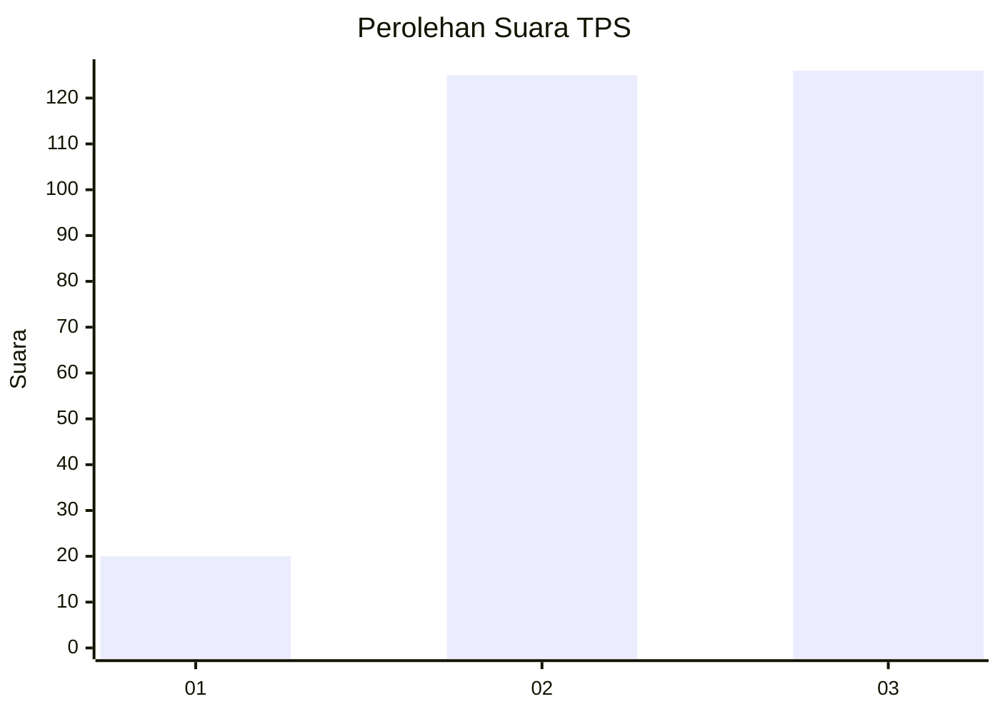
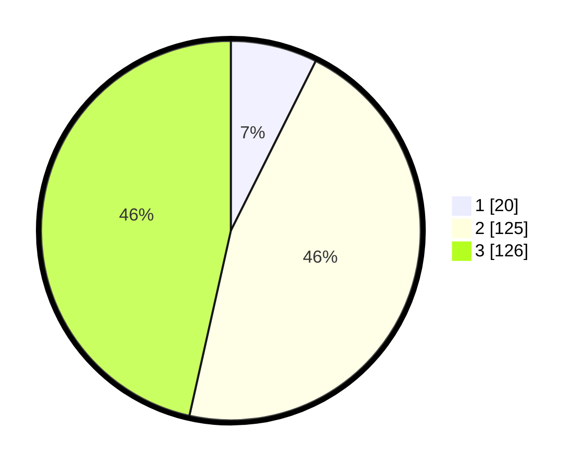

# Hasil

## Grafik

## Tabel

| No. | Nama Paslon    | Suara | Suara (raw) | Persentase |
|:--- |:-------------- | -----:| -----------:| ----------:|
| 1   | ANIES MUHAIMIN | 20    | [20][p-1]   | 7,38       |
| 2   | PRABOWO GIBRAN | 125   | [125][p-2]  | 46,13      |
| 3   | GANJAR MAHFUD  | 126   | [126][p-3]  | 46,49      |

[p-1]: https://github.com/gigit-pemilu/pemilu-2024-33-jawa-tengah/blob/main/pilpres/hitung-suara/sub/33-jawa-tengah/sub/03-purbalingga/sub/08-mrebet/sub/2002-onje/sub/011-tps/sub/paslon-1.txt
[p-2]: https://github.com/gigit-pemilu/pemilu-2024-33-jawa-tengah/blob/main/pilpres/hitung-suara/sub/33-jawa-tengah/sub/03-purbalingga/sub/08-mrebet/sub/2002-onje/sub/011-tps/sub/paslon-2.txt
[p-3]: https://github.com/gigit-pemilu/pemilu-2024-33-jawa-tengah/blob/main/pilpres/hitung-suara/sub/33-jawa-tengah/sub/03-purbalingga/sub/08-mrebet/sub/2002-onje/sub/011-tps/sub/paslon-3.txt

## Foto C Plano

https://sirekap-obj-formc.kpu.go.id/0767/pemilu/ppwp/33/03/08/20/02/3303082002011-20240214-233647--b802e5a7-9830-47dd-b187-4ad22ce9582e.jpg

https://sirekap-obj-formc.kpu.go.id/0767/pemilu/ppwp/33/03/08/20/02/3303082002011-20240214-233737--58fd32a6-1d98-4e9e-9cc0-09879f44cf32.jpg

https://sirekap-obj-formc.kpu.go.id/0767/pemilu/ppwp/33/03/08/20/02/3303082002011-20240214-233859--29c88aac-e185-40cc-a932-b0c59f5d7eee.jpg

## Metadata

| Key        | Value               |
| ---------- | ------------------- |
| Time Stamp | 2024-02-15 12:00:28 |

