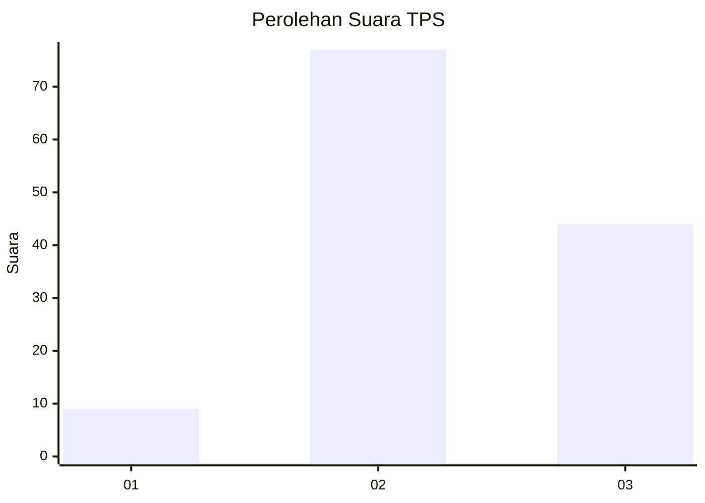
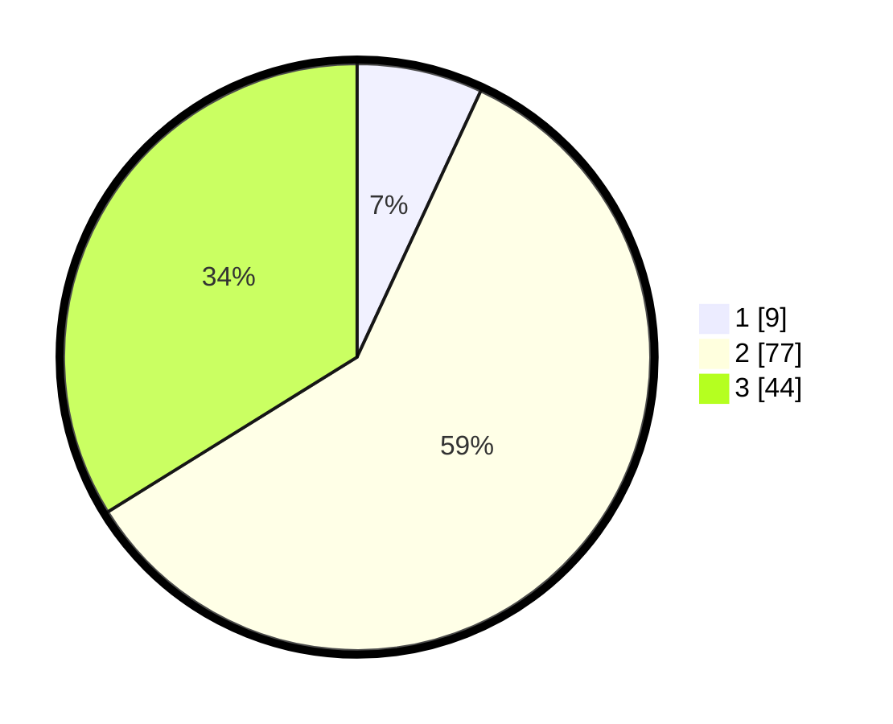

# Hasil

## Grafik

## Tabel

| No. | Nama Paslon    | Suara | Suara (raw) | Persentase |
|:--- |:-------------- | -----:| -----------:| ----------:|
| 1   | ANIES MUHAIMIN | 9     | [9][p-1]    | 6,92       |
| 2   | PRABOWO GIBRAN | 77    | [77][p-2]   | 59,23      |
| 3   | GANJAR MAHFUD  | 44    | [44][p-3]   | 33,85      |

[p-1]: https://github.com/gigit-pemilu/pemilu-2024/blob/main/pilpres/hitung-suara/sub/33-jawa-tengah/sub/03-purbalingga/sub/08-mrebet/sub/2003-sindang/sub/005-tps/sub/paslon-1.txt
[p-2]: https://github.com/gigit-pemilu/pemilu-2024/blob/main/pilpres/hitung-suara/sub/33-jawa-tengah/sub/03-purbalingga/sub/08-mrebet/sub/2003-sindang/sub/005-tps/sub/paslon-2.txt
[p-3]: https://github.com/gigit-pemilu/pemilu-2024/blob/main/pilpres/hitung-suara/sub/33-jawa-tengah/sub/03-purbalingga/sub/08-mrebet/sub/2003-sindang/sub/005-tps/sub/paslon-3.txt

## Foto C Plano

https://sirekap-obj-formc.kpu.go.id/6d74/pemilu/ppwp/33/03/08/20/03/3303082003005-20240214-212533--c629e835-7634-44c0-b110-95f4bf33bd89.jpg

https://sirekap-obj-formc.kpu.go.id/6d74/pemilu/ppwp/33/03/08/20/03/3303082003005-20240214-212636--1221568b-f340-4397-86a0-6a55a685708d.jpg

https://sirekap-obj-formc.kpu.go.id/6d74/pemilu/ppwp/33/03/08/20/03/3303082003005-20240214-212814--48600db1-59f1-46a7-975f-ad583a570e5f.jpg

## Metadata

| Key        | Value               |
| ---------- | ------------------- |
| Time Stamp | 2024-02-15 12:00:28 |

