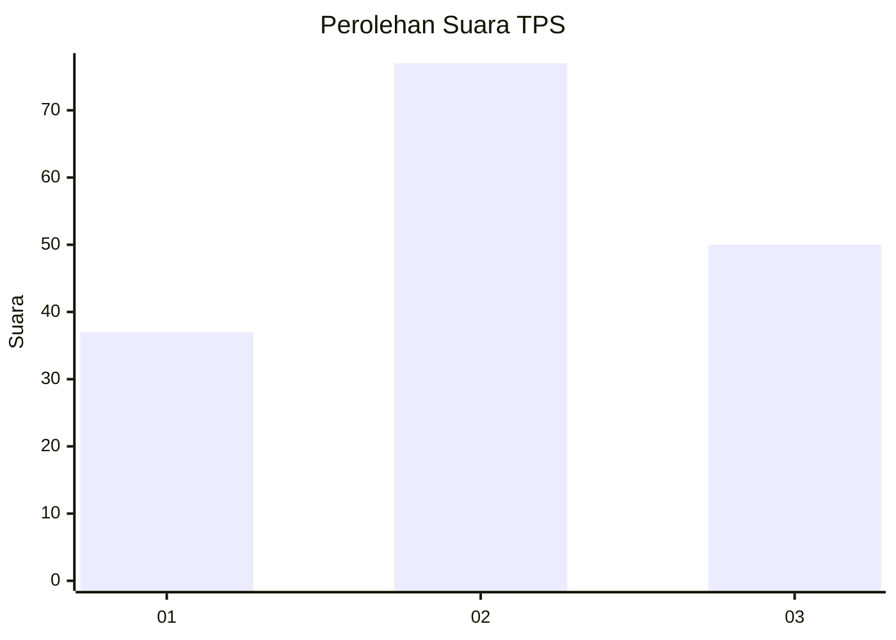
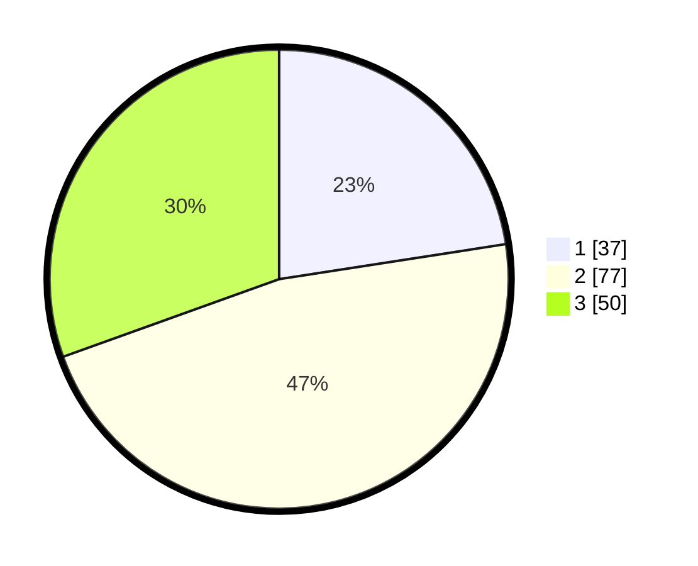

# Hasil

## Grafik

## Tabel

| No. | Nama Paslon    | Suara | Suara (raw) | Persentase |
|:--- |:-------------- | -----:| -----------:| ----------:|
| 1   | ANIES MUHAIMIN | 37    | [37][p-1]   | 22,56      |
| 2   | PRABOWO GIBRAN | 77    | [77][p-2]   | 46,95      |
| 3   | GANJAR MAHFUD  | 50    | [50][p-3]   | 30,49      |

[p-1]: https://github.com/gigit-pemilu/pemilu-2024-33-jawa-tengah/blob/main/pilpres/hitung-suara/sub/33-jawa-tengah/sub/03-purbalingga/sub/08-mrebet/sub/2018-pengalusan/sub/005-tps/sub/paslon-1.txt
[p-2]: https://github.com/gigit-pemilu/pemilu-2024-33-jawa-tengah/blob/main/pilpres/hitung-suara/sub/33-jawa-tengah/sub/03-purbalingga/sub/08-mrebet/sub/2018-pengalusan/sub/005-tps/sub/paslon-2.txt
[p-3]: https://github.com/gigit-pemilu/pemilu-2024-33-jawa-tengah/blob/main/pilpres/hitung-suara/sub/33-jawa-tengah/sub/03-purbalingga/sub/08-mrebet/sub/2018-pengalusan/sub/005-tps/sub/paslon-3.txt

## Foto C Plano

https://sirekap-obj-formc.kpu.go.id/3bec/pemilu/ppwp/33/03/08/20/18/3303082018005-20240214-141127--b594be5b-bb62-4d91-85d2-a3c9bf83c7a2.jpg

https://sirekap-obj-formc.kpu.go.id/3bec/pemilu/ppwp/33/03/08/20/18/3303082018005-20240214-195545--7b67a397-0b28-4835-a66e-3a8fc2dad560.jpg

https://sirekap-obj-formc.kpu.go.id/3bec/pemilu/ppwp/33/03/08/20/18/3303082018005-20240214-141308--f966e3cd-9f3b-437f-bd34-618df60e149d.jpg

## Metadata

| Key        | Value               |
| ---------- | ------------------- |
| Time Stamp | 2024-02-14 21:46:01 |

