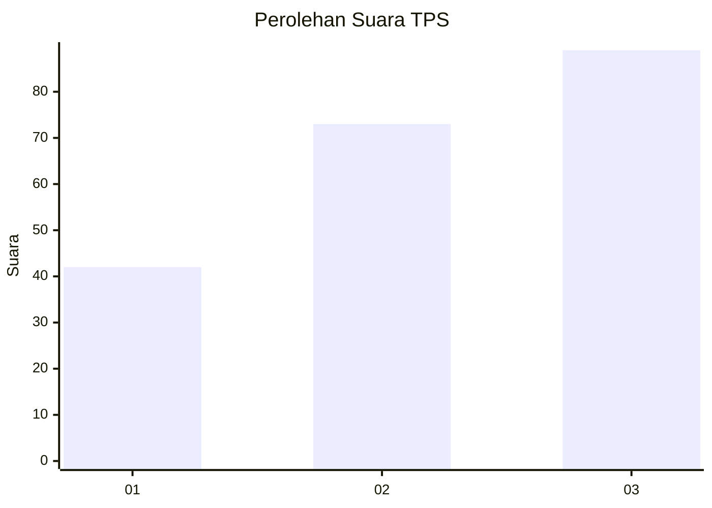
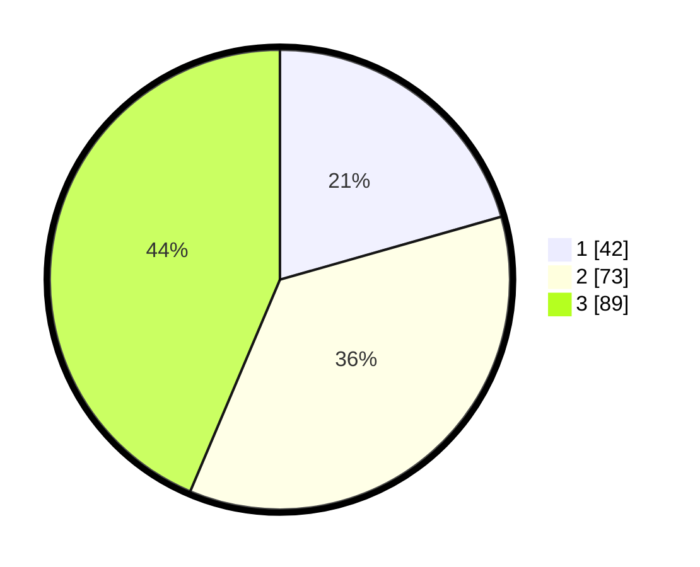

# Hasil

## Grafik

## Tabel

| No. | Nama Paslon    | Suara | Suara (raw) | Persentase |
|:--- |:-------------- | -----:| -----------:| ----------:|
| 1   | ANIES MUHAIMIN | 42    | [42][p-1]   | 20,59      |
| 2   | PRABOWO GIBRAN | 73    | [73][p-2]   | 35,78      |
| 3   | GANJAR MAHFUD  | 89    | [89][p-3]   | 43,63      |

[p-1]: https://github.com/gigit-pemilu/pemilu-2024/blob/main/pilpres/hitung-suara/sub/33-jawa-tengah/sub/03-purbalingga/sub/08-mrebet/sub/2019-sangkanayu/sub/005-tps/sub/paslon-1.txt
[p-2]: https://github.com/gigit-pemilu/pemilu-2024/blob/main/pilpres/hitung-suara/sub/33-jawa-tengah/sub/03-purbalingga/sub/08-mrebet/sub/2019-sangkanayu/sub/005-tps/sub/paslon-2.txt
[p-3]: https://github.com/gigit-pemilu/pemilu-2024/blob/main/pilpres/hitung-suara/sub/33-jawa-tengah/sub/03-purbalingga/sub/08-mrebet/sub/2019-sangkanayu/sub/005-tps/sub/paslon-3.txt

## Foto C Plano

https://sirekap-obj-formc.kpu.go.id/3b25/pemilu/ppwp/33/03/08/20/19/3303082019005-20240215-002300--981f6f36-c5d6-4561-a6ff-e9acd9ba7ce2.jpg

https://sirekap-obj-formc.kpu.go.id/3b25/pemilu/ppwp/33/03/08/20/19/3303082019005-20240215-002305--a9bf97b4-8bf9-4556-9be5-faaf8d31fa64.jpg

https://sirekap-obj-formc.kpu.go.id/3b25/pemilu/ppwp/33/03/08/20/19/3303082019005-20240215-002347--aefe97e3-fa88-4cdb-abae-1dacde28eef1.jpg

## Metadata

| Key        | Value               |
| ---------- | ------------------- |
| Time Stamp | 2024-02-15 19:30:26 |

