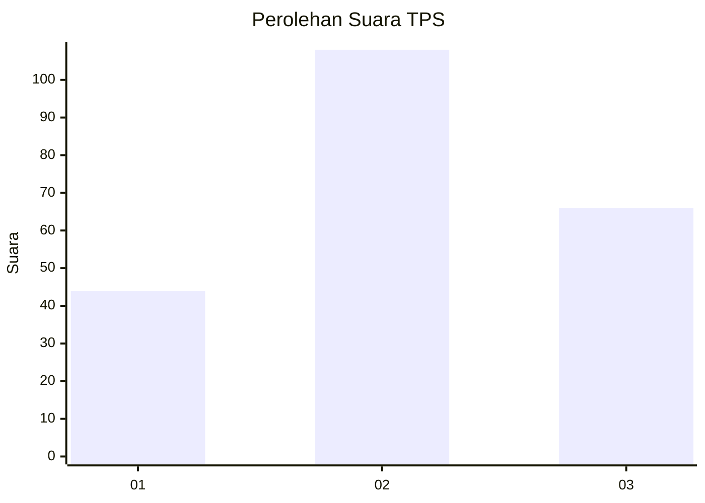
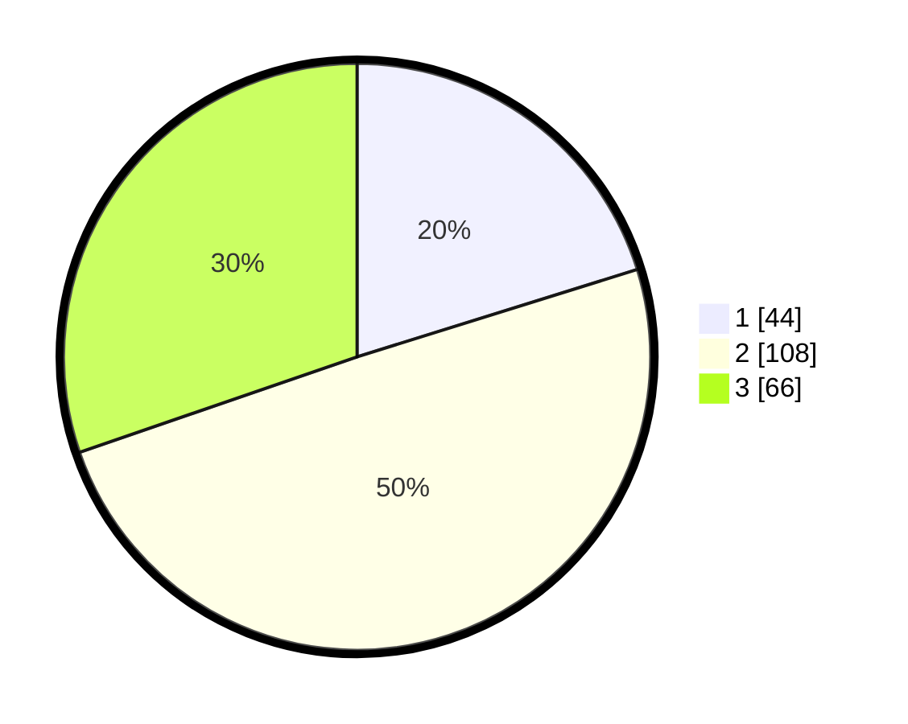

# Hasil

## Grafik

## Tabel

| No. | Nama Paslon    | Suara | Suara (raw) | Persentase |
|:--- |:-------------- | -----:| -----------:| ----------:|
| 1   | ANIES MUHAIMIN | 44    | [44][p-1]   | 20,18      |
| 2   | PRABOWO GIBRAN | 108   | [108][p-2]  | 49,54      |
| 3   | GANJAR MAHFUD  | 66    | [66][p-3]   | 30,28      |

[p-1]: https://github.com/gigit-pemilu/pemilu-2024-33-jawa-tengah/blob/main/pilpres/hitung-suara/sub/33-jawa-tengah/sub/03-purbalingga/sub/09-bobotsari/sub/2001-gandasuli/sub/003-tps/sub/paslon-1.txt
[p-2]: https://github.com/gigit-pemilu/pemilu-2024-33-jawa-tengah/blob/main/pilpres/hitung-suara/sub/33-jawa-tengah/sub/03-purbalingga/sub/09-bobotsari/sub/2001-gandasuli/sub/003-tps/sub/paslon-2.txt
[p-3]: https://github.com/gigit-pemilu/pemilu-2024-33-jawa-tengah/blob/main/pilpres/hitung-suara/sub/33-jawa-tengah/sub/03-purbalingga/sub/09-bobotsari/sub/2001-gandasuli/sub/003-tps/sub/paslon-3.txt

## Foto C Plano

https://sirekap-obj-formc.kpu.go.id/37e4/pemilu/ppwp/33/03/09/20/01/3303092001003-20240215-132532--0a59e8ac-de03-413a-a75c-bf92c850d9b8.jpg

https://sirekap-obj-formc.kpu.go.id/37e4/pemilu/ppwp/33/03/09/20/01/3303092001003-20240215-132602--7697db4f-7e3b-49cc-ae31-52441b77492e.jpg

https://sirekap-obj-formc.kpu.go.id/37e4/pemilu/ppwp/33/03/09/20/01/3303092001003-20240215-132635--233551ad-c81d-4ee9-8511-2634ae8f1e87.jpg

## Metadata

| Key        | Value               |
| ---------- | ------------------- |
| Time Stamp | 2024-02-15 18:30:25 |

