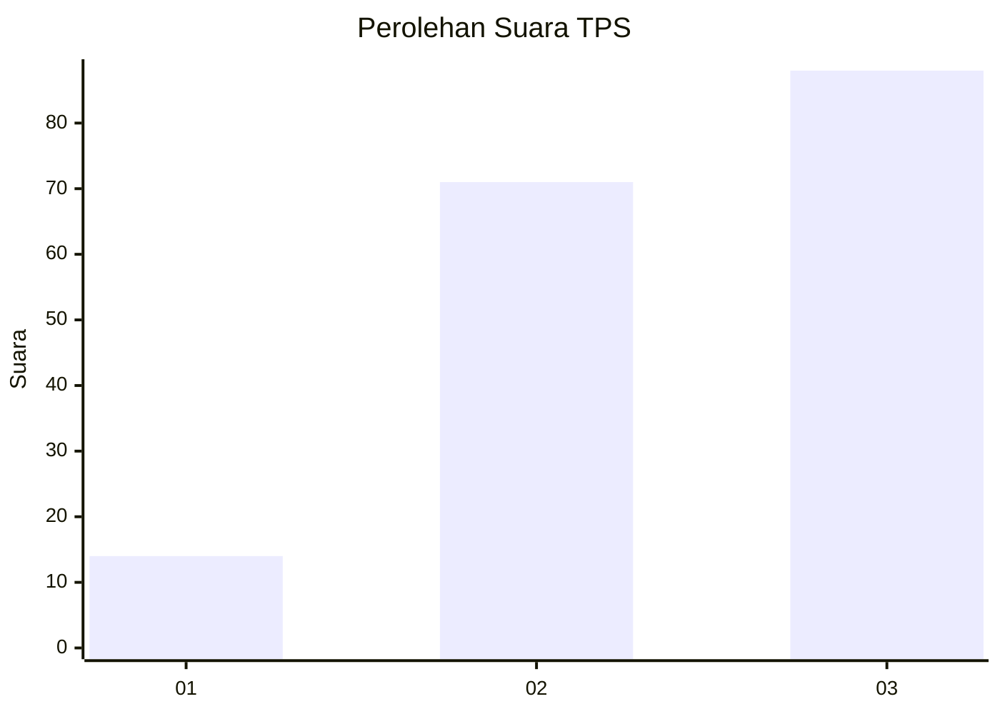
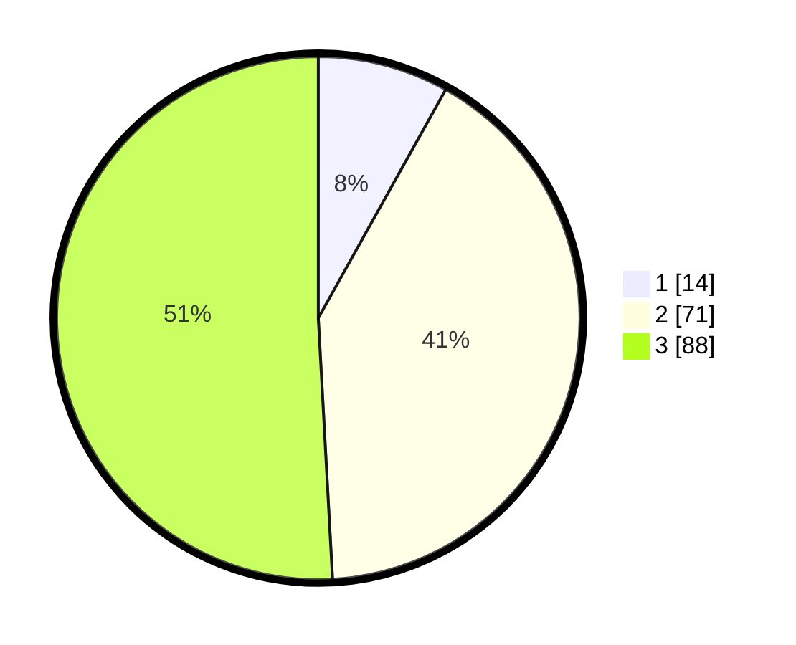

# Hasil

## Grafik

## Tabel

| No. | Nama Paslon    | Suara | Suara (raw) | Persentase |
|:--- |:-------------- | -----:| -----------:| ----------:|
| 1   | ANIES MUHAIMIN | 14    | [14][p-1]   | 8,09       |
| 2   | PRABOWO GIBRAN | 71    | [71][p-2]   | 41,04      |
| 3   | GANJAR MAHFUD  | 88    | [88][p-3]   | 50,87      |

[p-1]: https://github.com/gigit-pemilu/pemilu-2024/blob/main/pilpres/hitung-suara/sub/33-jawa-tengah/sub/03-purbalingga/sub/09-bobotsari/sub/2001-gandasuli/sub/007-tps/sub/paslon-1.txt
[p-2]: https://github.com/gigit-pemilu/pemilu-2024/blob/main/pilpres/hitung-suara/sub/33-jawa-tengah/sub/03-purbalingga/sub/09-bobotsari/sub/2001-gandasuli/sub/007-tps/sub/paslon-2.txt
[p-3]: https://github.com/gigit-pemilu/pemilu-2024/blob/main/pilpres/hitung-suara/sub/33-jawa-tengah/sub/03-purbalingga/sub/09-bobotsari/sub/2001-gandasuli/sub/007-tps/sub/paslon-3.txt

## Foto C Plano

https://sirekap-obj-formc.kpu.go.id/4706/pemilu/ppwp/33/03/09/20/01/3303092001007-20240215-142244--1efa9680-62cc-4899-b33c-34ccddfdcfab.jpg

https://sirekap-obj-formc.kpu.go.id/4706/pemilu/ppwp/33/03/09/20/01/3303092001007-20240216-065710--f9b5a12e-297b-4955-8e36-90c3c4278d76.jpg

https://sirekap-obj-formc.kpu.go.id/4706/pemilu/ppwp/33/03/09/20/01/3303092001007-20240216-065729--a5292169-4f16-4a24-af89-c3ba9e2cd016.jpg

## Metadata

| Key        | Value               |
| ---------- | ------------------- |
| Time Stamp | 2024-02-16 21:01:00 |

