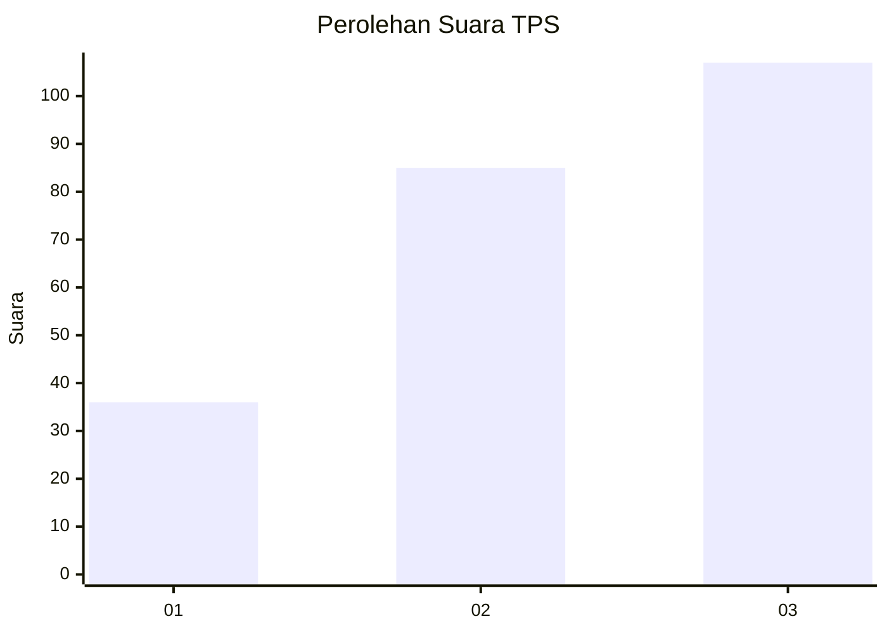
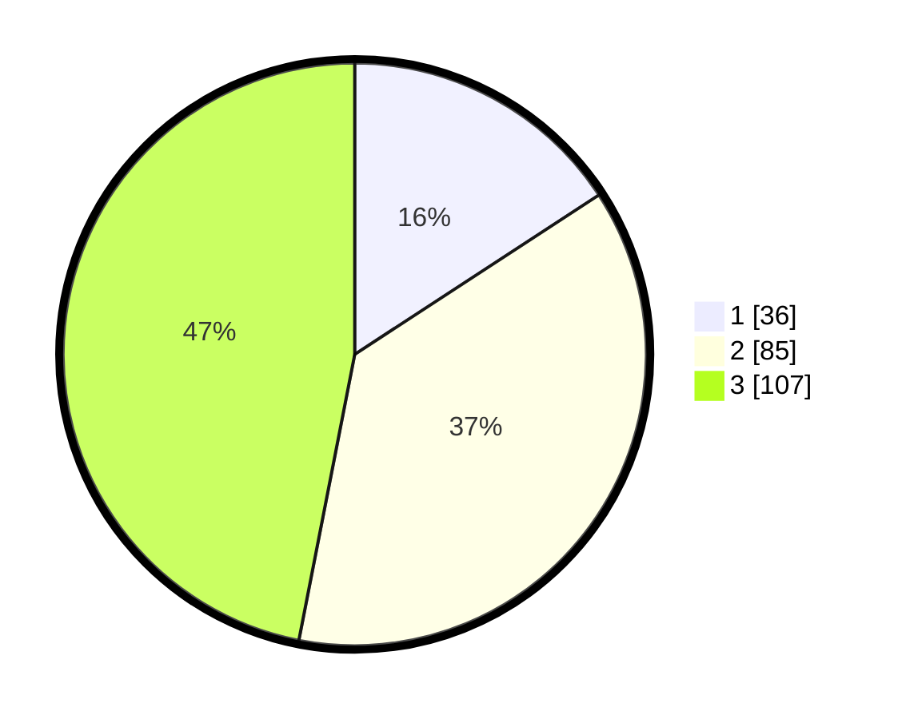

# Hasil

## Grafik

## Tabel

| No. | Nama Paslon    | Suara | Suara (raw) | Persentase |
|:--- |:-------------- | -----:| -----------:| ----------:|
| 1   | ANIES MUHAIMIN | 36    | [36][p-1]   | 15,79      |
| 2   | PRABOWO GIBRAN | 85    | [85][p-2]   | 37,28      |
| 3   | GANJAR MAHFUD  | 107   | [107][p-3]  | 46,93      |

[p-1]: https://github.com/gigit-pemilu/pemilu-2024-33-jawa-tengah/blob/main/pilpres/hitung-suara/sub/33-jawa-tengah/sub/03-purbalingga/sub/09-bobotsari/sub/2002-kalapacung/sub/001-tps/sub/paslon-1.txt
[p-2]: https://github.com/gigit-pemilu/pemilu-2024-33-jawa-tengah/blob/main/pilpres/hitung-suara/sub/33-jawa-tengah/sub/03-purbalingga/sub/09-bobotsari/sub/2002-kalapacung/sub/001-tps/sub/paslon-2.txt
[p-3]: https://github.com/gigit-pemilu/pemilu-2024-33-jawa-tengah/blob/main/pilpres/hitung-suara/sub/33-jawa-tengah/sub/03-purbalingga/sub/09-bobotsari/sub/2002-kalapacung/sub/001-tps/sub/paslon-3.txt

## Foto C Plano

https://sirekap-obj-formc.kpu.go.id/85e7/pemilu/ppwp/33/03/09/20/02/3303092002001-20240214-211921--341a0809-feba-4238-a6c3-cb2f98ccf4cf.jpg

https://sirekap-obj-formc.kpu.go.id/85e7/pemilu/ppwp/33/03/09/20/02/3303092002001-20240214-212039--00705672-3375-4e2b-ba87-a1e93051d0b5.jpg

https://sirekap-obj-formc.kpu.go.id/85e7/pemilu/ppwp/33/03/09/20/02/3303092002001-20240215-074054--867c17f3-8dfa-4a98-a26a-e6558e18bc15.jpg

## Metadata

| Key        | Value               |
| ---------- | ------------------- |
| Time Stamp | 2024-02-15 09:00:24 |

