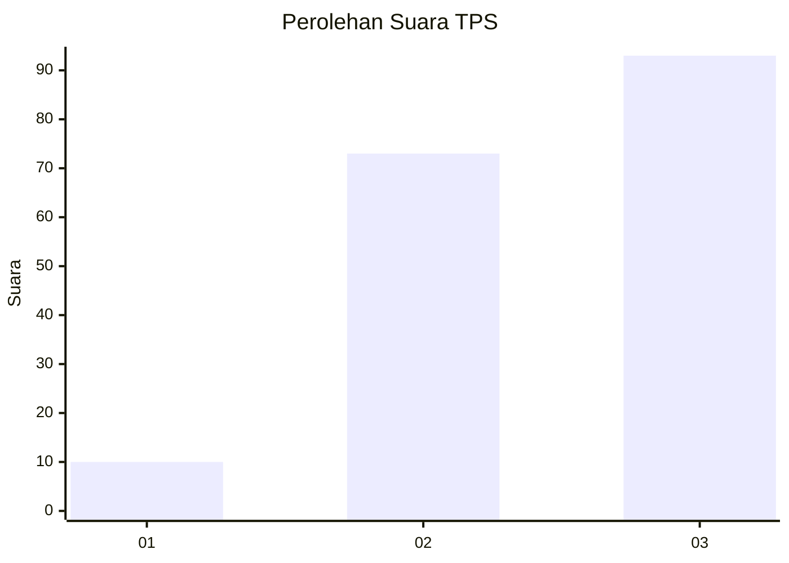
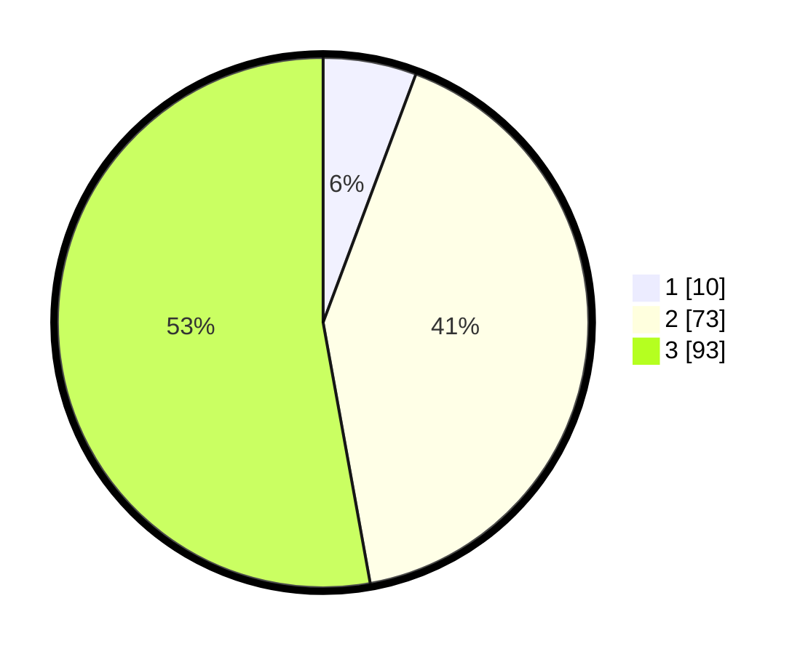

# Hasil

## Grafik

## Tabel

| No. | Nama Paslon    | Suara | Suara (raw) | Persentase |
|:--- |:-------------- | -----:| -----------:| ----------:|
| 1   | ANIES MUHAIMIN | 10    | [10][p-1]   | 5,68       |
| 2   | PRABOWO GIBRAN | 73    | [73][p-2]   | 41,48      |
| 3   | GANJAR MAHFUD  | 93    | [93][p-3]   | 52,84      |

[p-1]: https://github.com/gigit-pemilu/pemilu-2024-33-jawa-tengah/blob/main/pilpres/hitung-suara/sub/33-jawa-tengah/sub/03-purbalingga/sub/09-bobotsari/sub/2004-banjarsari/sub/006-tps/sub/paslon-1.txt
[p-2]: https://github.com/gigit-pemilu/pemilu-2024-33-jawa-tengah/blob/main/pilpres/hitung-suara/sub/33-jawa-tengah/sub/03-purbalingga/sub/09-bobotsari/sub/2004-banjarsari/sub/006-tps/sub/paslon-2.txt
[p-3]: https://github.com/gigit-pemilu/pemilu-2024-33-jawa-tengah/blob/main/pilpres/hitung-suara/sub/33-jawa-tengah/sub/03-purbalingga/sub/09-bobotsari/sub/2004-banjarsari/sub/006-tps/sub/paslon-3.txt

## Foto C Plano

https://sirekap-obj-formc.kpu.go.id/70a4/pemilu/ppwp/33/03/09/20/04/3303092004006-20240214-185251--8f0d83c9-6e97-4928-a09a-57e5588aeee5.jpg

https://sirekap-obj-formc.kpu.go.id/70a4/pemilu/ppwp/33/03/09/20/04/3303092004006-20240215-020323--2d4699e0-2507-42bd-92df-f33db63bdab7.jpg

https://sirekap-obj-formc.kpu.go.id/70a4/pemilu/ppwp/33/03/09/20/04/3303092004006-20240215-020625--9db7c085-c7af-4170-aa8f-86919dde10d3.jpg

## Metadata

| Key        | Value               |
| ---------- | ------------------- |
| Time Stamp | 2024-02-15 12:00:28 |

