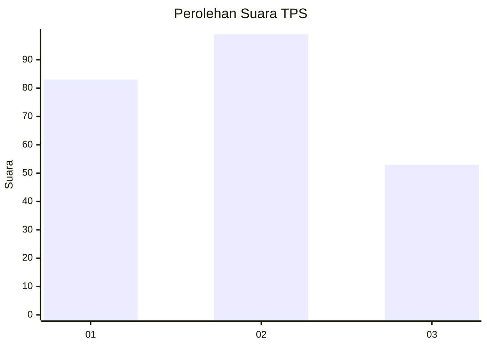
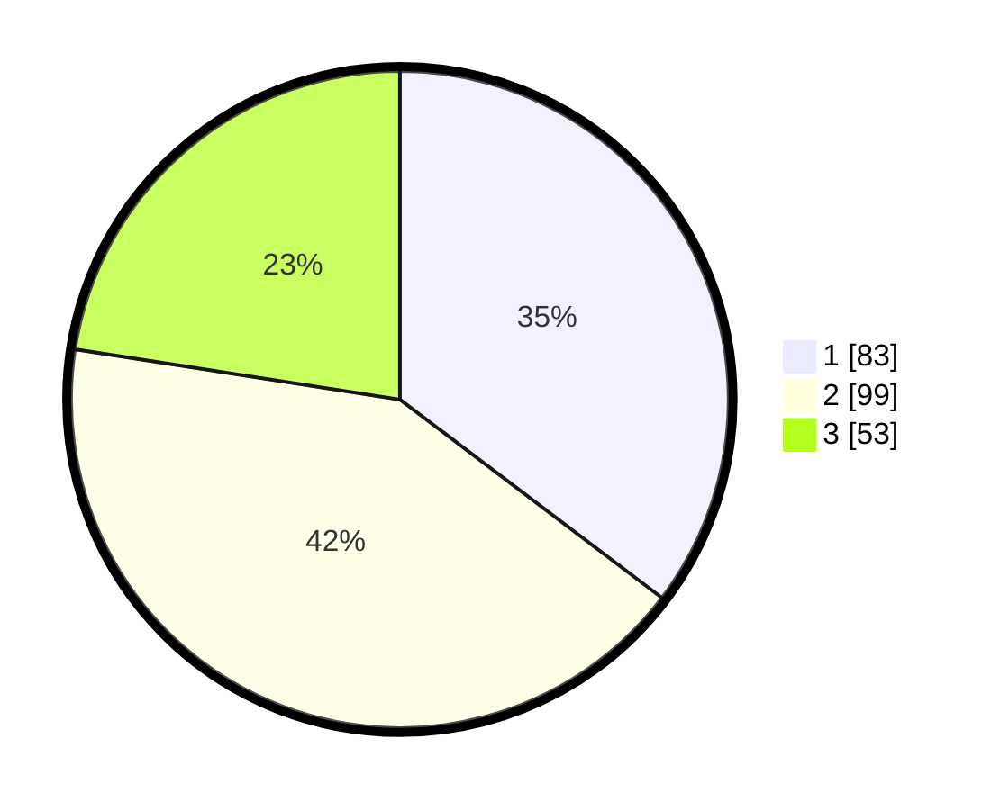

# Hasil

## Grafik

## Tabel

| No. | Nama Paslon    | Suara | Suara (raw) | Persentase |
|:--- |:-------------- | -----:| -----------:| ----------:|
| 1   | ANIES MUHAIMIN | 83    | [83][p-1]   | 35,32      |
| 2   | PRABOWO GIBRAN | 99    | [99][p-2]   | 42,13      |
| 3   | GANJAR MAHFUD  | 53    | [53][p-3]   | 22,55      |

[p-1]: https://github.com/gigit-pemilu/pemilu-2024-33-jawa-tengah/blob/main/pilpres/hitung-suara/sub/33-jawa-tengah/sub/03-purbalingga/sub/09-bobotsari/sub/2006-bobotsari/sub/001-tps/sub/paslon-1.txt
[p-2]: https://github.com/gigit-pemilu/pemilu-2024-33-jawa-tengah/blob/main/pilpres/hitung-suara/sub/33-jawa-tengah/sub/03-purbalingga/sub/09-bobotsari/sub/2006-bobotsari/sub/001-tps/sub/paslon-2.txt
[p-3]: https://github.com/gigit-pemilu/pemilu-2024-33-jawa-tengah/blob/main/pilpres/hitung-suara/sub/33-jawa-tengah/sub/03-purbalingga/sub/09-bobotsari/sub/2006-bobotsari/sub/001-tps/sub/paslon-3.txt

## Foto C Plano

https://sirekap-obj-formc.kpu.go.id/e958/pemilu/ppwp/33/03/09/20/06/3303092006001-20240215-023340--8aa5b27f-9ba0-4059-b754-c4cd8f3bcec3.jpg

https://sirekap-obj-formc.kpu.go.id/e958/pemilu/ppwp/33/03/09/20/06/3303092006001-20240215-023629--e4d5744a-3475-464b-9ba3-4b1c16ca8fc6.jpg

https://sirekap-obj-formc.kpu.go.id/e958/pemilu/ppwp/33/03/09/20/06/3303092006001-20240215-023853--83932d6c-0f00-4d8d-8b59-4bf92b450bac.jpg

## Metadata

| Key        | Value               |
| ---------- | ------------------- |
| Time Stamp | 2024-02-15 12:00:28 |

