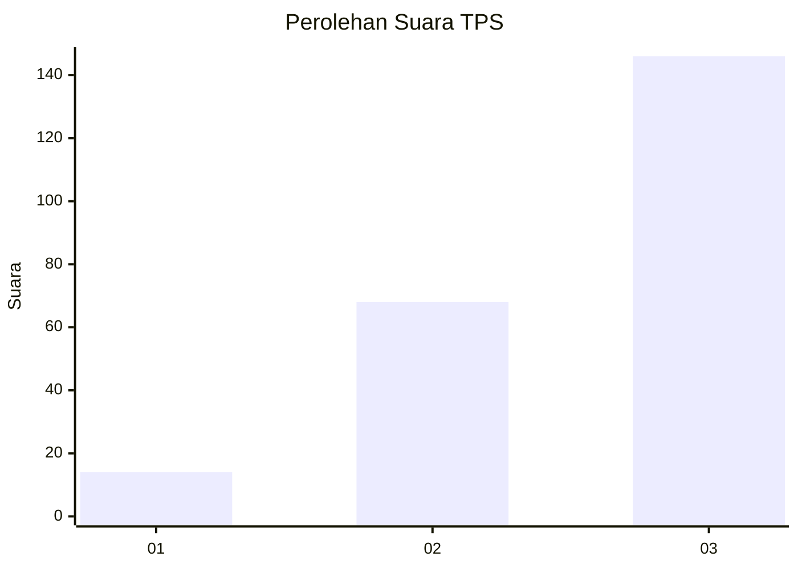
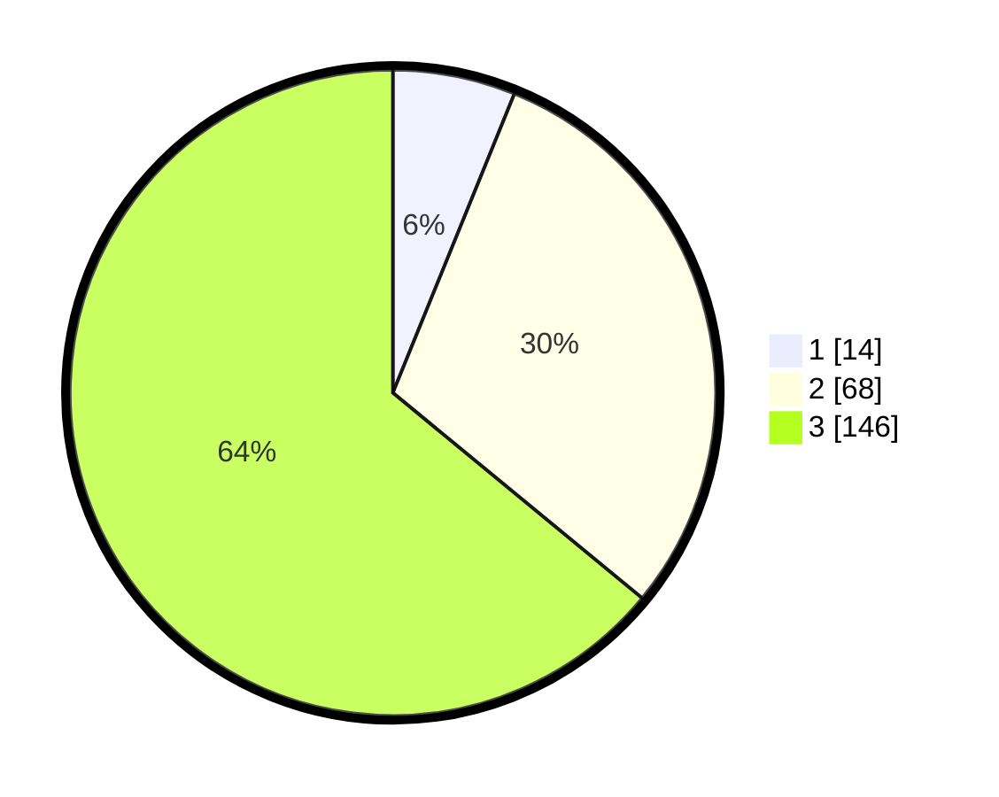

# Hasil

## Grafik

## Tabel

| No. | Nama Paslon    | Suara | Suara (raw) | Persentase |
|:--- |:-------------- | -----:| -----------:| ----------:|
| 1   | ANIES MUHAIMIN | 14    | [14][p-1]   | 6,14       |
| 2   | PRABOWO GIBRAN | 68    | [68][p-2]   | 29,82      |
| 3   | GANJAR MAHFUD  | 146   | [146][p-3]  | 64,04      |

[p-1]: https://github.com/gigit-pemilu/pemilu-2024/blob/main/pilpres/hitung-suara/sub/33-jawa-tengah/sub/03-purbalingga/sub/09-bobotsari/sub/2008-pakuncen/sub/007-tps/sub/paslon-1.txt
[p-2]: https://github.com/gigit-pemilu/pemilu-2024/blob/main/pilpres/hitung-suara/sub/33-jawa-tengah/sub/03-purbalingga/sub/09-bobotsari/sub/2008-pakuncen/sub/007-tps/sub/paslon-2.txt
[p-3]: https://github.com/gigit-pemilu/pemilu-2024/blob/main/pilpres/hitung-suara/sub/33-jawa-tengah/sub/03-purbalingga/sub/09-bobotsari/sub/2008-pakuncen/sub/007-tps/sub/paslon-3.txt

## Foto C Plano

https://sirekap-obj-formc.kpu.go.id/16ee/pemilu/ppwp/33/03/09/20/08/3303092008007-20240215-015728--ae2d4f66-6a94-41cb-bbf1-b99b04517665.jpg

https://sirekap-obj-formc.kpu.go.id/16ee/pemilu/ppwp/33/03/09/20/08/3303092008007-20240215-015806--7768fa16-b823-49b8-83fd-d7b2a5acf85b.jpg

https://sirekap-obj-formc.kpu.go.id/16ee/pemilu/ppwp/33/03/09/20/08/3303092008007-20240215-015950--339074cc-ae39-4fd7-97d8-798e6c1e3678.jpg

## Metadata

| Key        | Value               |
| ---------- | ------------------- |
| Time Stamp | 2024-02-15 18:30:25 |

