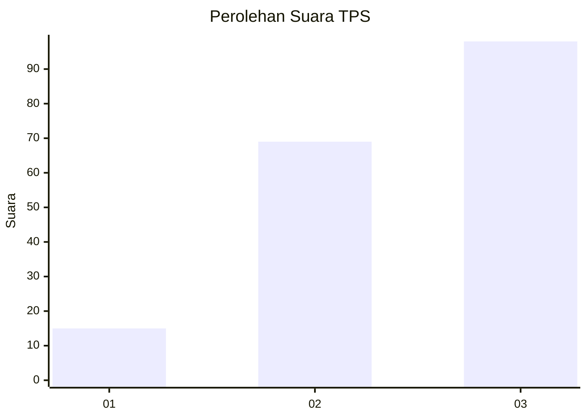
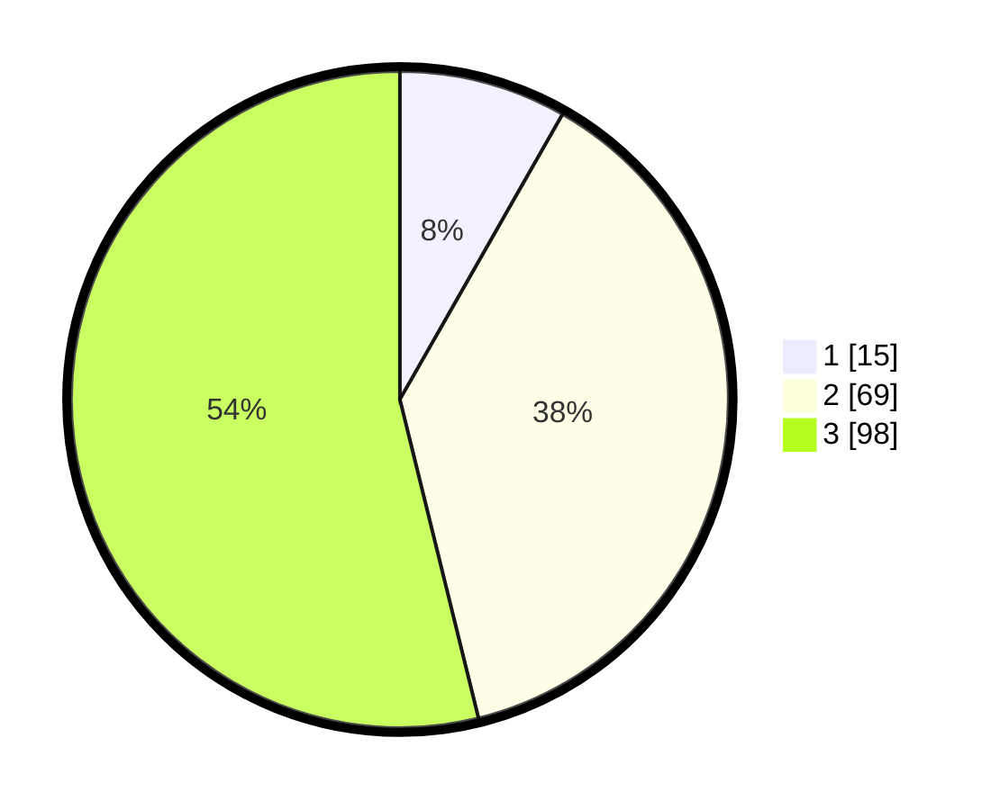

# Hasil

## Grafik

## Tabel

| No. | Nama Paslon    | Suara | Suara (raw) | Persentase |
|:--- |:-------------- | -----:| -----------:| ----------:|
| 1   | ANIES MUHAIMIN | 15    | [15][p-1]   | 8,24       |
| 2   | PRABOWO GIBRAN | 69    | [69][p-2]   | 37,91      |
| 3   | GANJAR MAHFUD  | 98    | [98][p-3]   | 53,85      |

[p-1]: https://github.com/gigit-pemilu/pemilu-2024-33-jawa-tengah/blob/main/pilpres/hitung-suara/sub/33-jawa-tengah/sub/03-purbalingga/sub/09-bobotsari/sub/2015-limbasari/sub/008-tps/sub/paslon-1.txt
[p-2]: https://github.com/gigit-pemilu/pemilu-2024-33-jawa-tengah/blob/main/pilpres/hitung-suara/sub/33-jawa-tengah/sub/03-purbalingga/sub/09-bobotsari/sub/2015-limbasari/sub/008-tps/sub/paslon-2.txt
[p-3]: https://github.com/gigit-pemilu/pemilu-2024-33-jawa-tengah/blob/main/pilpres/hitung-suara/sub/33-jawa-tengah/sub/03-purbalingga/sub/09-bobotsari/sub/2015-limbasari/sub/008-tps/sub/paslon-3.txt

## Foto C Plano

https://sirekap-obj-formc.kpu.go.id/8090/pemilu/ppwp/33/03/09/20/15/3303092015008-20240216-235837--3273c27d-0540-407a-8b71-f938f5bb8580.jpg

https://sirekap-obj-formc.kpu.go.id/8090/pemilu/ppwp/33/03/09/20/15/3303092015008-20240216-235832--2f7ae109-183b-4192-9654-2b4c99bcbcf4.jpg

https://sirekap-obj-formc.kpu.go.id/8090/pemilu/ppwp/33/03/09/20/15/3303092015008-20240216-235841--77dde532-f127-4b5d-801c-a758397aa8d0.jpg

## Metadata

| Key        | Value               |
| ---------- | ------------------- |
| Time Stamp | 2024-02-19 06:16:00 |

