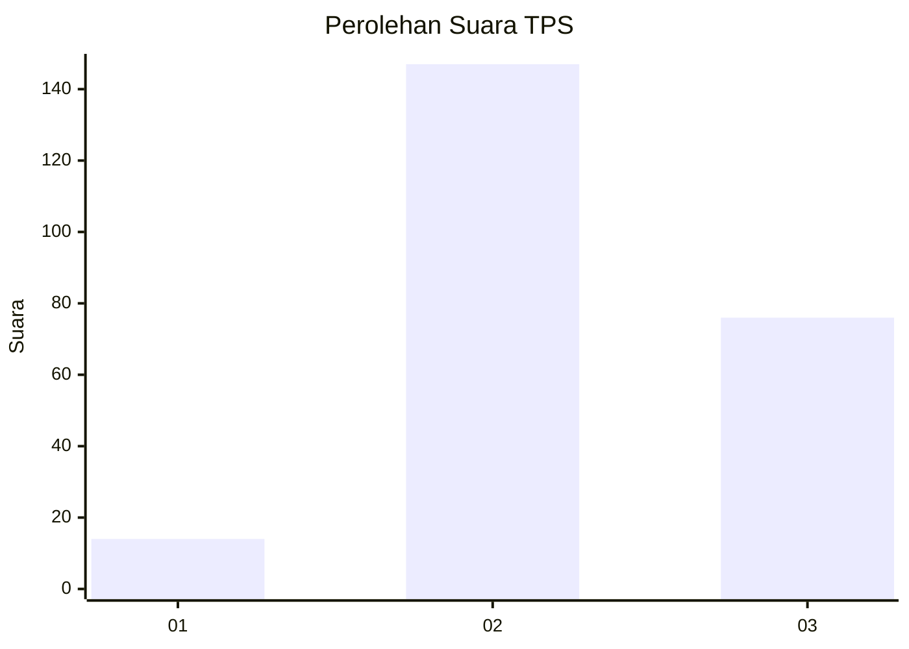
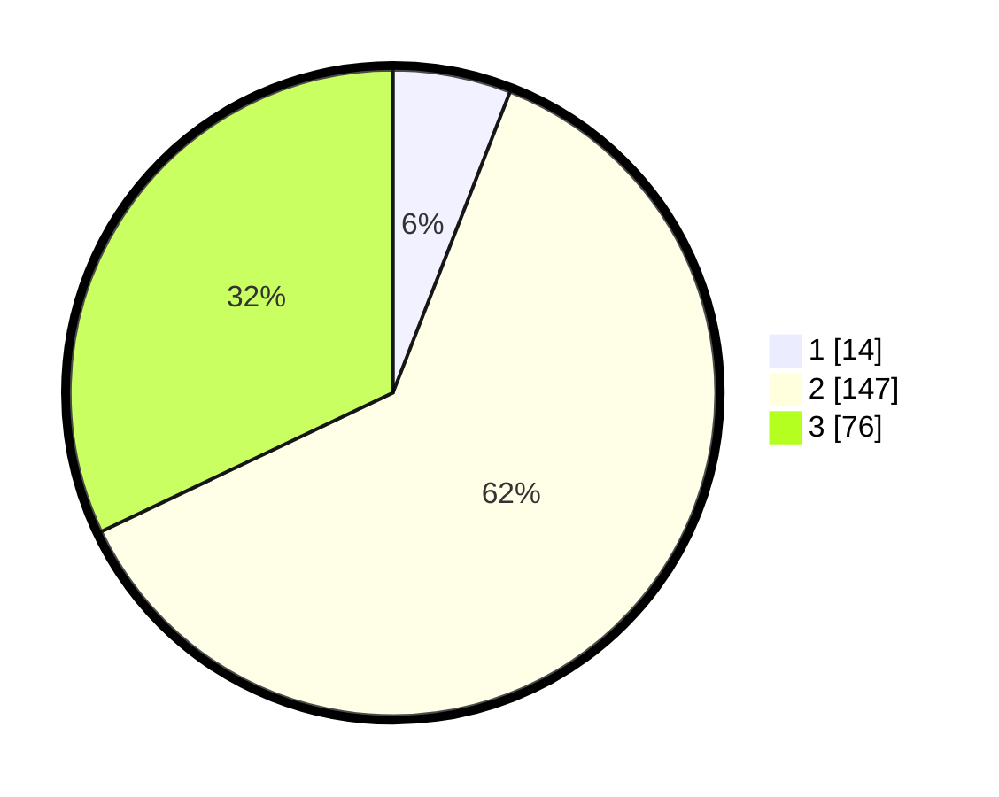

# Hasil

## Grafik

## Tabel

| No. | Nama Paslon    | Suara | Suara (raw) | Persentase |
|:--- |:-------------- | -----:| -----------:| ----------:|
| 1   | ANIES MUHAIMIN | 14    | [14][p-1]   | 5,91       |
| 2   | PRABOWO GIBRAN | 147   | [147][p-2]  | 62,03      |
| 3   | GANJAR MAHFUD  | 76    | [76][p-3]   | 32,07      |

[p-1]: https://github.com/gigit-pemilu/pemilu-2024/blob/main/pilpres/hitung-suara/sub/33-jawa-tengah/sub/03-purbalingga/sub/10-karangreja/sub/2001-serang/sub/010-tps/sub/paslon-1.txt
[p-2]: https://github.com/gigit-pemilu/pemilu-2024/blob/main/pilpres/hitung-suara/sub/33-jawa-tengah/sub/03-purbalingga/sub/10-karangreja/sub/2001-serang/sub/010-tps/sub/paslon-2.txt
[p-3]: https://github.com/gigit-pemilu/pemilu-2024/blob/main/pilpres/hitung-suara/sub/33-jawa-tengah/sub/03-purbalingga/sub/10-karangreja/sub/2001-serang/sub/010-tps/sub/paslon-3.txt

## Foto C Plano

https://sirekap-obj-formc.kpu.go.id/9e8f/pemilu/ppwp/33/03/10/20/01/3303102001010-20240214-141531--7541d095-2368-442e-b7e6-582aa7bee3b9.jpg

https://sirekap-obj-formc.kpu.go.id/9e8f/pemilu/ppwp/33/03/10/20/01/3303102001010-20240214-141547--5abeacdb-a7b5-4d0c-b222-0804b1b09605.jpg

https://sirekap-obj-formc.kpu.go.id/9e8f/pemilu/ppwp/33/03/10/20/01/3303102001010-20240214-141600--508173d0-60fd-483e-b4ec-325da98bc3d2.jpg

## Metadata

| Key        | Value               |
| ---------- | ------------------- |
| Time Stamp | 2024-02-14 21:46:01 |

